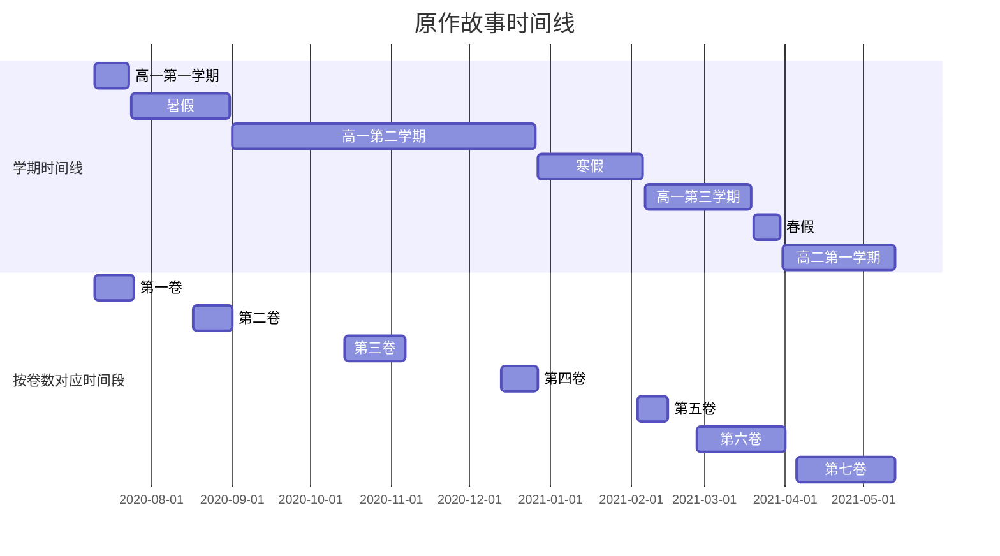

主要内容：

败女原作中的角色、环境、时间线等等创作同人文有可能需要的设定整理。

tips：八卷内容会更新的，但是最近有点忙，总之过了这阵子会更新的。

<!-- more -->

# * 感谢

按首次帮助实际进入整理内容的时间顺序排列。非常感谢这些为完成整理给予帮助的创作者/读者们。<mark><strong>没有你们，我无法完成这一篇设定整理</strong></mark>。

1. [BUGFx](https://tieba.baidu.com/home/main?id=tb.1.11319091.iQgvyI49bOEiEhRVOOPT9g?t=1731556715&fr=pb)，2024年12月21日。帮助如下：
    1. 在最一开始整理的时候，给予了很多创作者视角的建议。
    2. 从最一开始到结束，一直支持着我做下去。
    3. 指出了很多我有所疏漏（不仅在内容上）的地方。
    4. 帮助我给邀请的老师们所提供的内容提出改进意见。
2. 文研部，2024年12月22日至今。在完成这个整理的时候偷了不少群内大佬的结论过来。
3. [秋山そら](https://tieba.baidu.com/home/main?id=tb.1.f260a500.Hsa4181Io0oy4eVB6M35mg?t=1731690862&fr=pb)，2024年12月24日。帮助如下：
    1. 确定了八奈见的家的大概地理位置。
    2. 帮助我确定小鞠的家的大概地理位置。
    3. 帮助我找到了丰桥市的经济统计数据。
4. someone（字面义），2024年12月25日。虽然我不知道你是谁，但是你所整理出的部分角色间常用称呼表，给我最一开始整理的过程带来了极大的便利，真的很感谢。（另外整理的时候，除了汉字是我手敲的以外，剩下全是OCR识图出来的，日语真不认识，如果有问题请联系我进行修改，多谢）
5. [ruinform](https://tieba.baidu.com/home/main?id=tb.1.c03278fd.3JkRAkEBk-9BmRqe5Kba1Q?t=1722404833&fr=pb)，2024年12月28日。帮助如下：
    1. 整理了小说内出现的所有除社刊以外的轻小说。
    2. 纠正了我对于小说人设图的错误认知。
    3. 指出了二卷和七卷的一个翻译错误，帮助我捋清时间线。
    4. 完成了八奈见杏菜的基本性格特点分析和温八关系演变部分。
6. [乌丸府兰](https://tieba.baidu.com/home/main?id=tb.1.a5b901af.qHcTCdPJGtFpxFM7LKYwHQ&ie=utf-8&fr=pb)，2024年12月29日。出于我自己实在是没怎么看过以白玉为主题的文的原因，所以通过他的推荐找到了[林深时见鹿.txt](https://tieba.baidu.com/home/main?id=tb.1.fbc4e871.cRb--a-Xq5XcJNPS0xK--g?t=1734616395&fr=pb)老师。
7. [某上条的心理掌握](https://tieba.baidu.com/home/main?id=tb.1.309cee06.TJV3rfNq_ySxUFRc8_pESw?t=1730109151&fr=pb)，2024年12月29日。出于同样的原因，帮助我找到了[天罡三十七星天爱星](https://tieba.baidu.com/home/main?id=tb.1.d0024e7d.hMsU3nByBtBogn_DQB4_Uw?t=1723892770&fr=pb)和[天天天言](https://tieba.baidu.com/home/main?id=tb.1.3d5d3bb8.byhIdbOv8QQ7OZmHVgW_Vw?t=1723991204&fr=pb)老师。
8. [林深时见鹿.txt](https://tieba.baidu.com/home/main?id=tb.1.fbc4e871.cRb--a-Xq5XcJNPS0xK--g?t=1734616395&fr=pb)，2024年12月29日。帮助如下：
    1. 提出建议，帮助我注意到了在之前的整理过程中未曾注意到的点。
    2. 完成了对白玉莉子角色的性格特点的总结。
9. [我八胃大，无需多盐](https://tieba.baidu.com/home/main?id=tb.1.8c63d37a.V8ezIODj9P9nWVY1JgbmmA?t=1727570073&fr=pb)，2025年1月2日。帮助如下：
    1. 指出部分信息错误。
    2. 对地理位置推测部分的展示方式提出建议。
    3. 帮助我给邀请的老师们所提供的内容提出改进意见。
10. [风飞扬羽](https://tieba.baidu.com/home/main?id=tb.1.6a8fcc10.QYxJi_h9u5nlxbHUyKpVUQ?t=1728572637&fr=pb)，2025年1月2日。帮助如下：
    1. 提出建议，优化了时间线的视觉效果。
    2. 完成了对烧盐柠檬的基本性格特点分析和心路历程。
    3. 提供了第六卷的时间线。
11. [美琴赛高](https://tieba.baidu.com/home/main?id=tb.1.67d8e769.PvHpxDlxeOGOJASyiOAuqQ?t=1732896932&fr=pb)，2025年1月2日。帮助如下：
    1. 提供了一个对日本行政区划的比较详细的说明。
12. [太阳杭氧](https://tieba.baidu.com/home/main?id=tb.1.a53da60b.eY8JLHpAh87OUKJB2phFOg?t=1483833739&fr=pb)，2025年1月8日。帮助如下：
    1. 完成了关于创作八奈见杏菜主视角的经验部分。
    2. 完成、校对了所有角色的对人称呼的日语部分。
13. [沐冰河青龙王](https://tieba.baidu.com/home/main?id=tb.1.e2e92253.rOdA-Ma6dZ0NIuxyAoY1sA?t=1622625399&fr=pb)，2025年1月11日。提供了对温水家具体大小的推测。
14. [侦探蜘蛛](https://tieba.baidu.com/home/main?id=tb.1.4ac4e479.CETjJDHJSRTyN7bkxFHEBQ?t=1728588915&fr=pb)，2025年1月14日。帮助我找到了[和光同尘hl](https://tieba.baidu.com/home/main?id=tb.1.b794edb5.K8oxXlE-sCacH8cjXbU_Og?t=1735360659&fr=pb)老师。
15. [古蕾亚与安](https://tieba.baidu.com/home/main?id=tb.1.872933f9.ex7tuEnaTHrRyx1Q8kIYTA?t=1561799348&fr=pb)，2025年1月16日。完成了小鞠知花的基本性格特点分析。
16. [DONGRILANSEN](https://tieba.baidu.com/home/main?id=tb.1.47b94547.OXbsOJow6legbcvF3yCGdA?t=1734927133&fr=pb)，2025年1月22日。分享了关于在贴吧发帖的排版经验，以及一些写文小技巧。
17. [梅有鱼](https://tieba.baidu.com/home/main?id=tb.1.e23be542.2VniIiDYdFfjb1loVqj4PA?t=1734516322&fr=pb)，帮助如下：
    1. 2025年1月22日。分享了关于在贴吧发帖的排版经验，以及一些写文小技巧。
    2. 2025年5月24日。帮助校对了角色对人称呼的日语部分。
18. [咕咕鸡🐔太阳系固有](https://tieba.baidu.com/home/main?id=tb.1.6d904325.KfDp5R9ryWIMjocjC5ttnQ?t=1732460453&fr=pb)，2025年1月26日。分享了一些写文小技巧。
19. [和光同尘hl](https://tieba.baidu.com/home/main?id=tb.1.b794edb5.K8oxXlE-sCacH8cjXbU_Og?t=1735360659&fr=pb)，2025年1月29日。完成了志喜屋梦子的基本性格特点分析和心路历程。
20. [天天天言](https://tieba.baidu.com/home/main?id=tb.1.3d5d3bb8.byhIdbOv8QQ7OZmHVgW_Vw?t=1723991204&fr=pb)，2025年2月3日。完成了温水佳树的基本性格特点分析和心路历程。
21. [カオスアトラクター](https://tieba.baidu.com/home/main?id=tb.1.3beadd49.giWzxhyVew_OoBKj_zR4hg&ie=utf-8&fr=pb)，2025年2月5日。完成了对温水和彦的基本性格特点分析和心路历程。
22. [浅海漫步](https://tieba.baidu.com/home/main?id=tb.1.3c7f355c.OJ-70OSEPJIeZrVV-W8wcA?t=1729574867&fr=pb)，2025年2月5日。完成了对温水和彦的基本性格特点分析和心路历程。
23. [天罡三十七星天爱星](https://tieba.baidu.com/home/main?id=tb.1.d0024e7d.hMsU3nByBtBogn_DQB4_Uw?t=1723892770&fr=pb)，2025年2月6日。完成了对马剃天爱星的基本性格特点分析和心路历程。
24. [laial](https://tieba.baidu.com/home/main?id=tb.1.7494fb22.Shw6_HGUmxk7-3z4MTgRFg?t=1735043387&fr=pb)，2025年2月8日。指出部分错误。
25. [Yamada杏菜ᅟᅠ](https://tieba.baidu.com/home/main?id=tb.1.f192a1d.Pt8XJ0n-ICRHJF_IlptSag?t=1735101648&fr=pb)，2025年2月10日。指出对人称呼部分的日语错误。
26. [贴吧用户_a7NUaAU](https://tieba.baidu.com/home/main?id=tb.1.647ec1aa.yRofUV_1cWmOofpa-jisGQ&fr=pb)，2025年2月14日。指出部分错误。
27. [沈呀么沈二华](https://tieba.baidu.com/home/main?id=tb.1.8a6ffda0.DRsOYq1jKBo-1BXdEY75rg?t=1741442577&fr=pb)，2025年3月2日。指出朝云对人称呼部分的信息缺失。
28. [W0A2N1G3](https://tieba.baidu.com/home/main?id=tb.1.9fed56b6.GCgsGBCYyNlrAhOQF-55OA?t=1737213770&fr=pb)，2025年3月9日。指出部分文字错误。
29. [云淡快去写作业](https://tieba.baidu.com/home/main?id=tb.1.d42d5415.6N5TrkeYnixQ2bBHgiSd2Q?t=1738573488&fr=pb)，帮助如下：
    1. 2025年3月19日。指出`3.3.12`到`3.3.14`日期错误。
    2. 2025年5月18日。完成八卷时间线的整理。
30. [奈何](https://tieba.baidu.com/home/main?id=tb.1.75a60b35.Zkmc9p7G6WxYMJbRXfIi8A?t=1742742927&fr=pb)，2025年4月20日。指出樱井弘人部分对人称呼的日语错误。
31. [红天跃](https://tieba.baidu.com/home/main?id=tb.1.da596216.UnWf-M0L_MKRb9x9yA60lQ?t=1617361169&fr=pb)，2025年5月23日。指出角色对人称呼部分的日语错误。

# * 开始之前

> 必须要说明的是，邀请作者来解析角色们的性格的最初目的，是为了给创作者们一个对角色基础性格的认知，从而能够推敲角色在文中的行为、话语、动机，在创作过程中避免过度OOC。尽管我和被我邀请来撰写角色基本性格特点分析与心路历程的作者，都在有意避免主观因素，并且尽量以原文为依据进行判断、给出结论。但是，正如那句很经典的话所言，“一千个读者眼中有一千个哈姆雷特”。我们在完成这些的过程中，一定会**不可避免的会被我们自己的观感所影响**。我想要说的是，这里提供的仅仅是一个参考，我和作者们已经尽力让这个参考尽量具有普适性。<mark><strong>如果您已经有了对角色的判断，并且和这里给出的结论有冲突，请以您自己的判断为主</strong></mark>。
>
> 另外，这一板块的本意也**从来不是限制对某一角色的诠释**，这里所提供的参考仅是对原著中角色的基础性格特点分析和心路历程。在不同设定、不同世界观下的角色，自然会有不同的性格和行为，这其中的取舍，请您自行斟酌。

> 如无意外，所有的已知结论都会指出依据在原文的对应位置，并且附带部分原文（e.g. *一卷一败，“八奈见家似乎习惯吃甜味的煎蛋卷。*”）。如果是结论内已有原文的、或者结论本身就足够在原文直接进行搜索的，仅会指出依据在原文的对应位置（e.g. *一卷一败*）。所有被引用的原文，**1～6卷来源是轻之国度翻译版，7卷来源是吧内资源楼提供的版本**。

> 部分日期的xx..xx写法意为
>
> 1. 具体日期不明，推测可能发生的时间在xx到xx内。比如说2020年7月17..21日，意为该事件发生的时间点处于2020年7月17日到2020年7月21日之间。
> 2. 表示事件发生在一个持续的时间内。
>
> 部分日期可能还会带有问号，其意为：
>
> 1. 具体日期不明，但指出的日期可能性最大。
> 2. 具体日期不明，但范围会在指出的日期±一定天数的范围内。

> 下面的所有时间推测全部基于一卷开始于2020年7月10日，结论依据位于时间线下的年份锚定。

<mark><strong>如若在使用过程有有任何的建议，或者发现有整理错误，信息过期等情况，可以联系我（QQ、邮箱、贴吧私信）进行修改，我先在此谢过了。</strong></mark>

# 1 角色信息

## 1.1 人物关系图

此人物关系图基于七卷后的情况。

<iframe src="https://www.misaka19327.cc/c/makeine_people_graph/" width="100%" height="600" style="border:0;background:white" allow="fullscreen" loading="lazy" referrerpolicy="no-referrer-when-downgrade"></iframe>

## 1.2 八奈见杏菜

> 官方设定图，于2021年6月2日。[链接 | X](https://x.com/makeine0718/status/1400001564207550468)

> 在这里提一个点，我有印象，在以前水群的时候有聊过，除了志喜屋和小鞠这种明确点出来的以外，是不是这几个人其实都是黑头发，现在这么五彩缤纷的头发是为了动画化后来加的设定。这个结论当时我是认可的，但是整理的时候看到这个设定图的时候才发现不对。败女动画是在2023年12月14日宣布制作决定，但是这个明确点出头发颜色的设定图是2021年6月2日发出来的。
>
> 但是，还是需要强调，人设可能是为了角色的区分度而专门上色。**就原文而言，仅对小鞠和学姐的头发颜色有明确描写**。

基础设定：

1. 出生日期：2004-11-29
2. 身高体重：156cm，52kg+（*五卷一败，“我记得……上次量的时候是五十二公斤吧。”*）
3. 班级：一年级C班→二年级C班（*七卷一败*）
4. 罩杯：E
5. 加入文艺部时间：2020年7月17日（*一卷二败，“我加入！我现在就加入，可以告诉我月之木学姐的联系方式吗？我自己拜托她。”*）

***
可以直接确认的设定/信息：

1. 不爱吃的东西：薄荷茶（*一卷一败*）。
2. 有敏感性牙齿（*一卷间章·不，其实是个肚子饿了也不哭不闹的乖宝宝，“八奈见杏菜，拥有敏感性牙齿的十五岁少女。”*）。
3. 厨艺：一般水平（*一卷三败，“不，很普通，十分的普通。她用那让人有些担心的动作削着红萝卜的皮。”*）。
4. 一年级男生投票的不起眼巨乳排行榜第一名（*一卷特典·少女会议的B to E*）。
5. 在2020年7月20日之前不久，被篮球队长单独找过（一*卷四败，“男方是谁？上次篮球队的队长不是有把她找出去！”*）。
6. 能生吃辣椒，但是不生吃胡萝卜（*一卷特典·第一轮审查开始*）。
7. Line名：Yana-Chan（*二卷一败*）。
8. 三卷的石蕗祭，一年级C班的主题是“游击万圣节”。他们一共计划演出7场短剧，八奈见在其中三场有戏份（*三卷一败；三卷二败*）。
9. 吃拉面的话，习惯吃猪骨的（*三卷一败，“怎么扯到拉面——啊，味噌汤头也不错耶，而且我平常都吃猪骨的。”*）。
10. 很是吃过一些平常看起来不能吃的东西（*三卷一败，生吃过小麦粉，并且得出“会肚子痛，而且也不好吃”的结论；四卷一败，“我在怎么样也不会吃橡皮擦啦。又不好吃。”；五卷四败，“不过吃起来感觉满独特的，有种土墙的口感让人很怀念。”*）。
11. 最迟不超过2020年10月29日，和佳树就建立了联系（*三卷二败*）。
12. 成绩中等（*四卷一败，“呃……228名学生中排135名啊。”*）。
13. 骑自行车上学（*四卷一败*）。
14. 在学校不化浓妆甚至可能不化妆，至少不打粉底（*四卷一败，“我记得八奈见学姐在学校不会打粉底，兄长大人和其他女性碰面了吗？”*）。
15. 储物柜内不会放零食（*四卷一败，“所以我刻意什么都不放。”*）。
16. 母亲在市役所上班（*五卷特典·今晚不准睡，“话说杏菜的妈妈好像是在市政厅上班？”*）。
17. 人多时，很容易怯场（*七卷序章，“八奈见‘其实很容易怯场’的秘密竟然暴露了。*”）。

***
能够被推测的，具有一定不确定性的设定/信息：

1. 喜欢甜口（*一卷一败，“八奈见家似乎习惯吃甜味的煎蛋卷。”*）。
2. 疑似弟控（*一卷一败，“草芥就跟天使一样，很有弟弟的感觉喔。”*）。
3. 小的时候家庭条件不是很好（*不怎么吃过牛肉，一卷三败，“放心吧，我当然也会买牛肉的。我们已经是高中生了嘛。”*）。
4. 其父工作不稳定/灵活就业，年轻时游手好闲，会打柏青哥（*一卷三败，“嗯，嗯！有在工作喔？只是，我爸爸对组织之类的不太拿手。”；六卷一败，“我家老爸年轻时虽然游手好闲，但是现在勉强也算过得去！”；六卷特典·美好的回忆，收藏起来，“……我家爸爸也会用柏青哥剩下的小钢珠换零食来给我吃啊。”*）。
6. 截止二卷一败，不知道温水的名（*二卷一败，“真亏你知道温水的名字耶。我都不晓得。”*）。
7. 朋友圈内对温水是有所耳闻的（*七卷三败，“温水同学？哦，原来是你啊。”*）。

> 关于第5点，这一点**严重存疑**。在八奈见连温水的家庭地址都知道的情况下，还不知道温水的名是有一些不合常理的。

### 1.2.1 社刊

1. 虽然没出现过，但是在二卷尾声提了一嘴。除了《向你道早》，八奈见已经有了一篇“以淡淡的单恋与炸鸡块串为主题的极短篇”。
2.  《向你道早》（*二卷尾声*），主要内容：主角A子想要向他道早，并且一起上学，但是失败了。
3. 《绝对不放弃，直到说出口》（*三卷四败*），主要内容：A子再次试图追上他，但是为了等咖啡欧蕾再一次错过了。xx君上线。
4. 《还不算输？》（*四卷三败*），主要内容：他身边多了一位J子。三包糖上线。
5. 《新年留下的麻烦》（*五卷三败*），主要内容：A子同学目睹了有女生来找XX，并且咬了xx的美国热狗一口。
6. 《就决定是你了》（*六卷四败*），主要内容：常去的便利店倒闭，xx有些不安，A子反而有些悠然。

### 1.2.2 对人称呼

| 被称呼人  | 中文       | 日语    | 日语平假名    | 罗马音              |
| ----- | -------- | ----- | -------- | ---------------- |
| 温水佳树  | 妹妹       | 妹ちゃん  | いもうとちゃん  | imouto-chan      |
| 温水和彦  | 温水君      | 温水君   | ぬくみずくん    | nukumizu-kun     |
| 小鞠知花  | 小鞠酱      | 小鞠ちゃん | こまりちゃん   | komari-chan      |
| 烧盐柠檬  | 柠檬酱      | 檸檬ちゃん | 　レモンちゃん  | remon-chan       |
| 袴田草芥  | 草芥       | 草芥    | そうすけ     | sousuke          |
| 玉木慎太郎 | 部长       | 部長    | ぶちょう     | buchou           |
| 绫野光希  | 绫野君      | 綾野君   | あやのくん    | ayano-kun        |
| 姬宫华恋  | 华恋       | 華恋ちやん | かれんちゃん   | karen-chan       |
| 月之木古都 | 月之木学姐    | 月之木先輩 | つきのきせんぱい | tsukinoki-senpai |
| 朝云千早  | 朝云同学，小朝云 | 朝雲さん  | あさぐもさん    | asagumo-san      |
| 志喜屋梦子 | 志喜屋学姐    | 志喜屋さん | しきやさん     | shikiya-san      |
| 马剃天爱星 | 马剃同学     | 馬剃さん  | ばそりさん     | basori-san       |
| 放虎原云雀 | 会长       | 会長    | かいちょう    | kai-chou         |
| 樱井宏人  | 樱井君      | 桜井君   | さくらいくん    | sakurai-kun      |
| 白玉莉子  | 小白玉      | 白玉ちゃん | しらたまちゃん  | shiratama-chan   |
| 甘夏古奈美 | 老师       | 先生    | せんせい     | sensei           |
| 小拔小夜  | 老师       | 先生    | せんせい     | sensei           |
| 田中雄二  | 田中老师     | 田中先生  | たなかせんせい  | tanaka-sensei    |

### 1.2.3 海獭语收集

1. “就素说～啊呼呼哈哈喔呼咿呼哈哈呼”“哈呼嘿、呼呼哈嘿呜呼哈啊呼的呼呜哈。”（*一卷三败*）
2. “这个喔，呼哦咕哦。”（*二卷一败*）
3. “呼呼说，这就是咕噜呼咕的说。”（*二卷尾声*）
4. “呼呼稀呼噜的也还没哩呼噜嘿。”（*三卷一败*）
5. “呜呜，呼呜呼呜呜。”（*五卷一败*）
6. “咕呜咕的份，咕噜呜咕呜咕。”（*五卷三败*）

### 1.2.4 关于减重的假说们

1. “饮料又不算数，况且有冰淇淋吃了也不会胖的假说。”（*二卷一败*）
2. “为了美容，含有糖类与酯类的均衡饮食是很重要的……”（*二卷三败*）
3. “透过改善伙食，我这星期成功达成了250克的减重。”“换算成一个月，就是1公斤了。”（*二卷尾声*）
4. “温水，所谓的减重并非不分三七二十一绝食就好。有种说法是，虽然一天摄取的总热量相同，分成好几次吃的话就会变瘦。”（*三卷三败*）
5. “书上写，细心咀嚼偏硬的食物可以瘦身。”（*四卷一败*）
6. “一边吃零嘴一边走路，就能高效率地消耗吸收的糖类，并且提升基础代谢率——简而言之，会变成易瘦的体质。”（*四卷一败*）
7. “你看，这房间里有四个人吧？换言之，热量也会分成四等分，换个角度来看这也是减重。”（*四卷一败*）
8. “简单说就是要欺骗身体，不给身体有空档变胖喔。先不吃正餐让身体松懈，再趁机吃点心。只吃点心的话等级就比正餐还要低，可以得到和绝食同样的效果。”（*五卷尾声*）
9. “温水，人会因为错误的认知，摸到不热的汤匙也烫伤。只要相信，昆布既可以是炸鸡，也可以是牛肉干。”（*六卷四败*）
10. “减肥的最终阶段是想象。根据最新的减肥理论，减肥欲是可以抵消热量的。抹茶——冰沙——瞧，看起来能让人变瘦的要素不是都齐全了嘛？所以我喝这个不可能不会瘦。”（*七卷二败*）

### 1.2.5 基本性格特点分析

> 这一部分由[ruinform](https://tieba.baidu.com/home/main?id=tb.1.c03278fd.3JkRAkEBk-9BmRqe5Kba1Q?t=1722404833&fr=pb)老师完成。

作为本作的第一女主角，八奈见杏菜有着大量的情节用于其形象塑造，其人设的复杂度极高。如果要归纳她的基本性格特点，我认为可以从两方面着手：其一是她带有少女气息的脱线行径，其二是她通透深刻的情感洞察。这两者在原作小说的情节排布里大概是八二开的比重。

其一，**八奈见身上具备着与年龄层相符的少女气息**，她的贪吃、骄纵、随性、骄傲，皆源于此。

1. 贪吃自不待言，只要视线内存在食物，八奈见就会想方设法将其弄到手。在一些显而易见的喜剧情节里，她的贪吃属性甚至会被放大到宛如失去理智的地步；
2. 骄纵体现在八奈见旁若无人的行径上。阳角社交达人的身份赋予她远超同龄人的自信心，哪怕是面对学生会的盘查，她也敢于直接骑车强闯，以至于温水担心她某天会因为某种原因而停学;
3. 随性或者说达观的一面体现于她看待生活的态度上。八奈见幼年家境拮据，尝过墙皮和橡皮的味道、吃花朵到半饱、高中前在家吃不上牛肉、生日礼物是外界看来寻常的糖果……如是种种在旁人看来略显难堪的事情，她却可以处之泰然，坦荡受之；
4. 八奈见高度重视自己的尊严和脸面。她总能敏锐察觉温水话语里潜在的贬损，开展驳斥和反击；在故事的开篇，八奈见之所以会寻求温水和文艺部作为逃避的港湾，正是介怀他人过于顾及她的态度，不愿意因为失恋而被特殊看待；当温水因为流言蜚语和她断交时，八奈见刚烈的决断，也是出于类似的心理。

其二，**八奈见具备通透深刻的情感洞察**。在本作中，大部分时候八奈见都充当着活络气氛的角色，唯有在温水面前，她会时不时表露出看破人际关系本质的洞察力。

> 「被甩了也不会有任何改变，也不会觉得畅快。」
> 「不过啊，周遭的一切只会一直向前进，我也只能跟着向前走。」 ———第一卷第一败

>「我现在明白了。我当时就算跟草介表白，也会被他甩掉。我就是因为明白这一点，才没敢踏出那一步，起码还能继续维持现状。」
>「你可不要误会了啊？我早就接受了，也根本没有后悔。」———第七卷第三败

除了上述例子，二卷的坏孩子宣言、三卷对小鞠“情书”的解读、五卷的第一位理论和六卷的分班对谈中，八奈见敏锐地捕捉到每个人情感中暧昧不明的关键所在，并给予温水相应的引导和指点。在这个故事中，八奈见有着象征爱情的“玫瑰”花语，她对自身和他人的情感有着极高的关注度，并被雨森赋予了情感上的引导者角色，与偏重实证和直觉的温水的互为补充。

在创作与八奈见相关的情节时，最大的难点在于如何均衡上述两方面的内容，从而塑造出有血有肉的人物形象。倘若骄纵有余就会使人生厌，过度强化感性的一面又容易显得矫情。我们可以参考原作社刊和第三者视角间章的创作思路，在这其中，八奈见两方面的性格特征被杂糅表达：

- 一方面，她通常会以高度自我的心理活动去解读他人的心意。对他人口中的温水以及社刊中的“XX君”，八奈见表现出淡淡的嫌弃、掺杂傲娇意味的责难，一个好似总在闹脾气的青春少女形象隐于其间。
- 另一方面，她会将情感关系的体察蕴于日常的言行举止。就好比她在社刊中对咖啡糖包的诉求、对炸鸡口味的选取，实则都暗示着八奈见对感情的态度。

一旦综合这两方面的性格特点，我们将会看到八奈见身上存在微妙的矛盾感——**既有自信张扬、少女脾性的一面，敢于传达自己的所思所想；但又因为看得通透，会虑及更多后果，而裹足不前。**

从小说初期的社刊到后期她对待温水的态度上，都能体现这一矛盾，她总是在旁敲侧击地试探温水的态度，面对他直言不讳的质询，却不敢表露真心，这一点在第七卷随附的U盘特典里体现得淋漓尽致。这种矛盾体现在言行上，即是所谓的“嘴硬”，而唯有认识到这层矛盾感的根源，我们才能更好地创作与八奈见相关的情节。

### 1.2.6 关于创作八奈见杏菜主视角的经验

> 这一部分由[太阳杭氧](https://tieba.baidu.com/home/main?id=tb.1.a53da60b.eY8JLHpAh87OUKJB2phFOg?t=1483833739&fr=pb)老师完成。

嘛，其实我写的小八视角自认为还是比较普通的，但是既然御坂老师邀请了，那我也斗胆说两句，权当是抛砖引玉了。

原文链接在此：[【同人图文】（温八）毕业、告白，然后是……从头来过？](https://tieba.baidu.com/p/9218431198?share=9105&fr=sharewise&see_lz=0&share_from=post&sfc=copy&client_type=2&client_version=12.75.1.0&st=1735290388&is_video=false&unique=9C5B90FEC3D62767F2C79B404A7F96D0)

最开始想到写老八视角，主要是在前期温水视角里有意无意埋了一些伏笔，后期想要回收时，如果只是从两人对话解密有些无聊了，可能也不太合逻辑。就想到写老八视角，顺便也可以练练笔。所以我写的老八视角可能更多的聚焦在补全温水视角下遗漏的信息以及与温水对照的感情发展。

我的构想是这样，作为本文的核心设定，温水从高三穿越回来，由此产生的连锁反应，是本文的主要矛盾。对温水来说，如何再一次从零开始培养和老八的感情，是需要首先想清楚的。最简单的当然是全盘按照一周目的路子一步步走下去，问题是，温水在经历过三年后，还甘心只是重复以前的经历、甚至是以前的错误吗？

就像《命运石之门》里世界线的分歧，有大的分歧点也有小的分歧点。那么对温水和八奈见之间的关系来说，什么是重要的标志事件，什么是相对没那么要紧的，这也是温水需要想清楚的事情。所以温水需要一个明确自己的心意→明确八奈见的心意变化→下定决心改变的过程。

同样的对于八奈见来说，面对几乎是第一次见面就开始能熟练掌握与八奈见交往窍门的温水，八奈见自己又是怎么想的呢？明明是班上的阴角，却能次次正中自己好球区。温水是带有目的性地接近自己的？还是另有隐情？怎么看待和温水的交情，反过来温水又是怎样对待两人之间的感情的？温水为什么会如此熟练，温水背后有着什么样秘密？以及，八奈见自己是否要下定决心，迈出决定性的一步？这些都是八奈见自己需要想明白的事情。

感情总是双向的，所以这个问题是需要两个人一起面对，一起下定决心的。**我写八奈见的视角，也是从这个角度出发，猜测八奈见可能会抱有的想法。然后去以八奈见的视角，去重写这段故事，展现出与之前不一样的特点。**

重看我自己写的八奈见视角部分，其实多少有一些「成也萧何败也萧何」。以八奈见的感情变化为主线，不自觉地就写得「重力」了许多。相比原著雨森写的八奈见社刊，文字少了一些少女的灵动，反而更像陷入重力状态的温水。应该说，以雨森的八奈见社刊为对象，模仿起来的确有不少难度。**少女的那份活泼和灵动细腻的感情**，要表现出来确实不是容易的事情。

所以，一方面来说，以我的视角来看，**如果要写小八的视角，最好确认一下要写这个视角的目的是什么**。有一个主线以后至少剧情推进会顺利许多。然后再尝试**学习一下雨森的老八社刊**，为八奈见主视角佐点料，会好很多。

另一方面，关于如何让文字写的，相对看起来「比较像老八」这一点。个人认为，很重要的一个点是，温水这家伙的视角，比起一个中学生，更像是一个老成的中年大叔（吧里有过类似叙述）。造成的结果是，**以温水视角写的时候，会有许多「第三视角」式的「客观」陈述句**。比如说：啊、八奈见又怎么怎么做了。啊，什么什么事又发生了。这样一种很嫌麻烦的吐槽视角。相对应的，动作和心理活动的描写会偏少一些。

但是老八是不一样的。作为一个青春少女，**她的这种「第三视角」的吐槽是比较少的**（从老贼的老八社刊来看）。所以，**多多描写一些动作，加强灵动的感觉会很有帮助**。除此之外，**老八的心理活动会比温水要强很多**，而且会有比较强烈的主观感。即会强调「我」怎么怎么样，怎么样去想、去评价一些事情，心理活动上情绪化的用词修饰会比温水的视角多很多。作为一个阳角，老八也是一个很有自信的女孩子。比起温水常出现的一些不置可否的言论，老八的**言语间会更加自信、更斩钉截铁一点**。

当然，八奈见也会迷茫，也会犹豫。**在心情低落时，八奈见也会表现出迷茫**，会对自己的内心探索，思考自己内心的真物是什么。但是犹豫也好，迷茫也罢，**八奈见调节内心的本领还是很强的**。尽管可能还没有想明白，但是，在外人面前，八奈见还是会勉强自己振作起来。

另外，可以的话，八奈见也会不自觉地自然流露出一些对温水的「撩」。**会希望温水能感受到自己的魅力**，在试探中增温两人的感情。

## 1.3 小鞠知花

> 官方设定图，于2021年6月11日。[链接 | X](https://x.com/makeine0718/status/1403315290335703044)

基础设定：

1. 出生日期：2005-03-29
2. 身高体重：148cm，41kg+
3. 班级：一年级A班（*三卷一败*）→二年级C班（*七卷一败*）
4. 罩杯：A
5. 加入文艺部时间：2020年4月1日..2020年4月30日（*三卷二败，“……我、我在四月入社，两、两个人都对我很好。”*）

***
可以直接确认的设定/信息：

1. 能和温水互开玩笑（*二卷一败，“从智慧型手机的笔谈出发，最后对我敞开心房到能互开玩笑的程度”，有温水视角美化的嫌疑？*）。
2. 在大文豪网站上的笔名是“久远兔”（*二卷一败*）。
3. 在大文豪网站上排名极为靠前（榜上位置：8/300），并且积分超过3000（*二卷一败，“这是小鞠的笔名吗？咦？综合第8！？前十名！？”*）。
4. 自从7月23日为了给温水打掩护之后，偶尔会和柠檬一起跑步（*二卷一败，“最，最近，偶尔会，和烧盐一起，去跑步。”*）。
5. “那孩子喜欢布丁胜过冰淇淋。要记得她不喝咖啡。她不太喜欢长葱的绿色部分，要帮她切细喔？”（*三卷一败*）。
6. 擅长做点心（*三卷一败，“因、因为我家，有小不点。常常，做点心。”*）。
7. 如无意外，每天小鞠的午饭就是奶油面包卷或者是类似的东西（*三卷一败，“为什么你明明会做这个，午餐却每天都吃奶油面包卷？”*）。
8. 每天都会给妹妹读绘本（*三卷二败，“比、比较小的小不点，睡前不读绘本，就不睡觉。”*）。
9. 每天放学后要去保育园接妹妹（*三卷二败，“我、我必须去保育园接妹妹。”*）。
10. 弟弟年纪大概是国小低年级。（*三卷二败*）。
11. 睡衣样式：粉红色，星形图样（*三卷二败*）。
12. 在2月12日，和佳树交换了联系方式（*五卷特典·头发是女人的性命*）。

***
能够被推测的，具有一定不确定性的设定/信息：

1. 目前家庭条件不是太好（*一卷三败，“牛，牛肉，好久没吃了……”*）。
2. 大致饭量：早饭半片吐司（*二卷三败，“你吐司支持了半片耶。（换行）我、我早上，吃、吃不了那么多……”*）。
3. 对动物很有亲和力（*三卷四败，“你看，所谓的被动物喜爱，要像那样。”*）。
4. 会画画，而且画的应该不会很差。（*七卷四败，“她在会场前的停车场画风景画，同时观察人员进出。”*）。

### 1.3.1 社刊

1. 《妖怪咖啡厅的温馨事件簿》（*出现在一卷二败，但是内容在一卷三败*），主要内容：女主角水原百合误入一个由银色狐狸开的咖啡厅，并且被留下来当店员。
2. 《高声宣告撕毁婚约！》（*二卷一败*），主要内容：主角转生到中世纪设定的游戏中成为反派大小姐，为了推进最佳结局，硬要王子高声宣布与她结束婚约。
3. 《高声宣告撕毁婚约！第四话》（*三卷一败*），主要内容：主角用现代的Excel概念，帮助快要累虚脱的菲力普王子处理政务。
4. 《高声宣告撕毁婚约！第六话》（*四卷一败*），主要内容：主角最近和菲力普王子几乎三句不离工作，让主角感到不安。同时爱丽莎登场。作为菲力普王子以前的同学，最近她和菲力普王子签订了对他极为有利的契约，这件事也让主角有所怀疑。最后，主角有所察觉，这位爱丽莎很在意菲力普王子的同时，也有可能是转生者。
5. 《在这污秽的异世界》（*五卷三败*），主要内容：中原中也、太宰治和三岛由纪夫转生到异世界，拥有自己的技能，并且战斗了一场。
6. 《某个有趣的女人》（*六卷二败*），主要内容：三岛由纪夫和太宰治也转生到了《高声宣告撕毁婚约！》的世界观下，并且看到了主角当众让王子撕毁婚约的场面。

### 1.3.2 对人称呼

| 被称呼人  | 中文             | 日语       | 日语平假名         | 罗马音                     |
| ----- | -------------- | -------- | ------------- | ----------------------- |
| 温水佳树  | 妹妹             | 妹ちゃん     | いもうとちゃん       | imouto-chan             |
| 八奈见杏菜 | 八奈见            | 八奈見      | やなみ           | yanami                  |
| 温水和彦  | 温水             | 温水       | ぬくみず          | nukumizu                |
| 烧盐柠檬  | 烧盐             | 焼塩       | やきしお          | yakishio                |
| 玉木慎太郎 | 部长，玉木学长（学长退部后） | 部長，玉木先輩  | ぶちょう，たまきせんぱい  | buchou，tamaki-senpai    |
| 月之木古都 | 学姐，月之木学姐       | 先輩，月之木先輩 | せんぱい，つきのきせんぱい | senpai，tsukinoki-senpai |

### 1.3.3 基本性格特点分析

> 这一部分由[古蕾亚与安](https://tieba.baidu.com/home/main?id=tb.1.872933f9.ex7tuEnaTHrRyx1Q8kIYTA?t=1561799348&fr=pb)老师完成。

#### 1.3.3.1 写在前面的

因为本人只读过原文大概三四次，所以对于文章细节可能把握得不是非常牢靠，所以在分析的时候，可能会有一定错漏，这里就请多多包涵，同时也希望诸位能够斧正其中的错误。

其次，本人对于小鞠的理解主要来自于几件比较独特的事件，这些重点事件对于我来说是理解小鞠的核心要素，所以下文的性格分析会通过具体分析这些事件展开。

#### 1.3.3.2 小鞠的性格特点及分析来源

内向中带些好强、温柔坚强有时却称得上坏孩子、自卑中掺杂着些许自傲、缺爱又十分敏感、身上肩着的责任逼着她成长但又使她带着不少不成熟和别扭——这就是小鞠知花，目前败犬小说里少有的、几乎***把自己所有的信息和背景都暴露给了观众和温水***的角色。但正是这些特点让小鞠成为了一个***复杂的，非常有分析和二创空间的角色****，以下是正式的分析。

内向怕生，无疑是这个角色的底色属性之一，无论从小鞠的行事方式还是口癖都能很明显地看出来。小鞠几乎在面对所有陌生人时，都会表现出自己的这一特点。在小鞠和温水的初次对话里我们就能发现，面对作为幽灵社员的温水，小鞠对其***说话的态度非常非常拘谨，甚至到了有些滑稽的地步***。叫一个一直不参与部活的幽灵社员来参与社团活动，这种可以说是非常天经地义的事情在小鞠这里都是非常困难的，她***内向和缺乏有效的社交手段的特点可见一斑***。实际上，这个例子只是表现小鞠怕生性格非常小的一部分，整篇小说可以说处处都在强调小鞠的这一属性，这里就不多作表述，毕竟这也是小鞠最容易看出来的特征之一。

好强，依旧是小鞠非常凸出的特点。最明显的例子就是校园祭时，小鞠为了让学长姐放心，并且为了证明自己能够担起社长这一担子而一直高强度地写文章和处理社团事务，最终把自己累倒。这里非常明显地表现了小鞠的好强性格，实际上，她完全可以拜托温水等人帮助她完成文艺社校园祭的一部分工作，并且小说里的后文确实也是这么处理的，但她***为了证明自己的能力而把大量的、自己不可能完成的工作揽到了自己身上***，其好强的性格可见一斑。

温柔坚强这一特点，我们能从小鞠对玉木学长表白失败之后，对于玉木和古都二人的态度和处理方式中看出来。首先，我们设身处地地考虑一下小鞠在此时的处境，自己对玉木表白后被光速拒绝，并且玉木当天就和古都在一起了，可以说是完全被甩了。更重要的是玉木和古都二人还是自己非常亲密的前辈，在这样的情况下小鞠的处境只会显得更尴尬。在别人的视角来看就是，小鞠明明知道玉木和古都二人情投意合却一定要进去插一脚，在告白失败之后甚至有些卑微地向古都抛出和好并且将关系恢复正常化的橄榄枝。（实际上也确实如此，小鞠真的干了）***为了恢复三人的关系，刚经受了失恋之苦和与好友关系僵化之苦的小鞠，先于已经成为“胜者”的古都做出破冰动作***，不可谓不温柔坚强。（再补充一点，温柔坚强这个特点，很***有可能是来自于小鞠长期照顾其弟妹和长期父母不在身边的生活情况***，毕竟穷人家的孩子早当家嘛）

坏孩子这点的话，其实上文就已经谈到了。小鞠是不怕去做“坏事”的，只要她认为这是自己得去做的事情。最典型的例子就是小鞠在处理玉木古都和温水八奈见这两对人关系时的做法。首先我们明确一点，小鞠是非常清楚玉木古都和温水八奈见的关系的。在对玉木告白之后，小鞠说出了“至少赢过一点点”这种话，其实就证明了小鞠对于玉木和古都的感情是清楚的。而在小鞠的社刊中，也表现出了小鞠对于温水和八奈见之间隐约的情愫的察觉。但在这种情况下，小鞠还是向玉木表白了，还是向温水送出了自己的本命巧克力（虽然没有对温水挑明，不过温水多少是能猜到的）。所以，***小鞠实际上是一点都不怕当“恶人”或者“坏孩子”的***。这其实也是对前面提到的“好强”这一特点的补充，她***只要认为一件事是自己得去做的，一份情感是自己必须要表达的，那她就会去做，无论失败成功与否***。换句话说，“坏孩子”也就意味着“勇敢”，所以在写和小鞠相关的同人时，大可以把小鞠放在一个比较***主动勇敢***的位置上。

小鞠有些自卑这一点大家都能看出来，但很多人不一定能论述出具体的事件，毕竟小鞠遇到事了是会真上的而不是完全退缩。那她的自卑究竟体现在哪里呢？俗话说得好，***越是缺少什么越是要证明自己拥有什么***，这句话在小鞠这里体现得淋漓尽致。在校园祭上的逞强和在部长会议上的崩溃，都是很鲜明的表现。如果是一个不自卑的，能够接受自己弱小和性格上缺点的人，在遇到这些超出了自己能力范围的事情时，寻求他人的帮助是一个非常正常的做法。***但小鞠在遇到明显超出自己能力处理范围的事情的时候，她总是会试着自己去解决，最终导致自己的失败或是出丑***。实际上，这就是一种***自卑导致的倔强***。自己清楚地知道自己有哪些不足，但是因为希望别人不要察觉到这点，或者单纯不希望向别人示弱，抑或单纯只是不想对自己承认自己不行，所以不向身边的人寻求帮助，***本质是害怕自己的不足暴露给大家，是一种藏得非常深的自卑***。不过，表层的自卑的地方也是有的，温水曾经评价过小鞠“蛮可爱的”，但小鞠的第一反应就是有些不可置信甚至于是否认。不过这是***对自己外貌的自卑和不自信***，和前面说的对自己能力的自卑还是有一定的区别的。

那为什么说小鞠性格里有一定的自傲的成分呢？其实我们可以从两件事情里看出来。第一，还是校园祭里的工作。小鞠为什么如此执着于文艺社在校园祭上的工作呢？文艺社在校园祭上的活动内容和小鞠擅长的文学写作有关，即介绍日本文学史上的名人。小鞠这里除了想要证明自己的作为社长的能力，还有一点就是她***认为文学是自己擅长的领域，所以自己一定能够做好***。第二，温水曾经在去整理图书的时候遇到了小鞠，小鞠对温水炫耀了自己的网络小说在连载网站上拥有比较高的人气这一事实，这证明***小鞠对自己拥有不错的文字功底和写作能力是比较自豪的***。对于性格上有些自卑，认识到自己有许多方面能力不足的小鞠来说，***优秀的文字功底和写作能力是她少有的值得骄傲的事情***。所以我们也能发现小鞠对待社刊是比温水八奈见柠檬他们认真的。实际上，小说***原文里也提到过小鞠写的社刊的文学性很强***。所以我们可以合理地推测，在文学方面，小鞠是有自己自傲的一面的，但这份骄傲她不会直接展示给别人，而是以“关于文学（***亦可替换成任何小鞠有自信的事***）的事情，我一定能做好”这种方式表现出来，这也是小鞠性格中自卑掺杂着自傲的一个表现。

缺爱这点依旧是非常明显。首先，小鞠在三败犬里是非常早对温水“缴械”的。具体证明的话是第三卷小鞠因为劳累倒下，温水到小鞠家探望小鞠时小鞠的“***笨、笨蛋家伙，那是花椰菜……***”的梦话。花椰菜在日本文化中指的是新娘手上的捧花，这里小鞠才和温水相处了没多久，甚至还没有经历天台“表白”事件，她就在梦里幻想着和温水发展了更亲密的关系（***不过，也不能确定花椰菜绝对是这层意思，权当推测看也好***）。还有一点就是，在小鞠送了温水自己精心挑选的书签之后，温水很抽象地回赠了小鞠便宜的星沙作为生日礼物。如果是普通人，遇到这种情况（自己精心准备了礼物，对方却随便送了一个便宜小垃圾就打发了），不要说是喜欢的对象了，即使对方只是普通的朋友，多半也会很生气吧。但小鞠在收到星沙之后却没有明显的生气，甚至还有些开心，属于是***只要给点点关心和爱就会很开心***的类型。那小鞠为什么会比较缺爱？个人认为和小鞠***父母常常不在身边，对小鞠的关注比较少***（通过文中小鞠的生活状况推测得出）的原生家庭情况是分不开的。所以，结合上面两点我们可以得出，小鞠是一个在***生活中比较缺爱，对于别人的关心和好意没有任何抗拒能力的孩子，遇到稍微重视自己一些，对自己比较好的人就会很快产生好感。***

敏感和不成熟放在一起说，因为这两个要素是《败女》里各位角色的大底色，基本没人逃得掉。首先我们明确一点，实际上，《败女》这部作品里***大部分角色都是比较敏感和不成熟***的。毕竟诸位角色还是十多岁的青春年纪，这个岁数的孩子，尤其是女孩子内心不敏感的反而是少数；不成熟这点更是理所当然，个人认为，《败女》这部作品里目前还***没有出现过真正能称得上“早熟”的角色***（即使是佳树，个人也认为如此）。至于这两点的表现，在文章里可以说是比比皆是，举出其中一两个例子即可。比如在温八二人因为班级上同学的流言蜚语而闹矛盾时，小鞠敏锐的察觉到了，并且推了温水一把，促成了后面的天台和解。这里证明了小鞠的内心其实是敏锐而感性的，同样的例子还有很多，这里不一一赘述。不成熟就更是明显了，无论是向玉木的表白还是勉强自己一个人处理学园祭事务，乃至后来在部长会议上与温水的冲突，无不表现小鞠目前离“成熟”这个词还差的很远的现状。

#### 1.3.3.3 对典型事件的分析——三卷的部长会议

最后，是我个人的一点私心。接下来我会通过分析原文里个人认为非常能体现小鞠性格特点的一个片段来串讲一下小鞠的性格，并且也希望借着这次机会<strong><em>减少大家对小鞠的误解</em></strong>。

具体要分析的是在部长会议上，小鞠拿矿泉水水瓶砸温水的事件。相信有非常多的观众或是读者，在看到这个桥段的时候都会对小鞠的做法感到非常的不理解，但恰恰相反，这个事件是理解小鞠性格的***非常重要且具有代表性的点***。甚至在我心目中，这个桥段是败犬里最能体现所谓<strong><em>“青春感”</em></strong>的部分。

首先，一个人会在什么情况下通过“扔水瓶砸人”这种可以说是有些过分的方法来发泄自己的情感呢，那肯定是承受了过多压力的情况下。小鞠在那段日子承受的压力太多了，首先是学长姐的毕业，文艺社的担子落在自己身上，自己必须要***证明自己担得起身上名为“社长”的担子***。其次是她***不愿意轻易示弱，好强的性格***使得她不能轻易地向诸位参会者道歉，让温水代她发言。最后是***信誓旦旦地给文艺社的大家许下承诺，但是因为自己能力不足而失败***，代表着整个文艺社在社长会议上丢脸了。这些多重的要素累加起来，造成了小鞠情感的爆发。小鞠怀抱着“***有一件一定想要证明自己能做好的事情，别人觉得你做不好，自己不服输去争取，但随后就像别人说的一样失败了***”的苦闷，在自责和责怪别人中选择了最激烈的“***自爆***”。将自己无处言说的苦闷感化作了不理智的行为，狠狠地攻击了***轻飘飘一句话否定了自己努力的温水***（当然，这里温水***不是恶意的***，反而是想帮助小鞠，只是客观上无意间伤害了她）这个片段里我们可以看到小鞠非常多的特点，甚至可以囊括上面已经论述的绝大部分：内向（在会议上说不出话）、好强（即使自己能力不足，也想要证明自己能行）、“坏孩子”或者说“勇敢”（不是沉默着结束会议，而是选择了最暴烈的发泄方式）、自卑与自傲（不愿意向温水求助，不想暴露自己的弱势）、敏感（唯有敏感的人才会有如此复杂而外露的情感表达）、别扭（喜欢、依赖着温水，但是不愿意向温水求助；知道自己能力的不足，又竭尽全力想要证明自己等等）和不成熟（在社长会议这种比较严肃的场合，选择了最不理智的做法）。这一段可以说是***完美地表现***了青春期少女的别扭敏感和不成熟，是非常值得仔细分析的段落。

综上所述，小鞠的基本性格特点如下：<strong><em>内向，好强，温柔，坚强，“坏孩子”，勇敢，自卑，自傲，缺爱，敏感，不成熟</em></strong>。其中不乏有***冲突甚至完全相反的特点***，但是这并不奇怪，角色的性格构成是***多元***的，在不同的侧面看待角色其呈现出来的特质也各不相同。而这些各异的特质就是读者理解和喜欢上这些角色最重要的元素了。

总之，希望以上对于小鞠的性格的分析能够帮助大家更了解小鞠，如果诸位能够喜欢上这位让人怜爱的角色就更好啦！

## 1.4 烧盐柠檬

> 官方设定图，于2021年6月11日。[链接 | X](https://x.com/makeine0718/status/1403315086270164999)

基础设定：

1. 出生日期：2004-08-01
2. 身高体重：163cm，50kg
3. 班级：（桃园国中）三年级2班→一年级C班
4. 罩杯：B
5. 加入文艺部时间：2020年7月17日（*一卷二败，“烧盐一面在申请表上写名字，同时不停碎碎念：……”*）

***
可以直接确认的设定/信息：

1. 全市新人赛百米短跑冠军，高中综合体育大会县预赛得过奖（*一卷一败*）。
2. 厨房杀手级别的厨艺（*一卷三败，“她的程度还不可以碰火和刀子。”*）。
3. 其祖父在海外工作，祖母在新城市独居，以前曾经是大学教授（*二卷三败*）。
4. 祖母屋中的书是真的很多（*二卷三败，“高到触及天花板的书架上塞满了书，不过绝大多数都是工学方面的书，其中也参杂不少日文书籍。”*）。
5. 有出了事情就会立马逃走躲起来的习惯（*二卷三败，“这是我的坏习惯，一时慌了就会马上逃走。”*）。
6. 和绫野在小二开始建立关系，至今已经8年（*二卷四败*）。
7. 喜欢宝可梦（*三卷三败，“我也喜欢所以绝对不会错——她自己都这样说了，不会错的。”*）。
8. 成绩不好，第二学期期末全科挂科（*四卷一败，“柠檬大概去补课吧。听她说期末考了不及格。”；四卷一败，“咦？不及格有在分哪一科的吗？”*）。
9. 高一时，在县大赛上的百米项目拿了第三名（*四卷三败*）。
10. 国二时，在丰桥市大赛上参加了多达五项竞技，每项都是第一，并且一千五百米项目突破了丰桥市的县记录，但是县大赛上只报了100米项目，没有拿到前三名（*六卷四败*）。
11. 有一个名为烧盐凪的妹妹，目前在读小六（*六卷一败，“也许吧，我也有个小六的妹妹喔。”*）。
12. 母亲名为烧盐夕子，目前3？岁（*六卷特典·烧盐夕子（3○岁）的忧郁星期天*）。

***
能够被推测的，具有一定不确定性的设定/信息：

1. 早上6点出发跑步，7点开始晨练（*二卷一败，二卷特典·小麦色少女，奔驰于黎明*）。
2. 最初是骑自行车，后来在12月中旬前后的时间点之后，改成电车上下学（*四卷一败*）。

### 1.4.1 社刊

1. 《跑跑跑》（*六卷四败*），主要内容：主角害怕跑步被超过，失去了跑步的勇气；被乌龟先生反复的挑战所鼓励，又能继续跑下去了。

### 1.4.2 对人称呼

| 被称呼人  | 中文     | 日语       | 日语平假名      | 罗马音                |
| ----- | ------ | -------- | ---------- | ------------------ |
| 八奈见杏菜 | 八奈酱    | 八奈ちゃん    | やなちゃん      | yana-chan          |
| 温水和彦  | 温温     | 温水       | ぬっㄑん       | nukkun             |
| 小鞠知花  | 小鞠，小鞠酱 | 小鞠，小鞠ちゃん | こまり,こまりちゃん | komari，komari-chan |
| 玉木慎太郎 | 部长     | 部長       | ぶちょう       | buchou             |
| 绫野光希  | 光希     | 光希       | みつき        | mitsuki            |
| 月之木古都 | 月之木学姐  | 月之木先輩    | つきのきせんぱい   | tsukinoki-senpai   |
| 朝云千早  | 千酱/小千  | チハちゃん    | チハちゃん      | chiha-chan         |
| 马剃天爱星 | 小马     | 馬ちゃん     | ばちゃん       | ba-chan            |
| 白玉莉子  | 小玉     | 玉ちゃん     | たまちゃん      | tama-chan          |
| 甘夏古奈美 | 小甘夏    | 甘夏ちゃん    | あまなつちゃん    | amanatsu-chan      |
| 小拔小夜  | 老师     | 先生       | せんせい       | sensei             |
| 志喜屋梦子 | 志喜屋学姐  | 志喜屋先輩    | しきやせんぱい    | shikiya-senpai     |

### 1.4.3 基本性格特点分析

> 这一部分由[风飞扬羽](https://tieba.baidu.com/home/main?id=tb.1.6a8fcc10.QYxJi_h9u5nlxbHUyKpVUQ?t=1728572637&fr=pb)老师完成。

烧盐柠檬，她给人的初印象是一个**阳光开朗，带有一定天然属性，在跑步方面实力超群，同时成绩不是很好的人气女生**，事实上也的确如此。一方面，她擅长并且**热爱跑步**，是田径社的王牌；另一方面，她的成绩是全校垫底水平（文中不论是被反复提及的柠檬被老师补课这件事，还是二卷提到的石蕗七大不可思议都说明这一点）。后者和柠檬的学术氛围浓厚的家庭形成了强烈的对比，使得很多人会因此调侃柠檬的智商。但我并不认为柠檬是那种神经大条的角色。相反，柠檬是一个**心思细腻的人**，并且会**抑制自己的情感**，假装这一切不存在，去做一些在常人看来应该做的事情。

心思细腻有两点可以证明。一是在第一卷第四败，在温八午休冷战的隔天，柠檬就察觉到温水的视线一直在追着老八。但是她并没有点明，也没有追问，只是给予温水忠告和打气式的拍背（一卷四败，“虽然我不知道是怎么了，但是不把话说清楚会后悔喔。”，“我鹦鹉学舌般重复这句话，烧盐使劲拍打我的背，笑得露出一口白牙。”）。二是在三卷三败的石蕗祭上的跑步对决邀约。第一次看会觉得柠檬的行为像个小孩（*小智：我是不会输的*），但其实这是柠檬的拒绝。这么说的理由是柠檬将比赛项目从100米变成1500米，而1500米是柠檬最擅长的项目（六卷四败，“我记得特别是一千五百公尺的项目，甚至引发了一场骚动。”）。

关于克制自己这一点，我相信看过第二卷的都能明白。面对光希的请求，柠檬是真的作为朋友在好好帮助的。只是这种情感抑制的累积，不可避免地导致柠檬会做出自爆式的行为。第二卷地下馆的自爆和第六卷的约会都是这种情感压抑所导致的，即便这个时候柠檬的理智仍在运作，但已经无法压制住自己的感情了，这其实也侧面体现柠檬很少去倾诉内心的想法。

所以我个人认为，对柠檬的刻画**可以参考许多阳光开朗体育系的女生**以及**一些孩童般天真的行为**，但是**不能忽视柠檬内心的细腻和复杂**，这是在编写柠檬剧情时考虑剧情暗线必须注意的。另外，在第六卷后，柠檬算是放下心结全力奔跑，这种**运动员的竞争拼搏属性**也是一个独属于柠檬的特点。

### 1.4.4 心路历程

> 这一部分由[风飞扬羽](https://tieba.baidu.com/home/main?id=tb.1.6a8fcc10.QYxJi_h9u5nlxbHUyKpVUQ?t=1728572637&fr=pb)老师完成。

由于我并不是做什么精读的，我就只谈一些我粗浅的理解。

柠檬在整个七卷中，重点的出场在第二卷和第六卷，其他卷的剧情是少之又少，但其实一些片段还是值得注意的。

**第一卷**和柠檬相关的重要事件，就是文艺部光希自爆有女友，还被猜出是千早。这是柠檬败北的起点，而这件事紧接着文艺部出游，柠檬也直接加入了文艺部。我认为这里是**为了摆脱败北带来的影响而选择加入文艺部**，通过做其他事情来摆脱败北的阴影，但是这只是暂时的。

**第二卷**柠檬的心理可以先跳转到夜下谈话，然后再回过头看柠檬的行为。整个过程可以被理解成，柠檬被失恋的阴影再次追上。尽管尽力压抑内心的躁动，但最终还是向光希自爆了。这个过程中最受伤的柠檬躲到乡下，在月下神社和温水袒露一切，最终和光希在小学互相倾诉曾经的爱意。整个过程一句话形容就是，柠檬和光希曾是最接近彼此的两人。但是二人早已错过，曾经甜美的恋心化作一种痛苦折磨我们，最后化解于风中，留下痕迹，二人各自走上不同的路。万幸的是，结尾处柠檬和光希、千早的关系很好，柠檬对两人也不需要顾虑什么。我将整个事件称为柠檬第一次解开内心的拘束。二卷结尾，**柠檬的心理是从直面失恋的伤痛中走出来，并积极迈向明天**。

**第四卷**第三败，柠檬和温水在列车中偶遇，温水和柠檬说了他的平安夜计划。此时的柠檬是刚刚完成补课，可以重回社团活动的状态。这里单拎出来的原因在于，柠檬在重复地说「——我都不晓得。」，这里就已经可以看出**柠檬仍然身处迷惘**，这个迷惘在第六卷有更加具体的解答，**不过从这里也可以看出柠檬对田径社和文艺部都有点缺少归属感了，但是柠檬依旧选择压制这种情感。**

**第六卷**我认为是柠檬第二次解开内心的拘束，而这种拘束是针对与田径社和文艺部成员的关系。

第一败的约会剧情肯定会让大家惊讶柠檬想做什么。但是如果还记得上面提到的第四卷第三败剧情，再结合后面柠檬对比赛中打败同伴的内心压力，可以发现，**柠檬自己对田径社和文艺部有了隔阂感**。这种隔阂感是柠檬单方面产生的，也是这种情绪，让柠檬萌生了抛弃一切的想法。之所以是找温水组两人的回家部，排除老登推动剧情这一场外原因，我认为这源于以前柠檬多次倾诉内心情感的时候，只有温水在旁边，**柠檬对温水有些在意了**。然而这次温水并没有和柠檬站在一起，反而是站在了对立面。

进入第二败，柠檬的出场骤降，只有最后毕业典礼出现了，这其实就体现了柠檬一直以来的一个特点，就是**不常出现在温水的视野里**，这也是**隔阂感**的体现，以及柠檬的剧情很少的原因。但是正如我前面所说，**这种隔阂感是柠檬单向产生的**。只要推柠檬一把，站在柠檬身边，这种隔阂感是可以很容易消失的，田径部、古都、小鞠、老八都是这样做的。

但是雨森为温水安排的行动却并不是这样。他在这里为温水和柠檬安排了一场实力悬殊的比赛，这个情节设计我是很喜欢的。首先我想说的是，这次比赛胜负并不重要。**温水和柠檬的比赛，其实是这次两人观念对立的具象化，柠檬的放弃和温水的鼓励在对冲**。在温水的视角，赛跑是一种让他能够理解柠檬视野的过程，体会柠檬所要面对的残酷的体育竞技，正如温水和柠檬的实力对比。这个时候的柠檬已经被古都学姐开导过了，所以柠檬现在站在坚持和放弃的分岔口。也许柠檬更偏向于坚持，但是需要有人再推她一把。而选择赛跑的方式进行，我想是因为跑步是柠檬最喜欢的事情，也是柠檬人生的承载体，**她希望有人能陪着自己一起奔跑**。

后面的剧情就快进到休息室吧。比赛最终以温水胜利做结尾，按照约定柠檬将继续坚持在跑道上。这一段有大量柠檬和温水的假设，这些都是柠檬在和其他的可能性做道别，最终坚定走体育竞技这条路。此时的柠檬二度解开心结，而且又是温水陪在自己身边，这也使得**柠檬对温水的好感进一步上升**。当然，我知道很多人一定记得第六卷的那句「我虽然把阿温当作朋友喜欢，可是没有恋爱之类的感情喔。」。因为我当时直接“啊！”了，但是我的理解是，你要看她做了什么，而不是看她说了什么。这一点在老八、小鞠等人身上也是。也许当时确实没有，但是在第六卷之后我想，**柠檬应该是对温水有了点恋心**。

以上就是我自己对柠檬心理变化的简单理解。总结起来的话，柠檬的心理变化经历了两个大事件：**失恋后恋心依旧存在的阴影**，和**因为竞争、缺席而自我产生的隔阂感**。而这两次大事件，温水都是在柠檬情感爆发的时候站在柠檬身边的那个人，并且也算是窥探过柠檬艰辛的人（指竞技），柠檬对温水的喜欢也就自然高了。

## 1.5 温水和彦

> 官方设定图，于2021年6月2日。[链接 | X](https://x.com/makeine0718/status/1400002118652551174)

基础设定：

1. 出生日期：2004-12-25
2. 身高体重：170cm，52kg
3. 班级：（桃园国中）三年级2班→一年级C班→二年级C班（*七卷一败*）
4. 加入文艺部时间：2020年4月1日..2020年4月30日
5. 血型：A型（*四卷间章·诚心祈祷您未来能大展所长*）

***
可以直接确认的设定/信息：

1. 国三时，座位号17；高一时，座位号16（*五卷特典·桃园国中3年2班 座号17号；一卷二败，“……，由座号和日期相同的学生负责整理器材，……”*）。
2. 一年级时全年级排名37名（*一卷二败*），擅长国语和数学（*一卷四败*）。在第二学期退步到47名（*四卷一败*），并且在第三学期持续退步中（*六卷四败，“我阖起自第二学期算起成绩变差的成绩单，扫视教室。”*）。
3. 小学五年级被迫参加过童军团，留下心理创伤（*一卷二败，留下心理创伤这一点有点拿不准是调侃还是确有其事*）。
4. 厨艺：不擅长备菜，会做的饭也限定在不复杂的家常菜（*一卷三败，“我用和八奈见相去不远的笨拙动作开始将红萝卜切块。”；四卷特典·四舍五入的年纪，“也不算会，顶多就是简单的盖饭或咖喱之类的。”*）。
5. 喜欢吃八丁味增加鲣鱼高汤，配料要豆腐和油炸豆腐（*一卷特典·第一轮审查开始*），喜欢吃青椒镶肉（*二卷特典·○○学姐感觉有点那个*），喜欢吃獅鱼炖萝卜（*六卷一败，“晚餐是兄长大人喜欢的獅鱼炖萝卜喔。”*）。
6. 不知道该不该记，温水对于圣诞节情侣要做什么是有清晰的认知的（*一卷三败，“「还有没有其他的？比方说圣诞灯饰或夜景之类的，没有 浪漫度偏高的情境吗？」 （换行）「不懂体贴的那家伙，怎么可能带我去那种地方。」 （换行）「也不限于场所。比方说握住你冰凉的手、两个人共享一 条围巾、蛋糕切下去跑出戒指、彼此凝视的瞬间灯饰突然同时 点亮，并且播放小田正和的歌曲开头之类的。」”*）。
7. 他玩游戏（*二卷一败，“原来这功能不是用来告诉我手机游戏体力恢复的啊。”*）。
8. 截止第二卷，在大文豪网站上的积分仅为30到40（*二卷一败，“话虽如此，尽管积分是我的100倍，没实际读过也无法判断好坏。”*）。
9. 温水在一开始没有用过Line，但是有用Twitter（*二卷二败，“我有用Twitter，不过追随者是0人。”*）。
10. 猫耳女仆是好球区，也有足控xp（*三卷间章·兄妹，“女仆装加上猫耳，正中兄长大人的好球带。”，六卷特典·健全＆健康，“不，那个，我对那种东西没兴趣——（换行）哎呀，兄长大人最近天天都在搜寻这本书的消息啊。也有列在笔记的购书计划清单上。”*）。
11. 在幼儿园时，经常和女生玩过家家（*四卷三败*）。
12. 国中时期，通过佳树认识一个女生，两人在家里一句话都不说，只一起打游戏（*四卷三败，“那个女生不太喜欢上学，朋友只有我妹。有时我妹不在的时候也会跑来我家，我没办法只好陪她打电动之类的。我们一句话都不讲。”*）。
13. 平时搭电车上学，从六卷准备跑步对决时之后就变成了骑自行车上下学（*四卷四败；六卷三败，“与会长讨论之下，增加了肌力训练的分量，上学也改成骑自行车。”*）。
14. 不喜欢吃樱花鱼松（*五卷一败*）。
15. 相较于猫，温水是狗狗派（*五卷一败，“再说我比较喜欢狗——烦耶，八奈见，不要用肩膀撞我。”*）。
16. “你的身体骨架纤细，而且肌肉量少。”（*六卷三败*）。
17. 有在名古屋的亲戚（*六卷特典·干脆自甘堕落吧？，“在名古屋的亲戚家闲着没事的我，边散步边逛四周的书店。”*）。
18. 对电子产品不擅长（七卷三败，“不过我曾经就点击过一次可疑的横幅广告，结果把家里的电脑搞坏了。”）。

***
能够被推测的，具有一定不确定性的设定/信息：

1. 对动物有很高的热情，但是会怕海星和虫子（*二卷三败，“哦哦，泽蟹。我顿时萌生了兴趣，在小鞠身旁蹲下。”；五卷四败，“佳树抓着海星，追着我跑的场面。我逃走的表情非常严肃。”；六卷一败，“等、等一下！我不喜欢虫子——总之先放开我的手吧？”*）。
2. 对志喜屋学姐的评价是“集我喜欢的要素于一身”，据此推测他的xp也有一定的m成分（*二卷一败*）。
3. 疑似姐控（*二卷一败，“顺带一提，我迷过的女性声优不知为何都有年龄相仿的弟弟。”；一卷开场那本《年上妹妹》，那不就是姐姐么；六卷四败，“……我不讨厌这种被管理的感觉。”*）。
4. 大致饭量：晚饭六个握寿司，一个豆皮寿司（*二卷三败，“而我吃了六个握寿司和一个豆皮寿司就饱了。”*）。
5. 不那么喜欢甜口（*二卷三败，“烧盐祖母特质的柑橘酱不会太甜，很合我的胃口。”；三卷一败，“温水每次都喝微糖的吧？”（指咖啡）*）。
6. 温水对2.5次元不熟（*三卷一败，“回想起来我曾把2·5次元当成角色扮演，结果被月之木学姐以杀手般的眼神瞪视。”*）。
7. 对大多数关系较近的人，可能都有一本类似观察日记的东西（*四卷一败，“我最近在观察志喜屋学姐的生态。”；四卷一败，“根据我对八奈见同学的生态观察，她差不多要进入减重的周期了，还是算了吧。”*）。
8. 不擅长说谎（*五卷四败，“你、你每次说谎时，平常的死鱼眼，就、就会闪闪发光。”*）。
9. 其父工作会经常和海外进行联系（*六卷特典5，“我爸会从职场带用过的外国邮票回来给我，我那时候都把那些当作宝物。”*）。

### 1.5.1 社刊

1. 《初恋街的半吊子》（*一卷三败*），以地方的商店街为舞台的恋爱喜剧。
2. 《我的女友有男友。但是除了我以外还有》（*五卷四败*），“NTR要素较强的纯爱小说”。

### 1.5.2 对人称呼

| 被称呼人  | 中文             | 日语         | 日语平假名           | 罗马音                         |
| ----- | -------------- | ---------- | --------------- | --------------------------- |
| 温水佳树  | 佳树             | 佳樹         | かじゅ             | kaju                        |
| 八奈见杏菜 | 八奈见，八奈见同学      | 八奈見，八奈見さん  | やなみ，やなみさん       | yanami，yanami-san           |
| 小鞠知花  | 小鞠             | 小鞠         | こまり             | komari                      |
| 烧盐柠檬  | 烧盐             | 焼塩         | やきしお            | yakishio                    |
| 袴田草芥  | 袴田             | 袴田         | はかまだ            | hakamada                    |
| 玉木慎太郎 | 玉木部长，玉木学长（一卷后） | 玉木部長，玉木先輩  | たまきぶちょう，たまきせんぱい | tamaki-buchou，tamaki-senpai |
| 绫野光希  | 绫野             | 綾野         | あやの             | ayano                       |
| 姬宫华恋  | 姬宫同学           | 姫宮さん       | ひめみやさん          | himemiya-san                |
| 月之木古都 | 月之木学姐          | 月之木先輩      | つきのきせんぱい        | tsukinoki-senpai            |
| 朝云千早  | 朝云同学，姐姐（五卷限定）  | 朝雲さん       | あさぐもさん          | asagumo-san                 |
| 志喜屋梦子 | 志喜屋学姐          | 志喜屋さん      | しきやさん           | shikiya-san                 |
| 马剃天爱星 | 马剃同学，天爱星同学     | 馬剃さん，天愛星さん | ばそりさん，ティアラさん    | basori-san，tiara-san        |
| 放虎原云雀 | 会长             | 会長         | かいちょう           | kai-chou                    |
| 樱井宏人  | 樱井君            | 桜井君        | さくらいくん          | sakurai-kun                 |
| 白玉莉子  | 白玉同学           | 白玉さん       | しらたまさん          | shiratama-san               |
| 甘夏古奈美 | 甘夏老师           | 甘夏先生       | あまなつせんせい        | amanatsu-sensei             |
| 小拔小夜  | 小拔老师           | 小抜先生       | こぬきせんせい         | konuki-sensei               |
| 田中雄二  | 田中老师           | 田中先生       | たなかせんせい         | tanaka-sensei               |

### 1.5.3 基本性格特点分析

> 这一部分由[カオスアトラクター](https://tieba.baidu.com/home/main?id=tb.1.3beadd49.giWzxhyVew_OoBKj_zR4hg&ie=utf-8&fr=pb)老师和[浅海漫步](https://tieba.baidu.com/home/main?id=tb.1.3c7f355c.OJ-70OSEPJIeZrVV-W8wcA?t=1729574867&fr=pb)老师共同完成。

温水和彦，作为2025年轻厉男主角榜单的第一名，塑造得不可谓不成功，甚至在某些方面，在近些年的轻小说作品的男主角中有着独树一帜的气质。

温水的性格中存在着不少有着对立关系的特点，这些让他显得更加立体，更像一个活生生的人；而雨森以温水的第一人称视角展开故事，再辅以时不时出现的叙述诡计，甚至让温水自己的心声和独白有时都变得不再可信。比起言语，有时更需要靠行动来判断温水真正的心理活动和感情变化。把自己的真实想法和感情深深埋藏起来，甚至对读者都不予以开放，这份心口不一也正是温水“嘴硬论”的来源。

对于把自己比喻成过“海獭”的温水，八奈见也用另一种海洋生物形容过温水，那就是“水母”。无论是温水性格中的优点亦或是缺点，联想到水母的习性，也确实都有着充分的体现。可以说，水母也许就是最能代表温水的动物了吧。那么，仅作为抛砖引玉，浅谈一些温水的性格特点：

***

1. 温柔随和但又有小小的恶毒的一面

人如其名。无论是家庭餐厅对仅仅知道姓名的八奈见伸出援手，还是安慰失恋的小鞠烧盐、解决各败犬遇到的问题，都无不体现着温水作为轻小说男主最经典的属性——温柔；而温水也很少会有情绪剧烈起伏的时候，面对妹妹佳树各种挑战伦理关系的示好，亦或是日复一日面对八奈见和小鞠的言语攻击，身处神人遍地的石蕗，温水表面上总是一副很温和的样子。

如果只看这些就觉得温水只单纯是位如春风般温暖的草食系男生，那就大错特错了。对于各位女角色，他会进行吐槽，而且往往内心里的会比口头上的更猛烈，对于跟自己亲密的角色更甚——心中贬损八奈见或是无数次觉得惨叫的小鞠很可爱。对于八奈见的一些言行，甚至还会记仇并进行小小的报复。同时，他也有着高中生该有的欲望，甚至有时显得有些油腻下头。

如水母般淡然地漂浮着，但要是欺负过头，也许也会遭到毒液的反击，这里不能不感叹八奈见的一针见血。

***

2. 对他人感情敏锐但有时又很迟钝

跟一部分传统的轻小说男主角不同，温水并不是那种木头疙瘩。相反，他有很高的情商，很能体谅身边人的感情，甚至能敏锐地察觉到她们有求于自己的目的：第六卷中当其他人都觉得烧盐的约会代表着对温水的好感，只有温水感觉到了是迷茫的她需要依靠；第七卷中更是提前一步意识到白玉为什么要跟自己独处。

但社交零经验的温水在高中才交到第一位朋友，他在社交氛围方面相对迟钝，有时候就算察觉到其他人的异样，也会不知道原因而选择了错误的解决办法，这一点在第二卷和第三卷中解决烧盐和小鞠的事件中都有所体现。

而在恋爱方面，我们完全有理由相信，饱读恋爱题材轻小说的温水能够看得出来身边部分女角色对自己的示好。如果有时觉得温水表现得过于迟钝，那么肯定是他在装傻充愣，但是在这装傻的背后，温水真实的想法和动机，目前只能被推测为出于面对败北女生们的炽烈感情，进而产生的对自己在感情方面的浅薄的自卑，导致的不敢承认他人对自己的恋情。

***

3. 不喜欢主动涉入事件，但涉入后行动会有强大的爆发力，会自己默默地承受

行动力，可谓是温水极富矛盾色彩的一个特点。一方面，他不喜欢主动涉入事件。温水作为直到高一都享受着一个人的时间的班级背景板角色，奉行的是“不招惹是非，多一事不如少一事”的行事原则。这在第一卷的各种细节里得到了充分的体现，下课后为了避开嘈杂会去水龙头那里喝水；当烧盐坐在自己座位上则会默默等着上课铃响起。第二卷中温水一开始也是不想参与朝云的提议，这一卷中也数次提到“平稳的生活”，活脱脱一位与世无争的隐士。正如他所说，“我不期望现实，以及我自身，被这种短暂的关系所影响”。

有这样的性格，他会自我退缩也很好理解了。当他不愿行动的时候，可以看到他瞻前顾后、能拖就拖：在第一卷和第三卷中，温水分别和八奈见和小鞠之间产生了关系的裂痕。在这之后，温水都非常失落，也有去弥补关系的想法，但都没有做出很好的行动，小鞠的事件中更是一拖再拖。这种优柔寡断除了他的性格，很大程度上要归因于温水经验的不足，他有时并不能很好地处理人际关系中会出现的问题。

而当八奈见闯入温水的心房，无法否认她让温水的生活变得鲜艳起来。无论是主动还是被动，温水开始屡屡涉入各种事件。在这些事件里，温水表现出了两个特质：一方面，他无与伦比的爆发力：在上述的事件中，温水看到痛苦的八奈见勇于挺身而出与袴田对峙，也能破门而入闯进社团会议。另外还有与烧盐比赛中提前冲刺、抱起白玉逃离婚礼会场，无不告诉我们：温水要是做的话，不仅能做得到，而且会做得非常好。另一方面，他会展现出孤独的一面，想要一个人扛起并解决一切：第三卷中他试图一个人进行学院祭的准备；第六卷和第七卷中面对烧盐和白玉的诉求，他也没有选择向其他人倾诉。如果去看联动语音，你甚至可以看到一个因为八奈见的烤肉愿望就一个人默默在图书馆调查的温水。把自己的心情包裹起来、总是默默地去承受，直到第七卷，这个特质仍然存在于温水的身上。

***

4. 抗拒变化但又随波逐流

如前文第3条所述，温水有时候展现出的犹豫和消极又可以归因于抗拒未知的变化。这一点在第六卷和第七卷里表现得尤为明显：在即将升上二年级之际和已经升上二年级之后，当温水看到表现出老样子的八奈见和小鞠的时候，他会感到安心。自从与八奈见相识相知以来，经过几卷的剧情发展，温水有了以前无法想象得充实的校园生活，有了佳树以外的避风港。但世间万物都在不断变化着，无论是身边的人，还是她们与自己的关系。

所以当烧盐提出一起退部这个要破坏他现在这个舒适圈的时候，他在一定程度上陷入了混乱。为了保住旧关系，他全身心投入了与烧盐的赛跑中，甚至忽视了一直陪在身边的八奈见等人，忘记了分班等变化纷至沓来。越是抗拒变化的潮流，就越有可能失去更多。最终在八奈见进行的半是试探半是刺激的分班对谈中，温水不得不承认了现实。而在比赛的自我突破后，虽然有着不安，温水内心也开始有了一丝对于构筑新关系的期待。

而在一些小的方面，温水也会表现得随波逐流，这跟他的随和也有一点关系。如果需要一个更具体点的例子的话，那就是周围的异性关系。温水身边的女生很多，其中不乏虽抱有的目的不明但会跟自己进行超过普通朋友范畴的接触的人。无论是没有铁石心肠去拒绝，还是自己也有些暗暗享受，温水总是抱着“不主动，不拒绝”的态度，这份如水母般的特质想必也是招致八奈见不满的地方吧。

***

5. 对自己（恋爱）冷静清醒却又时常有着期待

温水的周围存在着一个个耀眼的女角色。相较于善于读空气的美少女阳角八奈见、很会跑步（偷跑也算？）的烧盐、~~怪叫很好听~~写作很有天赋的小鞠……他对自己的“普通”很有自知之明。再加上有些严苛的恋爱观，他在感情中的主动性比较差，常常以“朋友”或“社团同伴”之类的身份与喜欢的人相处，压抑了他感情的进一步发展。

另一方面，温水无疑对恋爱有着同龄人该有的期待。在第一卷开篇阅读轻小说的时候，他憧憬着能温暖地包容着自己的异性。看到在天台哭泣的八奈见，他不禁想着如果自己是如轻小说男主角般帅气的角色的话，是不是就能用一句话夺得芳心了呢。

这份矛盾随着剧情的进展不断发展，我们也有理由相信现阶段的温水心中已经有了一个名字，也许在不久的未来，我们就能看到这份矛盾会碰撞出怎样的火花。

### 1.5.4 心路历程

> 这一部分由[カオスアトラクター](https://tieba.baidu.com/home/main?id=tb.1.3beadd49.giWzxhyVew_OoBKj_zR4hg&ie=utf-8&fr=pb)老师和[浅海漫步](https://tieba.baidu.com/home/main?id=tb.1.3c7f355c.OJ-70OSEPJIeZrVV-W8wcA?t=1729574867&fr=pb)老师共同完成。

众所周知，败犬这部作品是通过温水和彦作为第一视角讲述的，身为贯穿整部作品的男主角，可以说他的心路历程是最直观的。

在八奈见的章节里，温八关系得到了非常详尽的分析与解读。所以在温水这里，我们选择抛开恋爱部分，说一说各位败犬女主们在其他方面对温水的影响（~~结果写到一半发现根本没办法抛开温八关系~~）。

***

1. 第一卷——被八奈见拉入现实世界

作为透明背景板，一开始的温水沉浸在自己的小世界，对于改变现状不屑一顾。在家庭餐厅中，面对强硬闯进其生活中的八奈见，一再劝说其不要打扰自己的清净。但或许是因为自己的温柔善良，八奈见陷入窘境时，温水多次施以援手让他们有了更多相处的机会。阳角世界的一角开始展露在温水眼前。

然而社交经验为零的温水要学的东西还有很多。烧盐教会他~~阳角之间共享餐具很正常~~女孩子有时候会想撒娇；小鞠用自身行动告诉他冲动打破现状可能会让一切分崩离析（最后并没有）；高冷八事件教会了他不要擅自为他人着想，他也把这一点明白无误地表达给了也许是出于补偿心理而“为八奈见的幸福考虑”的袴田：“但是，要是你擅自认定八奈见同学的心情！那她之前喜欢你的事实，还有那些心意，不就无处可去了吗！”。

> 要靠近或远离谁、要交谈或不交谈，要怎么行动都必须由自己来决定。是这个意思吧？
>
> 至于要如何看待我的言行、要如何回应，则交由对方来决定。

***

2. 第二卷——知晓恋爱的阴暗面

除去温八暗线，第二卷摆在明面上就是解决烧盐凌野朝云三角关系而产生的风波。其中对温水来说影响最大、最关键、最深远的当属“坏孩子宣言”（毕竟温水在第七卷的时候还记得清清楚楚）。

八奈见头一次向温水揭露了恋爱中自私不堪的一面，喜欢这种感情并不如同温水从轻小说中了解到的那般无私伟岸，只要喜欢的人幸福就好。恋爱是充满占有欲的，哪怕是被甩的人，也有可能想着趁虚而入。八奈见让温水意识到自身的幼稚。

> 「我会说，干脆交往不就好了。」
>
> 「抢走不就好了。反正朝云同学自己说过退出也无所谓。」
>
> 有时候，面对她会让我觉得自己还很幼稚，有种焦躁般的感受。

当然，温水的成长并不局限于这一点。二卷中解决三角关系的过程中，温水就知晓面对问题时沟通的重要性，只是从他五卷的表现来看，大概可以用一句话来总结：道理都懂，就是不按道理行动。

***

3. 第三卷——能创造出回忆的只有当下

说到第三卷就不得不提到前文中的一些铺垫。

一卷尾声的“朋友宣言”中，八奈见误以为温水告白便拒绝了他，二卷三败的“坏孩子宣言”时，八奈见暴露出恋爱的阴暗面让温水误以为她还执着于草介，二卷尾声的“假扮男友”中，八奈见的人选不是面前的温水而是已经有女友的绫野。这些行为让温水感到迷茫，一方面已经习惯身边有八奈见的他害怕现状有所改变，另一方面又不愿意忽视（他自以为的）八奈见向往的幸福。

温水在挣扎中做出了选择，这在石蕗祭结束时和鞠谈话时有所体现。

> 「就、就这样渐渐地，愈来愈少和社长见面，社、社长在我心里面，会变得愈来愈淡，感觉有点讨厌……」
>
> 「……那样也没关系吧。」
>
> 我这次像是告诉自己般喃喃说道。
>
> 「该怎么说，虽然我不喜欢时间会解决一切这种说法，但我感觉也有些事情，不随着时间过去是不会结束的。」
>
> 要这样比的话，我曾经被没有喜欢上也没告白过的对象甩过喔。

他选择远离八奈见，靠时间慢慢放下心中的感情，默默逃避。不知小拔老师是未卜先知还是温水将心事写在了脸上，在这之前就开导起了温水。

> 「是啊，只是回忆罢了。没有其他任何意义，但只有现在的你们才能创造。」
>
> 「是啊，回忆只要摆在某个地方，偶尔缅怀就很够了。」

但真正教懂温水珍惜当下的是小鞠。在经历过差点毁掉一切的告白后，小鞠仍然将和社长夫妇相处的时光视若珍宝，美好的回忆留存在小鞠心中，在心底深处熠熠生辉。

逃避和远离不能解决问题，只会徒增烦恼和痛苦。抓住当下，绘制更多的回忆画卷，哪怕到了分别的时候，还有如同宝藏一般的事物留在心中。

***

4. 第四卷——打破舒适圈的尝试

温水很满足步入高中的生活，结交到不多但各个“身怀绝技”的朋友。但私物检查事件打破了这平静的一切，温水触发了第四卷的主线剧情——夺回BL小说，他也正式面临和马剃天爱星，这位与文艺社成员几乎无关的陌生人如何相处的问题。

在夺回BL小说这一点上，志喜屋学姐给温水指了一条明路，即“攻陷”马剃同学。~~在八奈见的强行“矫正”下~~出于自身温柔善良的性格，温水选择更温和的方式，希望能平等的与马剃同学“交涉”。待在文艺社舒适圈内的温水并不懂得如何搭讪，使用的方法是“强行制造巧合”，这一点很符合温水的现状，参考轻小说的剧情进行社交。

在和马剃以及志喜屋的相处过程中，温水明白了什么叫做暧昧的氛围，他也凭借从佳树那学来的撩妹说辞和自身的温柔，俘获马剃的芳心、成为志喜屋的~~代餐~~“玩弄对象”。

***

5. 第五卷——沟通才是解决问题最好的方法

分析第二卷的时候有所提及，温水明白沟通的重要性。但当某位强调自己不是妹控的妹控选手自己遇到问题之后，也许是关心则乱，即使道理再正确都不如“偶遇跟踪”和“私自调查”来得实在。

不仅仅是沟通上产生障碍，在与佳树的相处上温水也开始摸不清距离，平常习以为常的摸头都要看佳树的反应，和八奈见约会完回家下意识隐瞒，与四卷尾声异曲同工。这其实与温水内心对关系纽带的认知所导致的，对于温水来说，佳树有男友之后，她与自己之间名为“兄妹”的纽带可能会因此而黯淡。温水很不喜欢这样的变化。

而在私下里调查佳树的过程中，温水逐渐意识到自己认知上的问题所带来的遗憾。看着坐在相同班级相同座位上已经成为朋友的烧盐，温水终于明白，无论时间如何向前，桃园国中3年2班在那时无疑是自己的归宿。

现在的温水也早已不是国中时期的他，在与佳树的谈心后，温水也懂得了她的不安，兄妹两也达成了共识。

>  「不用担心，我们之间累积的时光没有任何人能改变。就算将来我们彼此分开──就算佳树心里有了特别的人，那也不会改变。」

***

6. 第六卷——被卷入变化的漩涡

佳树的问题在上一卷解决了，温水对另一个人的误会——八奈见还喜欢草介——还迟迟没有解开。当然，这也不能怪温水，八奈见的一些操作实在是让人“叹为观止”，如果说“心中的第一名暂时不会改变”是安慰温水是不小心“弄巧成拙”倒也可以接受，用分享食物的方式隐晦送出自己的本命巧克力简直忍无可忍。

六卷一整卷暗线的核心就是解开这个误会，这个时期的温水表现出了矛盾挣扎的心态：一方面是试图更加靠近八奈见，对她的心意还抱有一丝幻想；另一方面是尊重八奈见向往的幸福而不敢靠近（虽然那是他自认为的八奈见向往的幸福）。

第一点从很多地方都能看出来，比如逼问小鞠八奈见的下落、死活不说和八奈见只是普通朋友等等。第二点体现在更微妙一点的地方，往往是紧跟着第一点后展露的，比如说12K会谈后，面对擅自追上了质问的八奈见先进行安抚，然后又用“十几二十次不小心看呆了”刺激她（明明约会时三番五次脑海里浮现八奈见的身影），最后见她不高兴了又好生安抚。

这样忽近忽远的拉扯一直持续到“分班对谈”，温水意识到草介和华恋的恋情目前没有可插手的余地（稍微放下心），自己和八奈见也有可能分到不同的班级（这意味着，温水和八奈见的交集可能只存在于文艺社了）。所以在最后，温水明知有危险，为了取得胜利，维护住文艺部，他也要提前停止呼吸冲刺。

好在八奈见意识到温水的误会后，写好了社刊《就决定是你了》，算是向温水坦白自己已经不在意草介。温水应该get到了八奈见的暗示，尾声里尽显对八奈见的偏袒：

> 「八奈喝了我的蛋白啦！阿温你也帮忙讲她一下。」
>
> 「烧盐，不可以把吃的摆在社办啦。八奈见同学会全部吃掉的。」

明明是八奈见的问题，倒是数落起烧盐不应该把食物放在暴食海濑的面前，某位社长可真是偏心呢。

***

7. 第七卷——新的开始，身处现在，等待未来

升入二年级后，温水的周遭发生了很大的变化：烧盐和草芥被分去了别的班级，小鞠、绫野和樱井加入；迫在眉睫的社团招新问题等等。但最重要的是，温水身边人和他与她们之间的关系、甚至包括温水自己，也在不知不觉中变化了。

如前文的性格分析所述，就算身处变化之中，温水的心中仍然有着恋旧的一部分，这点在小鞠身上表现得尤为明显：前半部分，看到小鞠面对生人仍会躲在他的背后，他感叹到“小鞠还是老样子”而感到安心；而在之后看到她可以一个人与生人说话后，则有些怅然若失。以前那个怕生的女生在自己不知道的时候成长起来了，这样的变化并不是个例，今后温水想必将会体会更多吧。

第七卷整体围绕新角色——高一学妹白玉莉子而展开，她无疑占据了卷中大部分的篇幅。但随着温水众人被卷入白玉掀起的风暴，为她实现抢走一次未来的姐夫的愿望时，我们可以发现，在这个与八奈见无论是外貌还是经历都有些相似的女生身上，温八二人都看到了过去的八奈见的影子，这也就是“代餐论”的来由。但与其说是“代餐”，不如说面对白玉的时候，温水终于愿意向我们透露一部分他一直以来深藏起来的对于八奈见的想法：对于第一卷伤害过八奈见的后悔内疚和对第二卷八奈见的“坏孩子宣言”的反刍。不得不说八奈见给温水留下的印记之深，但若是说温水接下来就将马上在感情的道路上行动起来，其实也不然。

在用“未来有机会横刀夺爱”这样十分勉强的说辞说服自暴自弃的白玉后，温水将矛头一转对向了自己：

> ——暂且维持现状。不是只有下结论，才能解决问题。
>
> **我不相信在现在的自己**。
>
> 一切都将顺其自然，也只能顺其自然。
>
> 人能负起责任的范围，只有当下的自己——

可以看出，纵然温水的心中已经有了答案，他仍然觉得自己在现阶段拿不出更好的解决办法。所以，他选择了“拖”——既然身处现在，那么无需也无法过于期待未来，静静地等待吧。我们目前尚且拿不准让温水无法相信自己的原因是什么，但既然雨森选择让温水在这一卷向我们透露出来，那么改变这个状态的转机也许就会在不远的前方。

## 1.6 温水佳树

> 官方设定图，于2021年6月3日。[链接 | X](https://x.com/makeine0718/status/1400383424016224257)

基础设定：

1. 出生日期：2006-06-06
2. 身高体重：147cm，40kg
3. 班级：（桃园国中）2年级3班
4. 罩杯：A

***
可以直接确认的设定/信息：

1. 在国中一开始并不能很好地融入班级，但是后来逐渐有了自己的粉丝团（*三卷二败，“帮忙搬榻榻米的那些男生，好像自称是她的粉丝团？”；三卷二败，“一年级的时候，我妹有点无法融入班上。”*）。
2. 不太擅长跑步（*五卷四败，“唯独一个缺点，是不太擅长跑步。”*）。
3. 房间陈设：“来自走廊的灯光微微照亮房内，房内是以粉红色为基调的少女风格。墙面上以我为主角的海报，又添增了新作啊……”（*五卷四败*）。

***
能够被推测的，具有一定不确定性的设定/信息：

### 1.6.1 社刊

1. 《好似廉价的国产电影》（*五卷四败*），主要内容：一个怀了哥哥的孩子的妹妹在送别哥哥。

### 1.6.2 对人称呼

| 被称呼人  | 中文       | 日语         | 日语平假名         | 罗马音                    |
| ----- | -------- | ---------- | ------------- | ---------------------- |
| 八奈见杏菜 | 八奈见学姐，姐姐 | 八奈見先輩、お姉さん | やなみせんぱい、おねえさん | Yanami-senpai,onee-san |
| 温水和彦  | 兄长大人     | お兄様        | おにいさま         | onii-sama              |
| 小鞠知花  | 小鞠学姐     | 小鞠先輩       | こまりせんぱい       | komari-senpai          |
| 烧盐柠檬  | 烧盐学姐     | 焼塩先輩       | やきしおせんぱい      | yakishio-senpai        |
| 朝云千早  | 朝云学姐     | 朝雲先輩       | あさぐもせんぱい      | asagumo-senpai         |
| 志喜屋梦子 | 学姐       | 先輩         | せんぱい          | senpai                 |
| 放虎原云雀 | 会长       | 会長         | かいちょう         | kaichou                |
| 白玉莉子  | 白玉学姐     | 白玉先輩       | しらたませんぱい      | shiratama-senpai       |
| 权藤亚美子 | 小权       | 権ちゃん       | ごんちゃん         | gon-chan               |

### 1.6.3 基本性格特点分析

> 这一部分由[天天天言](https://tieba.baidu.com/home/main?id=tb.1.3d5d3bb8.byhIdbOv8QQ7OZmHVgW_Vw?t=1723991204&fr=pb)老师完成。

温水佳树，在初登场时给我们的印象是一个在生活里温柔贤惠，极端宠溺自家哥哥的知心能干兄控妹妹，事实上也确实是这样子的。纵观目前出的七卷小说，无论是为哥哥准备角色便当（第一卷开头帮温水找朋友）、帮助兄长大人的社团活动准备小吃，甚至挪用自己学校的用具帮助温水（第三卷搬社团活动）等等一系列行为都可以看出，佳树是一个**很聪明且很能干**的孩子。

这个聪明能干不止在生活里。在学习上，温水作为能够考进石蕗前五十名的存在，居然在和佳树一起备考的时候感到了压力，这里都有可能是佳树为了照顾兄长大人的脸面故意停下来的。在电子设备方面，与温水电子白痴的形象不同，佳树甚至可以手动改装窃听器。总之聪明能干一定是温水佳树这个角色的魅力之一。

不只是能干，**贴心**也是佳树最重要的魅力所在之一。这一点得感谢温水的培养，因为温水本人就是这样一个温柔的人。“兄长大人从来不会将自己的想法强加在佳树身上…”，温水从小到大对佳树的悉心照顾造就了佳树同样知心的性格。在兄长大人需要的时候总会出现，在兄长大人迷茫的时候总能帮他找到自己的内心，在兄长大人无助时总会站在他的身后。和温水一样，她也不会把想要兄长大人变得好的想法强加在温水身上，而是在恰当的时候出现，又在恰当的时候消失。兄长大人想说的时候就请和佳树讲，如果不想说的话佳树也会默默地等着你。这样的妹妹又有谁不爱呢？

当然了，也不要把佳树看的太过神性了，说到底她也只是一个**普通的初中女孩**。吃到甜品后会感到开心，和朋友逛街会感到开心，有时候打扮一下也会感到开心。

也不要把佳树想成无论做什么都会很开心的笨蛋兄控，相反佳树**有时候也会有自己的脾气**。在第四卷察觉到粘上别的女人（志喜屋学姐）的妆后，以及几乎每次和白玉对线的时候，都能明显的感觉到佳树的不开心，这里待会儿在心路历程里再分析。总之佳树在我心里，简直就是林黛玉与薛宝钗优点的完美集合，有黛玉的细腻而无她的造作，有宝钗的贤惠却没有她的市侩。但是她并不是别人的影子，她只是温水佳树这样一个可爱的角色。

### 1.6.4 心路历程

> 这一部分由[天天天言](https://tieba.baidu.com/home/main?id=tb.1.3d5d3bb8.byhIdbOv8QQ7OZmHVgW_Vw?t=1723991204&fr=pb)老师完成。

后面分析一下佳树的心路历程吧，由于并不是做精读的所以如果有错误还请见谅。

首先明确一点，佳树的核心观点就是“**希望兄长大人变得更好**”，佳树变成怎样都没有关系。

因此我们看第一卷开始时，温水上高中已经四个月了，但是没有任何朋友。此时在佳树的心里，兄长大人要变得更好，就要多交点朋友，这样人际关系才健全。这个时候的佳树还是有一些窃喜在的，哪怕她知道自家哥哥的魅力很高。但此时她选择性的忽略了这一点，即这个时候她认为兄长大人和自己的关系并不会因为其他人的关系而改变。因此当八奈见嫂子（存疑）出现时她没有抗拒，而是兴奋地对老八进行“问卷调查”，并且在后续经常促进他们的联系。例如温水不想去找老八，佳树还拿手机主动去联系。

然后、然后就“玩脱了”（当然这里的玩脱了要打双引号哈）。佳树还是低估自家哥哥的魅力，喜欢自己兄长大人的女孩子数量超过了自己的预期。于是课余生活丰富了不少的温水不能像以前那样除了上课就是陪在佳树身边了。此时的佳树除了温水找到朋友的开心，也有点落寞。所以在第三卷以及后面佳树开始越来越粘温水了。

这里插一点第四卷的小东西，有一幕是温水扶了志喜屋学姐之后衣服沾上了妆，我给大家把原文粘过来哈：

> “是的，外套领口还留着妆呢。八奈见学姐在学校里应该是不用粉底的，你是去见其他女性了吗？”

这里佳树故意用八奈见的角度“指责”温水，我的理解是佳树有一种“我好不容易接受了兄长大人有这几个女孩子了，结果居然还有新的女孩子？”的这种感觉。这里很有趣啊，虽然有可能是我的过度理解。可如果顺着这个往下想，可以知道佳树这个时候的确开始动摇了。兄长大人身边这么多女孩子，会有自己的位置吗？虽然佳树很相信温水，但一个正常的女孩子孩子绝对免不了这样想。

这里就可以引出第五卷了，也是佳树转换心思的最重要的一章。可以说从这一章开始，佳树才从妹妹变成了ban位的女主。这里要提及小权、橘学弟和甘夏老师。他们之间的关系反而让佳树重新审视了自己和温水的关系。

小权和橘学弟是青梅竹马，与自己和哥哥一样的青梅竹马。尽管面对的人不一样，小权和佳树都想要这样的日子可以一直下去。橘学弟和甘夏老师，他们因为残酷的现实环境不能在一起，就像自己和温水也因为残酷的现实环境不能在一起一样。结局是三个人的悲剧，可看似是三个人的悲剧，其实在佳树眼里是自己和兄长大人的悲剧。看似是三个人的故事，实际上是自己和兄长大人的未来。

一开始佳树只是为了捉弄一下温水，可随着剧情推进，佳树仿佛看到了自己和兄长大人注定悲剧的未来，橘无法接受小权，甘夏无法接受橘学弟，兄长大人可能也无法接受自己，因此情绪才会喷发而出，佳树才会去向温水坦白。

幸运的是相互表露心迹的兄妹间并没有出现隔阂，让佳树高兴的是兄长大人对自己的心意的制约是因为现实，而不是因为佳树。兄长大人也是同样喜欢佳树的，可是他怕这样伤害到佳树。佳树不怕，但是佳树怕这样会伤害到兄长大人，因此第五卷看似放下的佳树，才会在后面转换方向后攻击性那么强。

然后自然而然的引出了佳树的社刊。可以天马行空地推测一下，社刊中的陪伴象征着过去的陪伴，物质的世界不能和兄长大人在一起，因此要有精神上的孩子。自己与兄长大人在灵魂上是相爱的！在灵魂上是共鸣的！在灵魂上是有结晶的！因此这个孩子出现了，佳树也自然而然的完成了心路历程的最后转换。

自己可以和兄长大人永远在一起，无论如何，兄长大人也会和自己永远在一起，这就够了。

六七两卷佳树的心理也延续了这个思路，倒不如说佳树的心理在第五卷已经完全定型了。佳树认为现在这样是有意义的，是开心的，所以我认为后面新出的话也不会出现太大的改变了。

以上是我对佳树心里历程的简单认识，总的来说，佳树对温水的好感来源于温水的温柔，可大老师说的好啊：对你温柔的人对其他人也温柔。佳树在帮助温水丰富人生的时候逐渐患得患失，害怕温水将自己丢下。好在最后这真挚的感情得到了事实的检验，兄妹两人隔阂不在，佳树也从一个妹妹变成了幕后的女主，好感依旧是满的，后面的“进攻性”只不过是转换了思路后自然而然的情况了。

## 1.7 志喜屋梦子

基础设定：

1. 身高：163cm。

***
可以直接确认的设定/信息：

1. 成绩很好，年级前10名（*一卷二败，“可别以貌取人，那孩子成绩很好喔，上次考试好像也有近年级前10名。”*）。
2. 外观：“浅褐色的波浪卷发上头别着花朵饰品。手腕戴着弹力发圈，再加上夸张的假指甲片。制服故意穿得邋遢不整齐，裙摆也特别短。妆容乍看之下还算自然风格，但是假睫毛没有少。是说，白色的变色隐形眼镜好恐怖。”（*一卷一败*）。
3. 喜欢狗（*三卷一败*）。
4. 家境富裕（*四卷一败*）。

***
能够被推测的，具有一定不确定性的设定/信息：

### 1.7.1 对人称呼

| 被称呼人  | 中文              | 日语         | 日语平假名           | 罗马音                          |
| ----- | --------------- | ---------- | --------------- | ---------------------------- |
| 马剃天爱星 | 天爱星             | 天愛星        | ティアラ            | tiara                        |
| 温水和彦  | （文艺部的）少年、温水     | 少年、温水      | しょうねん、ぬくみず      | shounen,nukumizu             |
| 樱井弘人  | 樱井少年            | 桜井少年       | さくらいしょうねん       | sakurai-shounen              |
| 放虎原云雀 | 云雀              | ひばり        | ひばり             | hibari                       |
| 月之木古都 | 月之木学姐，古都学姐（四卷后） | 月之木先輩、古都先輩 | つきのきせんぱい、ことせんぱい | tsukinoki-senpai,koto-senpai |
| 玉木慎太郎 | 玉木学长            | 玉木先輩       | たまきせんぱい         | tamaki-senpai                |
| 小鞠知花  | 小鞠              | 小鞠         | こまり             | komari                       |
| 烧盐柠檬  | 烧盐学妹            | 塩焼後輩       | やきしおこうはい        | yakishio-kouhai              |

### 1.7.2 基本性格特点分析

> 这一部分由[和光同尘hl](https://tieba.baidu.com/home/main?id=tb.1.b794edb5.K8oxXlE-sCacH8cjXbU_Og?t=1735360659&fr=pb)老师完成。

志喜屋梦子，学生会的辣妹学姐，这种在任何的作品里不是女主，便会成为福利角色，推动剧情发展的工具人，这是许多人读完后对梦子的第一印象。但是其实志喜屋梦子这个角色在文中有着很用心的刻画，只是很多时候以不太明显的形式出现。

梦子的性格是典型的外冷内热，外表有着天然呆加辣妹的设定，内心却是细腻温柔，总是在默默关注着他人的一举一动。她是自由的风儿，喜欢吹乱人的发梢，也总是安抚受伤的心灵。梦子有着可爱的天然呆和自由自在的行事方式，这一点文中有许多体现，也是性格中比较有争议的点，因为过分的自由容易伤害到他人。

1. 初次登场时的外貌描写。温水第一次看到学姐的时候，脑子里只有两个字，夸张。（第一卷第一败）从指甲片到假睫毛，从隐形眼镜到穿衣风格。无处不在提示着梦子的性格，追寻自我，不在乎世俗的约束，不在意他人的眼光。
2. 售货机旁的喂水互动。因为低血糖晕倒在饮水机旁，笨蛋美人的属性和年纪前十的聪慧形成可爱的反差。喂水时的行为提示她不擅长把控和他人的距离，渴望与他人的接触。
3. 石蕗祭事件中出现的梦子，似乎一直在忙于逗小鞠，玩弄天爱星。在文艺社的突然出现吓得小鞠瑟缩在角落，假借会长的命令，让天爱星穿上猫耳女仆装，彰显出性格中爱玩的一面。
4. 对亲密情感的向往。因为想要更了解古都学姐，扑倒玉木学长，圣诞约会偷吻古都学姐，雨中的牵手，圣诞约会和温水吃甜点，表现出对这种情感的探索和向往。
5. 喜欢凑热闹。第六卷的合宿事件和第七卷的婚纱照都积极参加，可以看出梦子的性格中喜欢热闹的一面。

综上所述，可以看出梦子爱好自由，喜欢与他人交往，向往亲密关系又不擅长把控距离。可是如果只分析到这里，那好比是买椟还珠。所以接下来，让我们接着分析梦子深层次的美好品质和越挖越有的小心思。

1. 志喜屋梦子多方关照。这个标题指的不仅是第三卷第一败，也是对梦子乐于助人的美好品质的最好写照。从初次登场对文艺社活动安排的关心，到在文艺社社办潜伏纠正不良话题「十八禁……这不行……」，再到第三卷悉心指导申请书的填写，对社长会议上怯场的小鞠温柔关照，无不提示学姐对文艺社，对学弟学妹无微不至的关心，其实是个喜欢帮助别人的好孩子。
2. 其实是喜欢可爱东西的美少女。喜欢水蜜桃味的LOHAS，用的手帕是粉色的荷叶边。喜欢佳树做的迷你松饼（第三卷参观文艺社展览时），喜欢漂亮的花花草草（圣诞玫瑰被小八摘走）。
3. “或许…现在我明白了…自己的心意…”从第四卷圣诞约会后在操场上的表白到第七卷婚礼现场的共进法餐，梦子以不多的出场机会，打出了超强的进攻性。第四卷结束后在操场上的当众表白，第五卷在公开课堂上的甜蜜合影，第六卷在夜间沙滩下一起仰望星空，第七卷掐掉吵闹的耳麦享受独处时光，梦子似乎明白了自己的感情，开始了自己追寻爱情的脚步。
4. 比起恋爱之类的复杂情感更加单纯，只是想与人有所接触。这句话是第四卷中在牵起学姐手时，温水的感悟。难道梦子的性取向真的是女性吗，我想不然，试着喜欢上古都学姐，是因为想要成为古都学姐那样的人。那样无论何时何地脸上都挂着笑容，具有感染力，可以和大家打成一片的人。其实只是渴望被关注，渴望更亲密的情感。

### 1.7.3 心路历程

> 这一部分由[和光同尘hl](https://tieba.baidu.com/home/main?id=tb.1.b794edb5.K8oxXlE-sCacH8cjXbU_Og?t=1735360659&fr=pb)老师完成。

志喜屋梦子的心路历程，以第四卷为一个转折点。如果说第四卷前的梦子是在探索，那么第四卷后的梦子就是在追寻。

***

第一卷，初识文艺社。

梦子登场时，对文艺社，包括对眼前这个少年的感觉，是那种，文艺社是学姐珍爱的东西，所以我要保护好她的感觉。学姐似乎对这个少年很感兴趣，如果能了解这个少年的话，我是不是也可以成为古都学姐呢？如果说的直接一点可以称作爱屋及乌，但是不管怎么说，这个少年成功的引起了她的兴趣。

而只要提到温水和女生的感情线，圣佳树，就是绕不开的一环。在第一卷的间章，不用回头也知道总是近在身边中，梦子第一次看到了可爱能干的佳树，眼前的这个少女吸引了他的兴趣，当佳树说出自己的名字和哥哥是一年级生那一刻，梦子大概就意识到温水和彦和眼前少女的关系了，这也为之后的领带事件埋下了伏笔。

***

第二卷的梦子以喂水事件登场，这时的梦子对温水的称呼仍然是文艺社的少年。

> 「……你是……文艺社的少年……」——第二卷第一败

梦子明明是知道温水的名字的，可是她还是选择了这个称呼，为什么呢？我想这里充满了分寸感和试探，这点从后面喂水可以看出来。先看梦子在这里晕倒的原因，应该是低血糖。

> 志喜屋学姊也不等我回答，闭起眼睛、仰起脸庞，欠缺血色的单薄唇瓣微启。——第二卷第一败

所以才会选择寻求温水帮忙。在第四卷圣诞约会的时候，古都学姐明确说过，你不是喜欢玩弄男人的类型。从这里可以看出，其实梦子平时与男生的交集并不多。对这位刚认识的少年，她也不想做出失礼的举动， 所以在后面温水问她可不可以自己喝的时候，也是顺从接过了瓶子，大概这就是发乎情止乎礼。其实梦子是很有分寸的女孩，在有力气了以后第一时间接过了瓶子，不想再进一步的麻烦陌生的少年。

可是她还是想要尝试一下可否和眼前的少年更进一步。我想，此刻，这个少年在梦子心中形象开始从古都学姐社团的新人，变成了温水和彦。

> 我帮她把瓶盖锁上之后，这回她对我递出了手帕。粉红色有荷叶边的。
>
> 「帮忙擦嘴……？」——第二卷第一败

手帕，粉红色有荷叶边的，很符合梦子喜欢可爱东西的性格。这一句可以看做更进一步的尝试。梦子此刻递出去的不只是一块手帕，也是自己的心意。

第二卷中梦子的第二次登场是校门口的领带事件。

> 「文艺社的……少年……新学期……领带……要系好……」
>
>  出乎意料的展开让我傻住的时候，志喜屋学姊面露疑惑的表情，松开了手。
>
>  「……抱歉……是我……不解风情……」
>
>  嗯？什么意思？
>
> 志喜屋学姊从我领带的打结处不知抽出了什么，塞进我的掌心。
>
> 「那么……我就……告辞了……」——第二卷

这里发生的事情就是佳树借口给兄长大人整理领带，把自己的头发卡在了领带里。这里也是一个相当难挖的暗线，所以下面的内容只能作为**大胆的推测**来看。

佳树为什么要把自己的头发塞在领带里？是为了宣告占有？为了检验兄长大人是不是在学校被偷腥猫缠上？我想兼而有之。这里就要引出佳树的视角，她想要什么样的嫂子呢，我想是那种天真单纯一点的。那么这个头发藏在领带里会有几种结局呢？第一种情况，兄长大人在学校并没有亲近的女生，头发安然无恙。第二种情况，兄长大人学校有亲近的女生，可是她的心智并不足以支撑她发现这么细节的问题。这两种情况我想都是佳树可以接受的。是事实发生的却是第三种情况，头发被发现了，那么就意味着，和圣佳树旗鼓相当的对手出现了。

那么这时候我们转回梦子的视角。在第一章的间章中，梦子认识了佳树，并且注意到她在做红豆饭。学生会合宿的地点大概率就是梦子选择的，而且她是知道文艺社的社团活动计划的。那时候她已经知道眼前这个少女就是温水和彦的妹妹，结合此时出现在领带中的头发，我想梦子已经可以做出一个大概的推测。这位可爱的妹妹是个兄控。

领带事件可以视为佳树和梦子的暗中交锋，两个人以这种形式试探着彼此的存在。

***

第三卷石蕗祭，梦子在文艺社社办的阴影中出场，吓跑了小鞠，找来了温水，然后小鞠被温水关在梦子一起，成为了玩具。但是梦子是特意来文艺社帮忙修改申请书的，因为害怕文艺社落选而来亲自指导。这里有趣的是温水询问了为什么学姐会帮他们这么多，让梦子有些猝不及防。大概她也没有想明白自己这样努力的原因，最后给出的回答是“因为古都学姐…很疼爱你们…”，我想这就是梦子给自己的原因——是呀，如果我想成为古都学姐的话，我走一遍她走过的路就可以了呢？既然他关爱文艺社的后辈，那么我也来试一下吧。可以看到此时梦子和温水的纽带主要还是借由文艺社和古都学姐建立起来的，也是前三卷两个人联系的主基调——那个男生是古都学姐看好的后辈，我要多多关照他。

之后在温水交申请书的时候，在学生会社办见到了学姐调教天爱星的名场面。学姐特意告诉温水之后我也会去哦。石蕗祭当天，梦子如约而至，并且将挑选点心的事情交给了温水。

> 「给我…最可爱的那种。」——第三卷第一败

梦子开心的收下了佳树做的迷你松饼，用力的点头。这段互动带着一种“我相信你的选择”的感觉，两人进一步拉近了距离。

第三卷学姐的第三次出场，是在社长会之前。她目睹了温水和八奈见在走廊里打闹（其实是在抢饼干袋）。在听到温水拜托他照顾小鞠的时候，给出了`「男女…感情纠葛…关系…复杂。」——第三卷第四败`的评价，并拍了拍温水的肩膀。我想这里梦子对温水的感觉可能是纠缠于情感场中的少年。不过当她在社长会议上看到因为紧张而说不出话的小鞠的时候，当他看到温水为了救场宁愿被宝特瓶里的水淋湿头发的时候，她此刻又会怎么看待这个少年呢？

“他对谁都是这么温柔呢，那能不能对我也这样呢？”于是第四卷应运而生。

***

第四卷志喜屋梦子作为封面堂堂登场。梦子初次出现在正文中，是在长椅中上因为晒太阳忘了时间。为了感谢八奈见和温水的帮助，梦子邀请他们去了桌游茶餐厅，并且了解了天爱星没收古都学姐的同人本事件。至此在前面埋下的关于古都学姐与志喜屋梦子的伏笔开始回收。这里也是梦子第一次来到温水的教室，并且成功以自己的气场摧毁了8k的光之领域。

> 闪闪发光的姬宫空间，急遽被黑暗吞噬。能办到这种事的没有别人。暗影自姬宫同学背后幽幽逼近。——第四卷

这里温水提到了“我感觉我已经逐渐习惯了照顾这个人”，结合在长椅那里提到的学姐观察日记，可以看出温水已经对梦子产生了浓厚的兴趣。那么此时梦子对温水呢？

约好的作战计划因为种种失误而最终导致了梦子和古都学姐的提前碰面。古都学姐误以为梦子是像当时一样纠缠文艺社的社员，在自责中对梦子发了脾气。梦子感到了迷茫，我只是想帮助他们而已呀。梦子一个人走在雨中，任由雨水打湿好看的长发。

> 「我……让你们很困扰……？」——第四卷

面对追上来的温水，学姐提出了这样的询问。在得到了安慰和纸巾后，梦子看着眼前的少年，心里想着“他总是这么温柔呢，对文艺社的大家，对古都学姐，对天爱星…”

> 「那……只要现在……对我温柔。] ——第四卷

梦子第一次抛开之前的说辞，为了学姐珍爱的社团之类的种种，她只想好好看着眼前的少年，他不在是古都学姐社团的学弟，他此刻就是那个温柔的温水和彦。多次尝试后，她握住了那个少年的手，那个少年发现她哭的时候，不会流泪。

> 比起恋爱之类的复杂感情，更加单纯。只是想与人有所接触，那样的心情强烈地传达给我。 ——第四卷

之后是在运动仓库的圣诞约会邀请。从她见到古都学姐的诧异和得意的炫耀是温水约自己出来的可以看出，梦子确实把这当作了单纯的圣诞约会。之后梦子和古都学姐澄清了误会，面对古都关于温水的询问，梦子的回答是——

> 「没有…不过……好像……是有点可爱。」——第四卷

从这句话开始，或者说从雨中牵手开始，我想，梦子的探索变为了追寻。在餐厅，梦子来到了温水对面，并试着向对面的少年微笑。时间缓缓流逝，有些尴尬，却又不忍离去。

圣诞约会的第二天，当梦子在体育馆摔倒在温水怀抱中的时候，她将自己心境的转变放到了明面上。

> 「你想……和我交往吗……？」
>
> 彷佛轻抚着颈子般——甘甜的耳语朝我抛来。——第四卷

被遗憾拒绝后，梦子的回复是「……这样啊……搞错了……」。搞错了什么呢？是我搞错了，还是我觉得你搞错了呢？我们不得而知，但是可以看出的是，从这里开始，梦子对温水的感情，从探索，变为了追求。

***

第五卷的梦子在小甘夏的课堂上登场。作为学生会成员，给公开课堂拍照留念也是任务之一，当然也包括给温水拍照。

> 志喜屋学姊没有继续拍照，只是在我身旁悠悠地左摇右晃。
>
> 「为什么要拍我的照片？」
>
> 「有人想要……的预感……」——第五卷

后文得知温水的照片给了天爱星同学，但是这不是重点。重点是在众多同人文中多次登场的合照在此处出场。

> 我支支吾吾地找借口时，志喜屋学姊突然转身背对我，让身子倒向我。
>
> 随后她伸长手──喀嚓，按下自拍的快门。 ——第五卷

之后更是发出了双人约会的邀请。

> 「桌游……进了……你会喜欢的喔……」？我不知不觉间说出口了吗？
>
> 「咦？那个，是桌游咖啡厅吧？那下次就约大家一起──」
>
> 「那个游戏……两人用……」——第五卷

可以看出，从第四卷圣诞约会以后，学姐开始习惯或者说，期待和温水单独相处，而不是再借由文艺社这一中间渠道。

之后温水又询问了学姐关于佳树参加的去年夏天学生会合宿的事情。

> 去年夏天，我妹妹参加了丰桥市的学生会合宿，学姊也有参加吗？」
>
> 我为了排解尴尬而找着话题，志喜屋学姊斜眼瞄向我。
>
> 「有……温水佳树……和你……很像……」
>
> 「没有啦，从以前就──咦？我们很像！？」——第五卷

从这里也可以验证前文提出的想法。一二卷时，志喜屋学姐总是和佳树捆绑出现，这里也是对第一幕间章梦子和温水佳树二人初次见面的补充，也进一步说明梦子在那时就对温水产生了兴趣——温水和彦，我比你想的更早注意到你哦。

***

第六卷为了跑步特训，来到了会长家的温水踩到了在檐廊晒太阳的梦子。为什么志喜屋学姐也会在这？温水提出了疑问，`「因为……合宿……好像很好玩？」`梦子表示会长喜欢热闹，我也一样，所以大家就聚在一起了。该说梦子的性格其实相比温水，更像小鞠，温水是享受孤独，而梦子一直更喜欢凑在人多的地方。

梦子拜托温水的第一件事，帮天爱星做饭吧。`「那孩子…做的饭…其实不太好吃…」`其实我很好奇，梦子是怎么知道温水会做饭的呢？或者说，梦子也不知道，但是我对眼前这个男生有一种莫名的信任，他来我说是无所不能的？

当天晚上，温水醒来，一个人散步到了沙滩。梦子悄悄的跟了过去。这种因为担心而跟出去情节多次发生，在柠檬的外祖母家，在丰桥地质资源馆门口，在桌游厅的雨夜里。不同的是，之前都是温水关心别人跟了上去，而这次，女孩跟在了他的身后。这次，就让我来跟在你身后吧，像影子跟着光梦游。

在沙滩上，两人并肩而坐。 很显然，星星不够温水看的，他的眼光转向了身旁的梦子。

`「你这样看……会害羞……」`之前都是梦子把别人搞到害羞，天爱星，古都学姐，但是这次，身旁的少年让她体会到了害羞的感觉，为什么呢？或许是因为，大大方方是友情，扭扭捏捏是爱情？不得而知。

> 「温水……可以……问一下……？」
>
> 「啊，好的！请随意！」
>
> 「为什么……这么努力……？」——第六卷

梦子问出了心底的问题，为什么为了柠檬做到这一步呢，是因为喜欢吗？得到了否定的回答后，心理大概有一丝庆幸，又有一点失落。

> 「你对所有人……都很温柔呢。」
>
> 温柔？呃～她是在称赞我吗……？
>
> 「呃～也没有啦。」
>
> 「因为……我那次……你也为我努力……」——第六卷

所以不是因为喜欢才帮我的吗，有点失望呢，还是回去睡觉吧。然后发现坡太抖了，爬不回去。`「……抱抱。」`——既然对大家都这么温柔，那么至少此刻，对我一个人，继续温柔下去吧。

***

> 「领带……要打好……」
>
> 是我的未婚妻——扮演这个角色的志喜屋学姊。 ——第七卷

第七卷的学姐以未婚妻形态登场，在听说温水的事情后，愉快的决定参与其中。

> 「怎么了——啊？一直盯着我看。」
>
> 「不用敬语……新鲜……」
>
> 志喜屋学姊很愉快似地用指尖玩弄我的头发。
>
> 「等等，请、呃——不要这样啦。」
>
> 「你……在害羞吗？」——第七卷

在第六卷被温水看到害羞后，梦子成功报了一箭之仇。

> 「人家要让我们参观教堂。梦子也把摄影——不对，可以站直一下子吗？」
>
> 「那就……抓着你……」——第七卷

参观教堂的时候，像真正的情侣一样揽住手臂吧。之后是对婚礼细节和流程的认真讨论，梦子是不是在此时真的会想，如果真的是吉田梦子的话，似乎也不错呢。

第七卷的梦子成功的展现出了占有欲。在第六卷的温柔宣言后，此时的梦子再次提出了第四卷的那此刻只对我温柔。“只要赢过行政机关就可以当新娘了吧”梦子说道。那么，是不是可以认为，梦子认为我们之间的流程，只差行政机关的认可了呢？

到此结束了吗？不，还有重头戏——特典，芒草，明月和猪鹿蝶。在下着雨的午后，安静的学生会室中，是志喜屋梦子和放虎园云雀的花札时间。

> 「你好像特别中意那位少年呢。就志喜屋来说，还真稀奇。」
>
> 志喜屋正要打出手牌的动作暂停。
>
> 「因为那孩子……有古都学姊的……味道……」
>
> 说着，她打出『芒上月』的牌。
>
> 「有点……有趣……」
>
> 「有趣啊？──倒也不是不能理解。」——《芒草，明月与猪鹿蝶》

这里是会让许多人觉得，经过这么多事，梦子不过还是把温水当做代餐，我觉得这样理解是不对的。

这段简单的对话蕴含了丰富的信息，从放虎原的角度，她表达了两件事情——首先她注意到梦子似乎很喜欢温水，所以答应了扮演未婚妻陪她们给学妹圆梦。其次，这件事情对梦子来说是少见的，很少可以看到梦子对男生这么上心，是不是有故事呢？

而梦子并没有否定这种说法，而是给出了「有趣」的回答，这是喜欢的原因。哪种喜欢并不是重点，甚至可以不是单纯是男女之情，因为学姐的情感本身就是更纯粹的。第四卷温水也是察觉了这一点，才说出了或许不是爱情，而是单纯的渴望与人肢体接触的感觉，而不再顾及，牵起了梦子的手。

至于少见，那就更好解释了。就像是你不能因为我不喜欢你，就觉得我不懂爱情，有没有可能，我只是单纯的不爱你呢？与其说梦子不懂爱情，不如说她没有遇到让她产生这种情感的人，所以在遇到温水后的改变处处也指向一点，这个少年，就是梦子感悟爱情的契机。

之后的故事由两张花牌续写。首先是芒上月，这张手牌与「有古都学姐…的味道…」同时出现。那么芒上月这张牌有什么含义呢？冷静与宁静，神秘与深邃，略带孤独感。熟悉感扑面而来，这不就是梦子吗？所以此处的芒上月指的正是梦子。那么为什么会和有古都学姐的味道这句话同时出现呢？我们需要回忆之前梦子，对古都学姐的评价。梦子认为古都学姐是闪闪发亮的，如果说古都像是太阳，那么梦子就像月亮，因为太阳的光照而发光。

可是温水和古都的性格乍一看来并不相似呀，这里就要看梦子眼中的温水和古都了。古都学姐温暖了梦子，让她产生了“我也想这样”的想法，但是因为失格的举动最终越走越远。幸运的是，她在文艺社遇到了温水，于是她试着接近，想要以这种方式搞懂古都学姐。渐渐的她发现，她不必再把这个少年视作古都的影子了，温水的形象渐渐从文艺社中脱离出来，变成了独立的个体，吸引着她。 他不像古都学姐那般光芒四射，却在更近的距离默默温暖着自己，就像温暖的水一样，在因为饮料冻住而吸不上来时，用自己的体温来温暖冰块。正是这种感情的最好写照，温水是梦子的小太阳，虽然不像那么光芒四射，也依旧闪闪发光。

接下来梦子抽出了第二张牌樱上幕帘——樱花爬上窗头，多么富有活力的春日景象，与前文的芒上月形成了鲜明的对比。芒上月指代的是学姐自己，而樱上幕帘如春光，象征着希望。这两张牌也是梦子心境转变的反映，从代表封闭自己的芒上月到充满希望，敞开心扉的樱上幕帘，这正是温水和彦的出现带来的改变，美好的双向奔赴。

整个七卷，梦子对温水的看法，从古都学姐关照的文艺社少年，到对他对所有人都很温柔，再到此刻就对我一个人温柔就好，两人的距离拉近到与结婚只差行政机关的认可，以不多的篇幅将少女情思的改变跃然纸上。

### 1.7.4 关于创作志喜屋梦子主视角的经验

> 这一部分由[和光同尘hl](https://tieba.baidu.com/home/main?id=tb.1.b794edb5.K8oxXlE-sCacH8cjXbU_Og?t=1735360659&fr=pb)老师完成。

其实这段交给蜘蛛老师写更合适，但是蜘蛛老师实在没有时间，那就由我代劳吧。

为什么会想要写志喜屋学姐的主线呢？首先是受了众多老师精读原著，从不多的篇章中抠糖吃的激励。其次，学姐的人物形象让我想到了我的白月光，所以让我产生了创作的欲望。

刚开始创作的时候，关于学姐的文章下面还是很经常可以见到一些不太友好的评论，譬如不过是福利角色，推动情节发展需要而引进人物罢了。作为原著中本身不是女主角，胜利可能性也不大的角色，受到这样的评价也是很正常的。纵然我心中为学姐打抱不平，但我也知道这不是我能改变的。

我能改变的就是尽自己的全力创造出我心目中的学姐，并让更多人接受这样的学姐。所以我的第一篇长篇选择了直接把故事线放在了学姐和温水成为情侣之后，虽然当时我的想法是写一篇关于圣诞约会的短片，所以直接把故事先放在这里，就当是为自己圆梦，但是我看到了众多喜欢学姐的观众，所以我坚持着把那篇文章一步一步写了下来，就当是为了给自己一个结果。但是我的那篇文章从始至终因为关系的确定，学姐与温水的人物形象和性格并没有太大的改变和成长。

所以还是让我们把目光转向温喜党的顶点，梦子的答案，蜘蛛老师吧。蜘蛛老师的文章，从学姐敲响温水家的大门开始，到在温水家得到温水父母的认可，这才是我们梦子该走的道路呀。

在蜘蛛老师那里看到过一篇长评，很适合作为为什么这个问题。

总说人不能在年少遇到太惊艳的人，我想，或许就是这种感觉。志喜屋梦子，这位清冷高雅的高岭之花，有着善良纯真的心境，她总是在他人需要的时候出现，不动声色的给出自己的关心。校园祭的活动规划，她亲自指导；社长会议面对学妹的紧张，她温柔提醒。恰似标题所言，志喜屋梦子多方关照，她虽然搞不懂自己的情感，不懂喜欢，爱和阿姨洗铁路的定义，可她从未忘记对他人的关心。她是自由的风儿，虽然有时候会吹乱人们的发梢，却在更多的时候轻抚受伤的心灵。

神爱世人，谁又来爱神呢？这是我看完七卷之后留在备忘录里的话，看着总是被当做工具人出场的梦子，看着一些并不那么尊重的言论，福利角色，工具人罢了…我仿佛看到了那位来自奥尔良的少女，那位在烈火中重生的圣女，她拯救了法兰西，却失去了自己，于烈火中结束了生命，世人提起她会称颂一句圣女贞德，却忘记她也不过是一位二十五岁的少女，相比刀剑，她可能更爱音乐与鲜花。这样的角色塑造，是我想要的么？

幸运的是，不同于贞德，梦子遇到了那位愿意给她鲜花与音乐的神，此篇文章，我的评价是恰似春江花月夜，孤篇压全唐，春江潮水连海平，海上明月共潮生。如一轮明月驱散了夜色的雾霭。

我喜欢原著中的志喜屋学姐，那种感觉，就像是我站在卢浮宫中的过道中，透过人流熙熙攘攘，远远望着墙壁上的《蒙娜丽莎》，她对着所有人微笑，在任何时间，以任何角度，如美神，如太阳。距离感会产生美，这句话是正确的，或许这样的层次本就刚刚好。但是在这里，蜘蛛老师仿佛在对我说——「为何不请她出来一叙呢？」

于是那画框中的人儿坐到了我的对面，手中捧着的蜜桃姜茶氤氲着，眉眼弯弯，笑的煞是好看。不必在仰望着，幻想着，遗憾着，她就在我的对面笑意盈盈。

她不再是那个作为剧情推进的工具人，而是独属于我的女主角。

她会穿着如画中人般精致的和服，站在我身边看烟火满天，告诉我她喜欢的还是我。

她会因为害怕缆车的高度而和我十指相扣，温柔的眼眸中带着一丝慌乱，除了这一丝以外，好看的眼眸中全是我的身影。

她会因为我的软弱站在雨中惆怅，雨丝打乱她好看的长发，如瀑般的白茶色洒在肩头，

她会为了亲手做的三文鱼寿司和我撒娇，坐在我的身边，摇晃着洁白的双腿，张着嘴让我投喂，脸上露出满意的表情。

甚至更进一步，会幻想她会和我牵着手站在鸡鸣寺的樱花中，看被晚樱染成粉色的天际，看落樱缤纷飘散在春光里，看香客信徒虔诚的祈愿，看青烟飘散在殿堂中。站在姻缘殿前，她羞涩的向我展示刚求来的红绳，将对未来的美好期许缠绕在祈福架上，在春风里飘扬。

是的，我们想要的是一个有血有肉，有自己的感情的梦子，而不仅仅是在剧情中一带而过的角色，我们想要以自己的能力丰富这个角色的形象，把梦子藏在暗处的美好展示给更多人。我们希望她可以像一个普通女孩一样，有自己的爱情。

至于创作学姐主视角的一些小技巧，首先就是模仿学姐的说话方式，简而言之，如何安排省略号。梦子其实话并不少，只是表达的比较慢，我们希望她可以被耐心倾听。然后梦子其实是个心思很细腻的女孩，所以在描写时也要注意这一点，描写时要注意表现出这份细腻敏感。也不要忘记学姐的小俏皮，其实她什么都知道，所以适当的时候让她逗逗温水也是很甜蜜的。

## 1.8 绫野光希

基础设定：

1. 班级：（桃园国中）三年级2班→一年级D班→二年级C班（*七卷一败，推测*）

***
可以直接确认的设定/信息：

1. 国中：桃园国中（*一卷一败，“我们是同一所国中出身，算是朋友——其实只是以前上同一所补习班，他偶尔会找我搭话，这种程度的交情而已。”*）。
2. 目标是从事有关书籍的工作（*二卷二败，“……光希同学说过，他想从事有关书籍的工作。”，“他想到东京深造文学，然后朝着学者或出版业，书店……总之，就是往有关书籍的方向努力。”*）。
3. 不爱吃甜（*二卷二败，“那个人其实不喜欢吃甜的。”*）。
4. 擅长组织活动（*二卷二败，“虽然绫野在恋爱方面是个废柴，但是在企画活动这方面却发挥了才能。”*）。
5. 上学骑自行车（*三卷二败*）。
6. 成绩极其好（*四卷一败，“期末考年级第6名——绫野欣然而笑。”*）。
7. 便当总是很丰盛（*七卷三败，“这家伙的父母好像很爱做饭，他的便当总是五颜六色的。”*）。

***
能够被推测的，具有一定不确定性的设定/信息：

1. 相对不太擅长英文和国语（*四卷一败，“光希同学选择的是以英文和国文为中心，基础强化和应用两者均衡的课程。”*）。

### 1.8.1 对人称呼

| 被称呼人 | 中文  | 日语  | 日语平假名 | 罗马音     |
| ---- | --- | --- | ----- | ------- |
| 朝云千早 | 千早  | 千早  | ちはや   | chihaya |
| 烧盐柠檬 | 柠檬  | 檸檬  | レモン   | remon   |

## 1.9 朝云千早

基础设定：

1.  班级：一年级F班（三卷三败）
2.  罩杯：A

***
可以直接确认的设定/信息：

1. 字面意义上的过目不忘（*二卷一败，“只要是文字，我看过一次大概都能记住。书架上的书名我也大致记住了。”*）。
2. 和绫野抱持着相同的理想（*二卷二败，“原来身旁就有和我抱持同样梦想的人。”*）。
3. 上学搭电车（*三卷二败*）。
4. 成绩极其好，而且比绫野好（*四卷一败，“看她这样用双手捧着苹果派，飞快嚼食的模样也许难以想象，但她在先前的期末考中排行年级第1名。”*）。

***
能够被推测的，具有一定不确定性的设定/信息：

1. 喜欢甜食（*二卷一败，“喔，你喜欢吃甜的啊。”*）。

### 1.9.1 对人称呼

| 被称呼人  | 中文            | 日语         | 日语平假名           | 罗马音                      |
| ----- | ------------- | ---------- | --------------- | ------------------------ |
| 温水和彦  | 温水同学，小彦（五卷限定） | 温水さん、彦ちゃん  | ぬくみずさん、ひこちゃん    | nukumizu-san,hiko-chan   |
| 绫野光希  | 光希同学          | 光希さん       | みつきさん           | mitsuki-san              |
| 温水佳树  | 佳树学妹          | 佳樹-?       | かじゅ -?          | kaju-?                   |
| 马剃天爱星 | 马剃同学          | 馬剃さん       | ばそりさん           | basori-san               |
| 八奈见杏菜 | 八奈见同学         | 八奈見さん      | やなみさん           | yanami-san               |
| 小鞠知花  | 小鞠同学          | 小鞠さん       | こまりさん           | komari-san               |
| 白玉莉子  | 莉子同学          | リコさん       | リコさん            | riko-san                 |
| 放虎原云雀 | 会长，放虎原学姐      | 会長、放虎原先輩 　 | かいちょう、ほうこばるせんぱい | kaichou,houkobaru-senpai |
| 田中雄二  | 田中老师          | 田中先生       | たなかせんせい         | tanaka-sensei            |
| 志喜屋梦子 | 志喜屋学姐         | 志喜屋先輩      | しきやせんぱい         | shikiya-senpai           |
| 烧盐柠檬 | 柠檬同学         |  檸檬さん  | レモンさん   | remon-san   |

## 1.10 袴田草芥

基础设定：

1. 班级：一年级C班

***
可以直接确认的设定/信息：

***
能够被推测的，具有一定不确定性的设定/信息：

### 1.10.1 对人称呼

| 被称呼人  | 中文   | 日语  | 日语平假名 | 罗马音          |
| ----- | ---- | --- | ----- | ------------ |
| 八奈见杏菜 | 杏菜   | 杏菜  | あんな   | anna         |
| 温水和彦  | 温水   | 温水  | ぬくみず  | nukumizu     |
| 烧盐柠檬  | 烧盐同学 | 焼塩  | やきしお  | yakishio-san |

## 1.11 姬宫华恋

基础设定：

1. 班级：一年级C班→二年级C班（*七卷一败*）
2. 罩杯：大于E

***
可以直接确认的设定/信息：

1. 父母调职回英国，目前单人居住（*四卷一败*）。

***
能够被推测的，具有一定不确定性的设定/信息：

1. 5月3日转入石蕗（*七卷三败，“去年今天，八奈见意识到自己并非袴田草芥的女主角，而是朋友A。”*）。

### 1.11.1 对人称呼

| 被称呼人  | 中文   | 日语   | 日语平假名 | 罗马音        |
| ----- | ---- | ---- | ----- | ---------- |
| 八奈见杏菜 | 杏菜   | 杏菜   | あんな   | anna       |
| 温水和彦  | 温水   | 温水   | ぬくみず  | nukumizu   |
| 小鞠知花  | 小鞠同学 | 小鞠さん | こまりさん | komari-san |
| 袴田草芥  | 草芥   | 草介   | そうすけ  | sousuke    |
| 烧盐柠檬  | 烧盐   | 焼塩   | やきしお  | yakishio   |

## 1.12 月之木古都

基础设定：

1. 身高：165cm
2. 班级：三年级F班（*六卷二败，“文艺社的两位三年级生是接下来的F班，所以现在唱出的人名对我来说只是一串没有意义的文字——咦？”*）。

***
可以直接确认的设定/信息：

1. Line 名：`Tsukino-Mono`（*一卷一败*）。
2. 成绩年级排名222名（*一卷二败*）。
3. 和学长俩人共用账号（*一卷三败，“那家伙，我还不锁了他的帐号！？”*）。
4. 以前在学生会的时候，曾经帮助过上一任女子田径队的队长寺井桃不少忙（*二卷三败，“我以前待在学生会时帮了她不少忙。”；六卷二败，“以开朗的嗓音向她打招呼的是女子田径队的前队长·寺井桃。”*）。
5. 以前在学生会是副会长（*四卷一败*）。
6. 是酒坊的独生女（*四卷三败*）。

***
能够被推测的，具有一定不确定性的设定/信息：

1. 有学习过或有计划要学习例如做饭这些“新娘课程”（*二卷三败，“烧盐的祖母与月之木学姐意外地聊得来，两人热中于料理的话题。”*）。

### 1.12.1 对人称呼

| 被称呼人  | 中文   | 日语   | 日语平假名 | 罗马音        |
| ----- | ---- | ---- | ----- | ---------- |
| 温水和彦  | 温水   | 温水   | ぬくみず  | nukumizu   |
| 志喜屋梦子 | 志喜屋  | 志喜屋  | しきや   | shikiya    |
| 天爱星   | 马剃学妹 | 馬剃さん | ばそりさん | basori-san |
| 放虎原云雀 | 放虎原  | 放虎原　 | ほうこばる | houkobaru  |
| 绫野光希  | 绫野   | 綾野   | あやの   | ayano      |
| 小鞠知花  | 小鞠   | 小鞠   | こまり   | komari     |
| 玉木慎太郎 | 慎太郎  | 慎太郎  | しんたろう | shintarou  |
| 八奈见杏菜 | 八奈见  | 八奈見  | やなみ   | yanami     |

### 1.12.1 社刊

1. 《折磨人的是等待，抑或是空闺？》（*一卷二败*），主要内容：三岛由纪夫和太宰治在异世界直接做。
2. 《沉眠之森的文士们》（*二卷三败*），主要内容：太宰治和川端康成等这些人转生异世界。太宰治想要找到芥川龙之介，川端康成设计阻止，反被太宰治利用，逼问芥川龙之介的下落。
3. 《沉默之蟹》（*三卷二败*），主要内容：太宰治和三岛由纪夫在异世界，用自己的技能互相骗，最后在一起做。
4. 《师生滋味甜如蜜》（*四卷四败*），主要内容：传说中的同人BL本的内容。

## 1.13 玉木慎太郎

基础设定：

1. 班级：三年级F班（*六卷二败，“文艺社的两位三年级生是接下来的F班，所以现在唱出的人名对我来说只是一串没有意义的文字——咦？”*）。

***
可以直接确认的设定/信息：

1. 大致2017年开始写轻小说，目前已经实际写了超过百万字（*一卷三败，“我吗？其实，我大概从三年前就在网站上开始连载了。”，“这建议来自实际写了超过百万字的人。”*）。
2. 目前在连载的小说名为《捡来的奴隶少女是S级冒险者，于是我决定当小白脸》（*一卷三败*）。
3. 笔名为“太郎介”，作品积分破两万（*一卷三败*）。
4. 报考目标是农学院（*四卷三败*）。

***
能够被推测的，具有一定不确定性的设定/信息：

### 1.13.1 对人称呼

| 被称呼人  | 中文    | 日语    | 日语平假名  | 罗马音         |
| ----- | ----- | ----- | ------ | ----------- |
| 月之木古都 | 古都    | 古都    | こと     | koto        |
| 志喜屋梦子 | 志喜屋学妹 | 志喜屋さん | しきやさん  | shikiya-san |
| 绫野光希  | 绫野    | 綾野    | あやの    | ayano       |
| 朝云千早  | 朝云学妹  | 朝雲さん  | あさぐもさん | asagumo-san |
| 温水和彦  | 温水    | 温水    | ぬくみず   | nukumizu    |
| 小鞠知花  | 小鞠    | 小鞠    | こまり    | komari      |
| 八奈见杏菜 | 八奈见   | 八奈見   | やなみ    | yanami      |
| 烧盐柠檬  | 烧盐    | 焼塩    | やきしお   | yakishio    |

## 1.14 甘夏古奈美

基础设定：

1. 社会科老师兼1年C班班导师，对拜占庭帝国有很深的热爱（*一卷一败*）。
2. 26岁（*三卷特典·拜托了☆老师，“花样年华的二十六岁。”*）。

***
可以直接确认的设定/信息：

1. 二年级7月课程是拜占庭帝国（7卷过后估计就真的要讲这个了）（*一卷一败*）。
2. 是桌球社的顾问老师（*三卷一败*）。
3. 已经任教5年，并且前三年是在青木国小当实习老师（*三卷一败，“教师生活第五年，第一次有学生有事相求。”；五卷四败，“六年前，老师曾经到青木国小当实习老师吧？”；五卷四败，“一直到两年前，我在报纸上的教职员异动名单上找到了老师的名字。”*）。

***
能够被推测的，具有一定不确定性的设定/信息：

1. 生日是在11月到4月这个区间（*三卷特典·拜托了☆老师，“花样年华的二十六岁。”；七卷间章·他人的秘密别有一番风味，“甘夏古奈美，二十八岁。”*）。

## 1.15 小拔小夜

基础设定：

1. 保健科老师（*一卷二败*）。
2. 文艺部顾问老师（*三卷一败*）。
3. 27岁（四卷一败，“活了二十七年，没想到还会再度打开新世界的大门。”）。

***
可以直接确认的设定/信息：

1. 喜欢四海王的纯米吟酿（*三卷特典·拜托了☆老师*）。

***
能够被推测的，具有一定不确定性的设定/信息：

## 1.16 马剃天爱星

基础设定：

1. 学生会副会长（*三卷一败*）。
2. 班级：一年级B班（*四卷一败*）→二年级F班（*七卷一败*）。

***
可以直接确认的设定/信息：

1. 在学生会室内，个人储物柜在从右边算起第二个的上段，并且每天回家前会上锁（*四卷一败*）。
2. 没有明显的兴趣爱好（*四卷一败，“——志喜屋学姐说，天爱星同学没有明显的兴趣。”*）。
3. 成绩在挂科边缘（*四卷一败，“印刷在上头的内容是——228名学生中，名次202。”*）。
4. 弟弟在四卷之前附近加入了足球俱乐部（*四卷二败，“弟弟最近加入了足球俱乐部。”*）。
5. 弟弟叫马剃贵司，国中二年级在读（*四卷间章·天爱星同学与圣诞夜*）。
6. 用的不是智能机（*四卷一败，“天爱星同学取出旧型手机，同时不愉快地说：……”；四卷二败，“电子邮件只有在登录电子报和网站的会员时才用到，使用起来很生疏。”；四卷间章，“她打开了对折式的旧型手机，志喜屋梦子的名字在萤幕上闪烁。”*），在六卷换成了智能机（*六卷二败，“最近改成智慧型手机了。”*）。
7. 田中老师是她的班导（*七卷一败，“田中老师是二年级F班的班主任啊”*）。

***
能够被推测的，具有一定不确定性的设定/信息：

### 1.16.1 对人称呼

| 被称呼人  | 中文    | 日语    | 日语平假名     | 罗马音             |
| ----- | ----- | ----- | --------- | --------------- |
| 志喜屋梦子 | 志喜屋学姐 | 志喜屋先輩 | しきやせんぱい   | shikiya-senpai  |
| 放虎原云雀 | 会长    | 会長    | かいちょう     | kaichou         |
| 绫野光希  | 绫野同学  | 綾野さん  | あやのさん     | ayano-san       |
| 温水和彦  | 温水同学  | 温水さん  | ぬくみずさん    | nukumizu-san    |
| 樱井弘人  | 樱井    | 桜井少年  | さくらいしょうねん | sakurai-shounen |
| 田中雄二  | 田中老师  | 田中先生  | たなかせんせい   | tanaka-sensei   |

### 1.16.2 基本性格特点分析

> 这一部分由[天罡三十七星天爱星](https://tieba.baidu.com/home/main?id=tb.1.d0024e7d.hMsU3nByBtBogn_DQB4_Uw?t=1723892770&fr=pb)老师完成。

虽然按照目前的走向，好像马剃天爱星已经彻底沦为搞笑役角色了，但是刨除老贼的BL部分，天爱星还是尚有一战之力的。在这里分享一下我对天爱星性格特点和心路历程的一点拙见，如果观点和大家有分歧还请海涵。

***

很明显的，也算是最大的性格特点，呆。马剃天爱星是唯一一位在一板一眼执行着石蕗高中校规的人，不仅戴着姓名牌，而且时刻按着校规要求自己。但天爱星绝对是不傻的，有些地方还能看出她的小心思，没收同人志后，她其实并没有将这本同人志列到名单上交给老师，和温水在KTV的一段的间章中，也表示了对温水迟钝的不满，她也能看出来，一开始温水接近她只是想拿回同人志。

约定在天爱星的认知里十分重要。在天爱星的几次赴约中，她都是很准时到达约定地点，也就是算好了时间一分一秒都不差，就算早到也会等到正点再出现，例如同光希和千早开讨论学习技巧以及之后的KTV补习。而当有人打破和自己的约定时，就会非常反感，比如KTV那次烧盐的出现，虽然后面误会解开了，但当时天爱星还是很想剐了牢温的。

重视形象，对于这一点有很多的描写，在很多地方，天爱星想维持住自身品学兼优的传统好学生形象，由此对成绩秘密的重视也就不言而喻。温水偷偷去翻柜子，却看到收拾得整整齐齐的储物柜，这一点对大部分人都很难做到。除此之外，天爱星有喷止汗剂的习惯，按理来说没什么运动量的学生也并不需要止汗剂，可能是代替香水使用了，而且大概率各种季节，天爱星都是穿着全套校服还要扣扣子的，会比较热。 

### 1.16.3 心路历程

> 这一部分由[天罡三十七星天爱星](https://tieba.baidu.com/home/main?id=tb.1.d0024e7d.hMsU3nByBtBogn_DQB4_Uw?t=1723892770&fr=pb)老师完成。

因为天爱星的出场整体来说算不上很多，恕我在这里直接按照卷数来按时间梳理一下天爱星在这几卷中都经历了什么。其实在老登先前写过的《住在隔壁的可爱青梅竹马在我稍微一不留神的时候就变腐了 ～我原本以为你是个更正经的女孩》中，马剃天爱星已经出场过了（老登对BL是否有什么奇怪执念），如书名一样，也是一个BL的故事（悲）。在《败犬女主太多了！》中，作为一个所谓的“客串/彩蛋角色”，两本书的天爱星人设大面上是相同的，在这里提一嘴，作为天爱星的起源论的扩展（）。

***

1. 第三卷

第三卷中，马剃天爱星第一次在本书中登场了，动漫化的也主要是这一部分。恋爱喜剧的人物初登场总要来点什么幸运色狼的MeToo事件，这似乎成了这类轻小说的常态。首先牢温就发动了死亡凝视，（当然我看的是胸牌）为什么看呢？第一是虽然学校发了名牌，但是学校里只有天爱星一个人戴；第二是，不仅戴名牌，而且名字还属于“KiraKira name”，日本起名先起音再取字，孩子可以取一个英文名字但是配其他汉字，读作Tiara但是写作天爱星就是这么来的，同样的Tiara，也可以写作星轮或者姬冠。如此中二的名字，温水要多看看也算在情理之中，这也是后来温水总直接叫天爱星名字的原因。

这之后的天爱星没怎么出场，在石蕗祭上扮猫娘被志喜屋狠狠调戏了一波，在社团部长会议上充当了主持人，除了表现出有点唐呆，也展现了自己干练的一面，和温水以及文艺部的人没有太多交集。因为之前月之木和志喜屋的误会，天爱星对于月之木乃至于文艺部是抱有敌意的，认为文艺部是在校园一角日复一日写着下流小说的集团之称（现实情况也大差不差）。

***

2. 第四卷

那么雨森老师，我承认前三卷的漫八确实很强，但是还有没有更加简单易上手的角色呢？🤓有的有的，第四卷中我们天爱星迎来一波史诗级加强，出场率很高并且也算是贯穿全卷的人物之一。天爱星和温水升温（存疑）同样比较快，因此这一卷分析会比较多，即便如此还是被八奈见一个抬手就被偷跑宣言完美防反😡，正牌女主的含金量一览无余。同样的，短暂高爆发的代价就是被雨森的大手加入BL特性成为了鼻血大王，直接导致后几卷的输出乏力。

这一卷基本上从搜到古都学姐的BL本开始，围绕着如何把同人志拿回来，到解开月之木和志喜屋之间的矛盾展开的。

天爱星给温水等人留下的初印象想必是死板又不好惹的问题人物，因此文艺部的众人毫不怀疑天爱星绝对会把这本同人志交到校代会上。但对于这个问题，同在学生会的志喜屋给出了不同的建议，她觉得天爱星很好搞定，并让温水尝试拿下她。不过在这之前，几人先商定去查找一番天爱星的储物柜，看能不能找到有用的东西。结果只找到了整整齐齐的书籍和文件，像老师的柜子一样，但还是收获了天爱星的成绩单，由此知道了天爱星公开的“秘密”——成绩并不好，在228名学生中排名202。但能做到没有不及格还挺奇迹的，大概率是科科压线。因为从烧盐那里，可以侧面得知不及格会参加补习，禁止进行社团活动，学生会想必也一样。

接下来是很关键的一个选项卡，在归还成绩单时，温水没想到成绩单对于天爱星这么重要，所以本来想着用成绩单直接把同人志换回来，但是良心还是战胜了温水（你就是这一点啊，温水同学）。他询问起天爱星需不需要找人探讨一下学习，并组织了与光希千早的谈话，但二人的神人程度导致谈话并没有实际的作用。回去的路上，牢马的神人神经又犯了，经过温水一通对校规的一通objection，天爱星同意吃点东西，二人一起吃了可丽饼，可以看出校外的天爱星要比学校内松弛很多，这里她第一次和温水说出了自己的一些烦恼，也可以说是两人关系的一次进步。

> *「……我在上初中的时候，还是个优等生。还以为进了石蕗之后，会和那些水平差不多的人互相切磋呢。」*
>
> *她自嘲似的继续说了下去：*
>
> *「可我想错了。哪怕通过一样的入学考试，每个人也不会站在同一起跑线上。那些人在入学的时候就已经拉开了实力差距。如果我还像以前那样努力，只会越来越落后的。」*

在青春期尤其是高中，每个人都有自己的顾虑，不管是学业也好爱情也罢，志喜屋在谈到天爱星时说没见过她干除了工作和学习以外的事情。可见天爱星最大的烦恼就在于学习成绩——到了高中以后，学习努力程度相较于初中而言更甚，却依然排到了年级的吊车尾，甚至考不过一些并不怎么把学习放在心上的同学们——代入到天爱星的视角，还是蛮绝望的。而出于对自己学生会传统品学兼优形象的维持，她也不好意思去找人帮助自己。现在有人愿意拉自己一把，对于天爱星来说是一个机会，所以本来想走的她犹豫一下又折返回来，并给温水留了话。

> *「我并不是在怀疑你。我觉得像你这种人呀，对我来说刚刚好。」*

之后乘着学生会其他人不在的机会，温水来到学生会与天爱星详谈，要求温水将学姐们的事进行解决。

> *「我再也不想被那两个人以前的过节折腾了，太烦了。石蕗高中学生会，只有放虎原会长和其他三名成员。过去的亡灵就给我退场吧。」*（旧时代的遗物，别出来丢人现眼！.jpg）

之后就是KTV这个扑朔迷离的对局，青春期孤男寡女共处一室，我不好说，这里我直接节选一些原文摆出来吧。

> *不过，今天的天爱星同学没有那么可怕。要是在学校里，她基本上都会生气。*
>
> *聊着聊着，我发现她的脸上时不时会流露出笑容。*
>
> *……她这个样子还挺可爱的。如果她能一直这样就好了。*
>
> *……*
>
> *「——再待一会儿，不也挺好的嘛。」*
>
> *……*
>
> *天爱星同学是不是靠得太近了？我要是跟她脸对脸会怎么样呢……？*

总之，双方进行了深入友好的交流，这次沟通充分推动了两人和平伙伴关系的进步，为两人的进一步发展奠定了基础。但很可惜，被八奈见的大手截断了，烧盐神使鬼差的出现，二人世界就此打住了。

对于学生会的其他人，会长是十分关心的，在发现天爱星的某些异常后，会长与温水谈过话，字里行间都有着某种试探。当然这可以理解为会长的误解，不过这一段也可以给我们透露出一些天爱星的信息。

> *「然后是副会长天爱星同学，你知道吧。」*
>
> *「嗯，算是吧。」*
>
> *「感觉她最近一直有事情瞒着我。你有什么头绪吗？」*
>
> *「啊？这个，为什么要问我？」*
>
> *「嗨，为什么呢？」*
>
> *会长从我身上松开手，立马挡在了我面前。*
>
> *「只要不偏离正道，恋爱就是自由的。但换句话说，误入歧途的人是没有资格谈恋爱的。你觉得是不是这样？」*

那么天爱星自己的具体想法，文中没有什么明确的书写。但是从天爱星的胡思乱想能看出来，一方面温水有着月之木学姐同人文的滤镜buff，另一方面天爱星接触的温水也确实是很温柔，样子也不差（唉海水）。所以到这里天爱星对温水的好感应该算是初步形成了（唉，旮旯给木教程角色）。下面附原文。

> *和同人志里面不一样，他是一个给人感觉十分成熟的学生。*
>
> *然而天爱星在办公室里独自检查书本时，他早就在不经意间向天爱星逼近了。*
>
> *假如我再晚点发现他。*
>
> *假如我没有避开他那只伸过来的手，书中的『温水』依然会——*
>
> *经过一番想象，她立刻满脸通红、脊背流汗。*

在志喜屋学姐的视角里，天爱星对温水的感觉也值得玩味，雨森老师很喜欢这种似是而非的写法，模棱两可，“下一个”的具体含义是什么呢？果然是说不清，道不明最暧昧。

> *「没有没有，我只是看她快摔倒了，就扶了她一把而已。学姐，您倒是说些什么啊。」*
>
> *「下一个……就轮到小天爱星了……」*
>
> *「什么？我没有——」*
>
> *咦，还有什么吗？*
>
> *我怕得不轻。志喜屋学姐站在我面前，用手指抬起了天爱星同学的下巴。*
>
> *「要我……替你说吗？」*
>
> *「不用了！温、温水同学！」*
>
> *天爱星同学满脸通红，两手叉腰迈开双脚站在我面前。*
>
> *「今天放学后，我有话跟你说，希望你能腾出时间！」*

接下来就是喜闻乐见的老马红温环节。在大池公园的长桥上，天爱星成功送出了和自己款式相同的围巾。是不是有自己的小心思另说，反正牢马是被温水一顿大公无私的佳树话术连招肘坠机了，本想着和温水多聊会，但是又被八奈见截胡了，这就是传说中的低攻低防吗，令人唏嘘又带点心疼。

> *天爱星同学泫然欲泣地盯着我看，用手指狠狠地戳我的胸口。*
>
> *「你给我听好了！这只是单纯的谢礼而已！只是因为现在正好是圣诞节，包装才会变成这个样子！」*
>
> *……*
>
> *「不好意思，马剃同学。同学叫我去班级晚会，我差不多得走了。」*
>
> *「咦，这样啊。不好意思，突然把你叫出来。」*
>
> *天爱星同学突然就没了气势。我朝她摇了摇头。*

第四卷后记之后，还有天爱星和月之木学姐在书店偶遇的特典剧情。天爱星放下了对月之木之前的敌视态度，并邀请她有空来学生会玩，月之木也在天爱星的身上看到了自己的影子，二人确实有相像之处，也难怪一开始志喜屋要给天爱星打扮月之木的装饰和头型，这里附上P掉眼镜的月之木的插图。

***

3. 第五卷

这一卷天爱星的出场比较零碎，并且次数不多，这里我就挑重点的说了。由于第五卷的时间线来到了情人节，天爱星本想着给温水送点什么，奈何温水可能是被八奈见的偷跑宣言吓破了胆，有点躲着天爱星的感觉，围巾也不戴了，所以天爱星找了一个时间gank到了温水。

> *「温水同学。最近你是不是在躲着我？」*
>
> *「啊？我才没——」*
>
> *说到一半我便下意识地蒙混过去。毕竟这个人有点恐怖。*
>
> *看着一言不发的我，天爱星同学低下头。*
>
> *「……你果然是在躲着我吧？」*
>
> *「不是！怎么会呢！最近我一直忙着复习，不太有空。话说回来，你今天找我有什么事吗？」
我敷衍地转移话题。天爱星同学似乎感到十分安心，表情有所缓和。这人真好糊弄。*

这里温水又觉得天爱星有点“恐怖”，现在不妨回翻前文综合分析一下，从温水的角度看，对天爱星是什么样的感觉呢？

首先，温水和天爱星相处的时间不算多。文艺部的几位可以在课后活动很方便的见到温水，天爱星不在文艺部，和温水也不在一个班，平时基本没有交集。而且二人的关系发展一开始建立在温水和天爱星打好关系拿到同人志这个基础上，多少心里会有些别扭。天爱星也不是一个会明确表达自己心意的人，很多情况下她去找温水都是带着“公务”的幌子，可能综合下来对温水最有攻击力的一段还在KTV那里，那时候温水也许还真的动了点小心思。圣诞节虽然送了围巾，但天爱星则直截了当表明了只是“谢礼”，再加上温水自己也基本上只是说了一段套话（甚至想拿小鞠先练手），所以温水对天爱星的认知里其实没什么恋爱方面的想法。另一方面，老八也是严防死守，首先叮嘱一番温水给天爱星上了一个妹妹的Ban位debuff，KTV烧盐的出现疑似也是她的大手发力了，圣诞节本来天爱星还有什么话要说，被八奈见一通电话打断施法，之后更是一句“你可不许偷跑哦？”把围巾也顺带Ban了，可以说，樱井上位的可能性都排在天爱星的前面（）。

在温水眼里，天爱星可能更像是：对文艺部抱着很大成见的学生会BL女·同学，时不时还爱流鼻血。这样一想，毕竟确实不太正常，温水害怕和天爱星呆多了又捅出什么篓子，给文艺部带来麻烦，再加上八奈见之前的“敲打”，温水觉得天爱星有些恐怖，会躲着她走就也不那么奇怪了。

温水对天爱星那方面的好感度没有很高，所以这里温水还在感慨天爱星真好糊弄（哎呦我测，温水怎么这么坏）。其实天爱星是想着让温水帮忙补习，下周情人节就可以借着“感谢”的名义，名正言顺送温水巧克力之类的来还礼，说着“才不是特意给你做的，只是有多出来的碰巧给你表达感谢罢了！”之类的话，很可惜，这次被志喜屋学姐一通女同操作搅黄了，大失败，情人节马剃天爱星查无此人。

在这之后的牢马出场后一直在流鼻血（唉BL），而本卷的最后出场中，天爱星也是和温水牵上手了好吧，这真是最光辉的时刻。

> *「能站稳吗？我送你到校舍吧。」*
>
> *「不、不用，去追你妹妹吧，不用管我。」*
>
> *「我不能放着你不管。没关系的，我妹妹应该已经回家了。」*
>
> *我向天爱星同学伸出手。随后她抓住了那只手，自己的手却还在打颤。*
>
> *天爱星同学平时就表现得非常硬气，唯独这次却很温顺。*

***

4. 第六、七卷

这两卷的天爱星也只是零散出场，所以并到一起来写。

第六卷里，天爱星终于换上了智能手机，并尝试和温水交换LINE。但是显然，天爱星的嘴就是说不出来（傲娇毁一生）。温水听她说了半天，大概也明白天爱星想要LINE，不过温水也没说出来，两个人就这样了两个来回话题也没扯到加LINE上。天爱星转开话题，给温水看了看自己手机里的照片，好巧不巧被发现自己手机里有温水的照片（这不铁暗恋）。一阵真实性存疑的辩解过后，保洁阿姨的到来及时叫停了拉扯，以天爱星去找手机结束。

这一卷月之木和天爱星的关系明显好起来了，可能是因为二者都推温X虎的缘故，中间天爱星流鼻血还给她送到了保健室。由于要和烧盐赛跑，解决烧盐的心事，温水训练完后碰上了来发通知的天爱星，并告诉了天爱星烧盐的事，看得出来天爱星还是很开心的，因为至少温水愿意主动和她说出来，而不是糊弄两句混过去。

> *「……我很惊讶。」*
>
> *天爱星同学瞪大了眼睛。*
>
> *「是吧，可能你不觉得我像是会跑步的人。」*
>
> *「不，是温水同学在和我说话的时候总是小心翼翼的。这些话你居然会愿意和我说，这让我很惊讶。」*

天爱星帮助温水找到会长进行特训，狠狠磕了好久温虎糖，又磕了半天温樱，这一卷天爱星算是完全沉迷在BL的世界里了。好在这回趁机加上了LINE，在会长家里还稍微有些交流，留下了“夫妻双双刷刷碗”的插图，不然真就是0输出了。

第七卷，天爱星提供了关于田中老师的情报，还专门写了一个调查报告，可见业务能力还是蛮强的。可惜她还在磕她沟槽的BL，而温水又在满嘴跑火车（温水，你没有心），不过天爱星还是很受用的。毕竟在天爱星看来，这算是她和温水之间特别的小秘密，是“只和你一个人说的”那种。

> *「……我也是学生会干部啊。」*
>
> *是吗？好像是来着。*
>
> *我一面逃避天爱星同学责备的目光，一面继续编造谎言。*
>
> *「呃……因为马剃同学是F班的，我觉得你比较能保守秘密。」*
>
> *「这个嘛，我口风确实还挺紧的──」*
>
> *话还没说完，天爱星同学便陷入沉思，随后心情莫名愉悦起来，扑哧一笑。*
>
> *「我明白了。以后有什么事，请随时找我商量。」*

可惜第七卷这之后的出场就只有流鼻血形态，没有太大的存在感。

在最后，从第三卷梳理下来，基本上是可以确定天爱星对温水是有好感，但是大部分时间她都小心翼翼的，连问line都要好几次，情人节礼物也没送成，围巾也被ban了，近几卷的出场率也不高，大多是为了促进剧情发展的工具人（），或者出来流个鼻血给读者放松一下。而温水对天爱星是看不出来有什么箭头的，可能最有感觉的时候就是KTV那一段了，之后嘛，谁家BL女？真不熟（），以至于到了躲着天爱星走的地步。

总之，作为败犬女主太多了中的非败犬配角，牢马的未来是成为温水的败犬（大概率）还是说别急，有反转，还请大家多多期待雨森老师的新一卷吧。

## 1.17 放虎原云雀

基础设定：

1. 学生会会长（*三卷一败*）。

***
可以直接确认的设定/信息：

1. 成绩优秀（*四卷一败，“我以外的学生会成员都成绩优秀。”*）。
2. 国中就读于市立笹百合国中（*六卷四败*）。
3. 家在丰桥市伊古部町，并且靠海近，走路15分钟就到（*六卷四败*）。
4. 家里的产业是：“照顾几片小田地，也做些公会的工作。”（*六卷四败*）。
5. 国中时曾经练过田径，但是在国二时被烧盐击败，最终放弃田径（*六卷四败*）。
6. 奶奶是专门的书法老师（*七卷三败*）。
7. 身边经常会带零食（*七卷三败，“原来……这人会经常这样随身携带零食啊。”*）。

***
能够被推测的，具有一定不确定性的设定/信息：

### 1.17.1 对人称呼

| 被称呼人  | 中文   | 日语   | 日语平假名    | 罗马音             |
| ----- | ---- | ---- | -------- | --------------- |
| 樱井弘人  | 弘人   | 弘人   | ひろと      | hiroto          |
| 志喜屋梦子 | 志喜屋  | 志喜屋  | しきや      | shikiya         |
| 马剃天爱星 | 马剃   | 馬剃   | ばそり      | basori          |
| 甘夏古奈美 | 甘夏老师 | 甘夏先生 | あまなつせんせい | amanatsu-sensei |
| 田中雄二  | 田中老师 | 田中先生 | たなかせんせい  | tanaka-sensei   |
| 温水和彦  | 温水君  | 温水君  | ぬくみずくん   | nukumizu-kun    |
| 白玉莉子  | 莉子同学 | 莉子さん | リコさん     | riko-san        |

## 1.18 樱井弘人

基础设定：

1. 学生会会计（*四卷一败*）。

***
可以直接确认的设定/信息：

1. 不太喜欢人多的场合，所以一般不会列席学生会会议（*四卷一败*）。
2. 成绩优秀（*四卷一败，“我以外的学生会成员都成绩优秀。”*）。
3. 和会长是表姐弟（*四卷一败*）。
4. 从七卷开始每天做便当，也会给会长做一份（*七卷三败，“他最近开始制作起了便当，据说每天也为会长做一份。”*）。

***
能够被推测的，具有一定不确定性的设定/信息：

1. 班级：二年级C班（*七卷一败*）。

### 1.18.1 对人称呼

| 被称呼人  | 中文     | 日语     | 日语平假名       | 罗马音               |
| ----- | ------ | ------ | ----------- | ----------------- |
| 放虎原云雀 | 云雀姐，会长 | 雲雀姉、会長 | ひばりねえ、かいちょう | hibarinee,kaichou |
| 志喜屋梦子 | 梦子学姐   | 夢子先輩   | ゆめこせんぱい     | yumeko-senpai        |
| 马剃天爱星 | 马剃     | 馬剃     | ばそり         | basori            |
| 月之木古都 | 月之木学姐  | 月之木先輩  | つきのきせんぱい    | tsukinoki-senpai  |
| 温水和彦  | 温水     | 温水     | ぬくみず        | nukumizu          |

## 1.19 白玉莉子

基础设定：

1. 班级：一年级F班（*七卷一败*）。

***
可以直接确认的设定/信息：

1. 外观：“她的身高和八奈见差不多，但身材非常苗条，手足十分纤细。稍稍长过肩膀的柔顺直发，远远看去，宛如一只洋娃娃。”（*七卷一败*）。
2. 受到爷爷影响，喜欢看时代小说（*七卷二败*）。
3. 田中家和白玉家是邻居，白玉的父母回家晚，因此田中老师会经常照顾白玉姐妹（*七卷二败*）。

***
能够被推测的，具有一定不确定性的设定/信息：

1. “她在姐姐的影响下有了缝纫的爱好，喜欢甜食。因为怕人多的地方，所以最近她的癖好是在四下无人的清晨时散步。”（*七卷一败，我之所以放在这里是感觉她这里有点，还在伪装的感觉（？）我也说不好，各位自己判断吧。*）。
2. 家里至少不会很缺钱（*七卷三败，“我把这十五年收到的红包和压岁钱都存了起来。卡里有100万日元。”，平均下来每年收约合3000块钱。*）。

### 1.19.1 社刊

1. 《黄昏长屋的吝啬鬼》（*七卷尾声*），主要内容：雄之助曾经入赘白田家，娶白田美野，但是美野去世后此事作罢。美野的妹妹白田铃要被迫嫁给榊屋家的混混三儿子，雄之助从烟草贩子温蔵处了解情况后，准备杀掉榊屋家的混混三儿子（？）。

### 1.19.2 对人称呼

| 被称呼人  | 中文    | 日语    | 日语平假名    | 罗马音             |
| ----- | ----- | ----- | -------- | --------------- |
| 小拔小夜  | 小夜小姐  | 小夜さん  | さよさん     | sayo-san        |
| 田中雄二  | 雄二哥哥  | 雄二兄さん | ゆうじにいさん  | yuji-niisan     |
| 小鞠知花  | 小鞠学姐  | 小鞠先輩  | こまりせんぱい  | komari-senpai   |
| 烧盐柠檬  | 烧盐学姐  | 焼塩先輩  | やきしおせんぱい | yakishio-senpai |
| 温水和彦  | 部长    | 部長    | ぶちょう     | buchou          |
| 朝云千早  | 朝云学姐  | 朝雲先輩  | あさぐもせんぱい | asagumo-senpai  |
| 八奈见杏菜 | 八奈见学姐 | 八奈見先輩 | やなみせんぱい  | Yanami-senpai   |
| 放虎原云雀 | 会长    | 会長    | かいちょう    | kaichou         |
| 温水佳树  | 小佳树   | 佳樹ちゃん | かじゅちゃん   | kaju-chan       |

### 1.19.3 基本性格特点分析

> 这一部分由[林深时见鹿.txt](https://tieba.baidu.com/home/main?id=tb.1.fbc4e871.cRb--a-Xq5XcJNPS0xK--g?t=1734616395&fr=pb)老师完成。

第七卷我们基本只能从温水自己的视角里去看白玉，温水对白玉的第一印象挺好的.就我个人看来，愿意帮白玉趟这个浑水，也基本上归咎于温水对白玉的第一印象挺好的这个大前提。

为什么这里要提到温水，因为我们只能从温水视角里了解白玉。他视角里的白玉，就是会**扮可爱，会利用自己作为女生和自己作为年下系角色的优势**，做出某些其他三个败犬在性格设定上不允许做的事。一是私下带走温水；二是在计划快成功时违反计划，擅自行动，给其他人造成困扰；三是结尾的“接吻”玩笑。这三件事的共同点，都是白玉莉子利用自己在与温水相处时的有利条件，做出一些出格的事情来达成自己的目的，所以可以看出，白玉莉子不是一个不理性的人。

从幕间中其他同学对她的评价——也就是捡橡皮这个梗——可知，男生对她的评价是正面的，女生基本都是负面的。但是白玉莉子并不在意女生对她的评价，因为在女生面前她的角色优势是起不到作用的，所以她干脆放弃了女生那一边对她的风评，或者说，她根本不在乎。这里可知白玉莉子是一个**在社交关系处理上十分果决**的人。

第三个方面，白玉对温水的感情变化。第七卷开始，白玉对温水肯定是谈不上喜欢的，只是个可以利用的，看起来很好搞定的学长。到中途出去玩的时候，白玉私下把温水带走，都可以说白玉完全是想利用温水。温水值得利用的点就是他是文艺部内目前唯一的同龄男性，唯一一个她可以获得对位优势的对象。温水作为一个偏理性的人最后会同意帮白玉，我也觉得大概是着了白玉的道。虽然肯定不是喜欢上了白玉，但是**白玉的家庭背景在温水看来是有共情的地方的**。到最后，白玉不按照计划离开，温水也没有放弃白玉去找她，这里就可以看出白玉是个**关键时间点会头脑发热的、不顾后果的小女生**。

最后，就是“接吻”申请了，从温水的视角来看，白玉还是在逗他，但是从伊右群的插画看，白玉耳朵都红了的，可以预见之后白玉会用田中作为借口对温水发起攻击，但也可以看出，白玉没有赢的希望了。

总结一下，我认为的白玉莉子是一个知道自己的优势；在大多数时候理性，但是在一些关键时刻会感性；尽量在异性面前保持进攻姿态，但其实心理很矛盾的女生。性格上偏向在人际交往中占据**主导地位**，并且**不太在乎别人的看法**。整体来说是个针对“**小恶魔学妹**”这一标签来说，十分刻板印象化的角色。

> *不过第七卷一卷内容太少了，雨森随时可以加设定，甚至于随时可以让白玉退场，只能说看后面雨森老贼会怎么处理吧，标签化确实严重，只是刚好在我好球区而已。*

# 2 角色关系信息

这里所整理的是针对两人或多人关系而言的，一些无法被归类到某个人身上的信息。

## 2.1 八奈见杏菜 & 温水和彦

1. 在高一第二学期开始的这一个半月，明面上这俩人联系没有那么紧密（*三卷一败，“八奈见来文艺社的频率大概一星期一到两次，绝大多数只是来社办以抱怨、点心、作业三项套餐打发时间。”；三卷一败，“进入这学期后，这是八奈见第三次找我出去。”；三卷一败，“在教室里我和八奈见几乎没有交流。社团活动则一定有小鞠在，最近午休时出现在逃生梯的次数，也是这家伙比较多，这样算起来——”*）。
2. 最迟不会超过10月14日，温水就有身边带吃的的习惯，并且在10月16日有明确地用吃的吸引八奈见注意力的行为（*三卷一败，“我用糖果和智慧型手机的影片当诱饵，划伤足足二十分钟，终于把她从社办的角落引诱出来。”；三卷一败，“我取出糖果，吸引八奈见的注意力。”*）。
3. 最迟不会超过10月16日，温水就有身边带垃圾袋的习惯（*三卷一败，“我从口袋取出塑胶袋。”*）。
4. 在社办，温水曾经帮八奈见缝过衬衫的扣子（*六卷二败，“之前不是在社办帮八奈见学妹的衬衫缝了扣子。”*）。
5. 即使是在八奈见宣布支持柠檬之后，也始终在给温水提供情报（*六卷四败，“根据八奈见的情报，烧盐似乎状态绝佳。”*）。
6. 进入七卷后，温水进一步了解八奈见的各种习惯，包括但不限于泡面两分钟，什么时候吃早饭一类，还认为自己是八奈见负责人。
7. 温水抱过八奈见，而且很有可能是公主抱（*七卷四败，“虽然比佳树重一点，但和八奈见比起来，感觉相当于抱羽绒被。”*）。

### 2.1.1 两人关系演变

> 这一部分由[ruinform](https://tieba.baidu.com/home/main?id=tb.1.c03278fd.3JkRAkEBk-9BmRqe5Kba1Q?t=1722404833&fr=pb)老师完成。

温水和八奈见有着相似的感情观，他们都认可**一段感情必须建立在双方互认的基石上**。用温水的话来说，就是需要在积年累月的相处中确认彼此的心意，对八奈见而言，则是需要对方给予相应的反馈。

因而，在看待温八关系时，可以通过简单的自问来解读他们的行为。
- 从温水的视角，应当着眼于他对双方感情的确认，回答“**我喜欢她吗？**”以及“**她会喜欢我吗？**”这两个问题。
- 从八奈见的视角，则要着重看待她从对方身上获得的反馈，即“**他对我抱有什么样的想法？**”。
  如果他们能够从这样的发问中得出新的结论，看待彼此的方式就会自然而然地发生转变。

温八关系有如房间里的大象，只要试图在原作的基础上展开，视时期而定，都不可避免要考虑他们此时的关系进展，并在此基础上进行推衍。因此了解各卷温八关系的发展水平对于同人的创作有着相当重大的意义。

雨森通过细腻的笔法，一步步刻画了温水和八奈见关系的转变，在这其中，有两个节点至关重要，即**第三和第六卷**，它们分别代表了八奈见和温水对自身感情的确证，在这两卷过后的第四和第七卷中，他们都表现出相比之前更加积极的态度。

接下来将简析二人关系在各卷中的变化。

1. 第一卷，虽无恋心，但高度重视着彼此。

八奈见失恋后的空窗期以及温水对人际关系定位的缺失，使得两人在此期间呈现出远超当前关系的亲密度，诸如手作便当、情侣扮演、烤肉喂食、星夜牵手，在暧昧程度上甚至比后期更胜一筹。

尽管如此，此时他们对彼此理应不抱有恋心，这是因为八奈见失恋的事实就摆在眼前。温水不会认为她有多余的想法，八奈见也不可能抛下心中的第一位去和他人发展恋情。

在第一卷的最后，通过朋友宣言，两人的关系由此有了最初的锚定点。

> ……我现在也不觉得孤独一人有什么不好。 自己要和周遭旁人怎么相处、怎么度过。交给当事人决定就好。 我只是喜欢像这样站在八奈见旁边的时间。———第一卷第四败

***

2. 第二卷，在朋友的框架内增进关系。
    1. 这个时期温水真心认定他和八奈见属于朋友关系，因而会在意她留下独处、约下午茶等超出朋友范畴的行为。同时，虽然认定她只是朋友，温水潜意识中还是会期待与她有更多的接触，我们从故事的尾声中温水一边嫌弃麻烦一边渴望时间过得快一点也能看出这层潜在心理。
   >有些开心？怎么会，麻烦的学校生活才刚要开始，我却看起来特别雀跃吗？ 今天放学后也已经被八奈见预订了。我不先保留一些力气的话，实在应付不来。 好了，之后就宁静地度过吧。只要走进教室内，在凝聚精神的过程中，放学时间很快就会到。———第二卷尾声
    2. 相比于温水，八奈见一直在若有若无地试探他的态度，有意增加与他的接触，仅凭现有信息我们无从得知八奈见这些举动的真实用意，但能够看出，八奈见确实对温水是有一定在意的。在坏孩子宣言的交心时刻，温水对八奈见形象情不自禁的回护，让八奈见意识到温水看待自己的态度确有特殊之处，从而得到相应的反馈，愈发在意温水的想法。

***

3. 第三卷，体察恋心的萌发。

   在这一卷中，温八二人经历了相似的心路历程，即从“不会喜欢对方”到“无法忽视心意”的转变。
    1. 即使不考虑事件，此时的温水已经会提前一个半月考虑八奈见的生日礼物、会因为其他男生接近八奈见而烦躁吃醋，可见他确实对她有所在意。而通过三卷里八奈见以顾问身份的陪伴，温水看待八奈见的方式从一开始的“我不会因为可爱又能吃就喜欢上对方”，到长椅上因她一如既往的笑容而想哭，再到最后能够接受她吃了一半的蛋糕，温水的心防一步步被八奈见撬开。
    2. 因二卷末尾的假男友事件，八奈见起初抗拒在温水面前表现自己的消沉，但在石蕗祭前夜，借由温水的吃醋行为所给出的反馈，解开了二卷末尾遗留的心结，并在随后的“园游会魔法”中更进一步意识到自己难以拒绝温水，从而不得不直面心意。

***

4. 第四卷，拉扯交锋之始。

   通过前三卷的故事铺垫，温八二人的恋心已然拥有萌发的土壤，但他们看待自身心意的方式截然相反。八奈见选择更加进取的态度，绕着弯子试探温水和周边女生的关系、在社刊里展现对他的在意态度、打断他和异性的亲密互动。温水则不同，他倾向于压抑乃至放弃自己的感情。
    1. 温水开始在八奈见面前刻意压制自己的心思，将她看做普通的女生、否定自己在意他、不承认对她抱有恋爱感情，试图用贬损的方式否定对她的心意。但温水在没能认出八奈见两度流露出的感想，则确证了他“自我压抑”的事实。在尾声中温水不由自主撒下的谎言，意味着他没能真正压抑住自己，开始直面内心的想法。
    2. 八奈见采取积极的进攻态度，并得到了相应的反馈——卡拉OK中温水被迫表示早已预想她会来、同学聚会上温水接受求援、扯围巾时温水撒下谎言，这其中既有误会也有真心，它们或多或少地作为八奈见能够更进一步释放自身感情的理由。

***

5. 第五卷，心意交错之刻。

    1. 无法否认自身心意的温水开始面临第二个发问，即“她会喜欢我吗？”。本卷序章温水就期待能从心仪对象那边收到巧克力，在和八奈见的约会中他进一步思考她留在文艺部的理由，温水很清楚八奈见和自己的关系匪浅，但对八奈见是否已然放下前缘仍不确信。经由本卷里的“断缘”“第一位理论”“华恋提及做了却没能送出的巧克力”，温水的忧虑得到进一步的确证。
    2. 在本卷中八奈见依旧保持着进攻态势，从名为跟踪的约会、社刊里的撒娇到借口送出的巧克力，八奈见相继得到了温水下意识看呆、主动分面包、索取第二颗巧克力的反馈。但我们也能看到八奈见的矛盾性格逐渐展现，她明明想和温水约会却不敢直言、索要面包却要先在社刊铺垫、想送手作巧克力却说是买来的，这无疑都妨碍了她心意的表露。

***

6. 第六卷。

   > 「我们明明是『才不交男女朋友』同盟的一员吧？可是最近的温水是不是开始拈花惹草了啊～」  我第一次听说有这同盟，况且「才不交」与「交不到」，两者之间有道既宽且深的鸿沟。  还有，最近我渐渐觉得，八奈见和我站在鸿沟的同一边。 ———第六卷序章

   六卷序章的这番交谈解释了整卷里温八二人之间的若即若离和冲突根源所在。

    - 从温水身上得到更多反馈的八奈见，越发在意他身边剪不断理还乱的异性关系，因而频频责难他“偷跑”和拈花惹草。

    - 而在温水看来，他们二人交不到男女朋友的理由是相同的，即“喜欢的人不喜欢自己”。温水认为八奈见仍然喜欢草介，因此不可能喜欢自己，所以他们才会站在鸿沟的同一边。他由此陷入了内耗，想着能否将和八奈见相处的时光变为美好的回忆。

   在六卷最后的蛋糕事件、分班对谈和社刊中，八奈见毫不掩饰地传达了对温水抱有的特别态度，并借助预设场景揭穿温水心中对“八奈见回到袴田身边”的隐忧，进而解开了从五卷开始的误会。

***

7. 第七卷。

   经过分班对谈的洗礼，二人的关系有所蜕变，对于此前存在误解的那一部分，两人都进行了相应退让，并表露出更加在意对方的态度。

    1. 温水开始刻意保持与异性的距离，回避柠檬戳背、让八奈见帮助接引白玉和小鞠从人潮脱困、在八奈见面前不谈其他女生的话题、握手前确认八奈见的脸色等等，皆可看出他的转变。另一方面，温水心中构建的八奈见文件夹、划分的八奈见区域、对八奈见进食间隔和方式的观察、自封的八奈见负责人，则体现了他对她的高度在意。
    2. 八奈见则会在提及草介时有意避嫌，强调自己毫不后悔，避免温水产生误会。此外，开始以“女友视角”对待温水，随时给他打电话查岗、和人聊天时三句不离他、会给疲惫昏睡的他披上外套。我们无从得知这两人私底下的互动方式，但从字里行间的细节看出，八奈见的不安在这一卷有了极大的缓解，这显然是因为温水已经给了她足够明显的情感反馈。

### 2.1.2 某人欠款变动

- 7月13日，3617日元。
- 7月14日，3267日元，便利店手工三明治+1个煎蛋卷+1个炸鸡块。
- 7月15日，2867日元，“八奈见用上浑身解数制造的米块”+炖菜+可乐饼。
- 7月16日，2367日元，蛋包饭+过期帝王饭店白酱。
- 7月17日，2867日元，内含腌渍小黄瓜的饭团、小香肠、炸鸡块、青花菜，另外今天某人又没带够钱。
- 7月20日，0日元，配合着酒酿味增和小黄瓜的三明治，~~还有一个被伤了的心。~~

### 2.1.3 电话粥

1. 二卷一败，八奈见约温水在咖啡馆喝下午茶。
2. 二卷二败，被绫野误会恋爱咨询的当晚。
3. 六卷四败，温水和柠檬跑步对决当晚（*“昨天我在电话里讲过了不是吗？”*）。

### 2.1.4 KTV建议

（四卷二败）

- 第一点：初学者绝对不要碰抒情慢歌。
- 第二点：动画歌就算知名也应该避开。
- 第三点：玩梗类歌曲看场合选唱。
- 第四点：一个人唱太嗨反而会冷场。
- 第五点：我就说不要唱动画歌了。

## 2.2 八奈见杏菜 & 袴田草芥

2. 说明：12年的青梅竹马（5卷之后也许就要算13年了？），两人在八奈见3岁时相识。
3. 八奈见给草芥做过便当（*一卷一败，“以前我这样草芥也会开心——”*）。
4. 两人以前经常因为一些鸡毛蒜皮的小事吵架（*一卷二败，“我们以前确实常常因为一些鸡毛蒜皮的小事吵架”*）。
5. 在他们这群比较相熟的朋友之间，有个交到男女朋友就要介绍的惯例，没有强制（*二卷一败*）。

## 2.3 月之木古都 & 玉木慎太郎

1. 和学长认识超过十年，从国小一年级开始，一直同班（*一卷三败，“ 「我们两个，不是待在一起超过十年了吗？」 「嗯，是没错啊。从国小一年级开始，不知为何连班级都同班」”*）。

## 2.4 温水和彦 & 温水佳树

1. 佳树小的时候（最晚不会超过3岁）就有意识想让温水照顾自己（*二卷一败，“那家伙在爸妈面前命名就吃得很干净，不知为何和我一起的时候总是边吃边掉。”*）。
2. 在温水国中户外教学时，佳树试图跟着一起去（*二卷特典·坦白说我妹也许很○○*）。
3. 佳树一岁的时候，温水片刻不离守护佳树，帮她学走路（*三卷四败，“以前佳树学走路的时候，兄长大人总是胆战心惊地守候着佳树，深怕佳树下一步就跌倒了。佳树有好一段时间还以为兄长大人才是爸爸喔。”*）。
4. 在温水准备石蕗的入学考试时，佳树准备了模拟考题，俩人一起答题，最后以温水的微弱优势获胜（*四卷四败*）。
5. 从佳树1岁起，她每年都会在2月14日送给温水巧克力（*五卷序章*）。
6. 国中时期，佳树经常来找温水在一起（*五卷二败，“正确来说并非甜蜜，印象中我老是忙着躲避不停来找我的佳树……”；五卷二败，“下课时间大多都在啊。有时候上课时也在。”*）。
7. 佳树会定期检查温水的房间，而且这事八奈见知道（*七卷特典3，“那些地方妹妹都会定期检查的，应该不对。”*）。

## 2.5 温水和彦 & 小鞠知花

1. 每次温水有新的小说时，小鞠都会和他聊感想（*三卷四败，“中午时啃着便宜的袋装面包；每次读我的小说都告诉我感想——”*）。
2. 第二学期开始之后，小鞠经常去逃生梯吃午饭，并且和温水走的很近（*三卷一败，“在教室里我和八奈见几乎没有交流。社团活动则一定有小鞠在，最近午休时出现在逃生梯的次数，也是这家伙比较多，这样算起来——”；三卷间章，“午休时还是和过去一样默默消失，但是似乎比过去开心一些……线人是这样说的。”*）。
3. 进入冬天后，温水没有再去逃生梯，小鞠应该是经常来（*四卷三败，“虽然好一阵子没来了，到了12月底这地方还真冷——”*）。

# 3 时间线

## 3.1 年份锚定

五卷开头的“下周星期日——2月14日，情人节。”和四卷特典 四舍五入的年纪开头的“11月底，星期日的午后。”对应八奈见生日11月29日，都可以直接印证原作时间线开始于2020年。

## 3.2 故事大致时间线

## 3.3 一卷事件梳理

### 3.3.1 日期锚定

日本学校第一学期大多都在7月20日..7月25日放假，按照2020年7月日历和一卷的时间长度，是7月10日开始最为合适。

### 3.3.2 7月10日 星期五

> 关联章节：
>
> 1. 第一败 专业青梅竹马 八奈见杏菜的惨烈败相

八奈见在家庭餐馆内成为败北女角，温水和彦和她开始有所交集，故事从此开始。

### 3.3.3 7月13日 星期一

> 关联章节：
>
> 1. 第一败 专业青梅竹马 八奈见杏菜的惨烈败相

- 温水从华恋和袴田的秀恩爱中把八奈见解救出来，两人随即前往影印室帮助甘夏老师。
- 温水和八奈见在逃生梯上敲定**还钱计划**。
- 温水和小鞠初遇，第一次在文艺社现身，并且在文艺社和月之木学姐，志喜屋学姐初遇。
- 佳树第一次出场。

### 3.3.4 7月14日 星期二

> 关联章节：
>
> 1. 第一败 专业青梅竹马 八奈见杏菜的惨烈败相

- 八奈见向温水抱怨昨晚上的KTV（*8K组合唱的歌名为`Love Is an Open Door`，并且文中所提及的“和我结婚吧”“当然好”确有其事*）。
- 绫野向温水提及借书一事。
- 八奈见第一次进入文艺社参观。

### 3.3.5 7月15日 星期三

> 关联章节：
>
> 1. 第一败 专业青梅竹马 八奈见杏菜的惨烈败相
> 2. 间章 不，其实是个肚子饿了也不哭不闹的乖宝宝

- **“你的问题就出在这里”上线**。
- 过期白酱上线。

### 3.3.6 7月16日 星期四

> 关联章节：
>
> 1. 第二败 为你献上注定的败北 烧盐柠檬

- 温水和柠檬的体育仓库事件，阿温称号上线。
- **八氏二分法上线**。
- “嘴巴上说要写，但是从来不写，这就是我们的作风”上线。
- 月之木学姐提出合宿。
- 商店街佳树听闻温水有了朋友要做红豆饭，后来又发现其实没有朋友只得作罢。

### 3.3.7 7月17日 星期五

> 关联章节：
>
> 1. 第二败 为你献上注定的败北 烧盐柠檬
> 2. 间章 那种郁闷是什么，让老师来教·教·你

- 八奈见为了逃避周末的烤肉聚会，**加入文艺社**。
- 温水邀请小鞠来逃生梯吃饭。
- 柠檬在文艺社内成为败北女角，并且**加入文艺社**。
- 小拔在晚上听7月16号中午发生在保健室内的对话，之后目睹柠檬晚上在操场上跑步。

### 3.3.8 7月18日 星期六

> 关联章节：
>
> 1. 第三败 未战先输 小鞠知花的撤退战
> 2. 间章 不用回头也知道总是近在身边
> 3. 特典 第一轮审查开始
> 4. 特典 少女会议的B to E
> 5. 特典 泳装少女的插曲

- 文艺部全员出发开始合宿，烧盐第一次引用“问题就在这里”。
- **小鞠在晚上向社长告白，并且成为败北女角**。
- 玉木和月之木互相确认心意。
- 温水和八奈见第一次牵手。
- 丰桥市学生会联盟 高中部国中部联合合宿，佳树给文艺部众人送红豆饭。
- 佳树开始注意八奈见。
- 八奈见和烧盐在浴池里聊天。

### 3.3.9 7月19日 星期日

> 关联章节：
>
> 1. 第三败 未战先输 小鞠知花的撤退战

- 早晨众人投稿。温水处女座发表，并被小鞠评为“处男的妄想”；烧盐的图画被投放到文艺社的推特号上。

### 3.3.10 7月20日 星期一

> 关联章节：
>
> 1. 第四败 当你凝望败北女角，败北女角也同样凝望着你

- 温水偷听到女生背后议论八奈见。
- 中午，**八奈见和温水在逃生梯上切断关系**。

### 3.3.11 7月21日 星期二

> 关联章节：
>
> 1. 第四败 当你凝望败北女角，败北女角也同样凝望着你

- 温水有了戒断反应（我觉得这词应该比较合适？），“我是她养的狗吗”上线。
- 温水在文艺社尝试和八奈见修复关系，但失败。

### 3.3.12 7月22日 星期三

> 关联章节：
>
> 1. 第四败 当你凝望败北女角，败北女角也同样凝望着你

- 温水第一次投喂小鞠牛奶。
- 袴田前来找温水，试图托付八奈见（？），但是场面被八奈见撞破，三人化解误会和矛盾。

### 3.3.13 7月23日 星期四

> 关联章节：
>
> 1. 第四败 当你凝望败北女角，败北女角也同样凝望着你

- 温水第二次投喂小鞠牛奶。
- **朋友宣言上线**，八奈见和温水正式成为朋友。
- **“我只是喜欢像这样站在八奈见身边的时间。”上线。**

### 3.3.14 7月25日 星期六

> 关联章节：
>
> 1. 特典 故乡在甜点屋

（原文说是“暑假才到第三天”，我拿不准是25号还是26号。）

- 温水陪八奈见去APITA向山店给文艺社买窗帘。

## 3.4 二卷事件梳理

### 3.4.1 日期锚定

由于在这一卷中全程没有使用星期x这一说法，所以无法精确地以某一天为锚点，确定整卷事件发生的时间点。因此，这里我所使用的时间锚点是卷末的可能的开学日期，以此反推之前的时间线。

尾声中提到，开学时已经是9月，那么就以2020年9月1日（星期二）为二卷的日期锚点。

推算过程：

> 注意，这一锚点并不完全可靠，仅供参考。另外，二卷一败中“距离新学期开始还有10天”为翻译错误，实际意为虚指十几天。

### 3.4.2 8月17日 星期一

> 关联章节：
>
> 1. 第一败 八奈见杏菜想要暗示

- 八奈见带着素面去了温水家，大吃特吃咖喱饭；八奈见和佳树第一次见面。

### 3.4.3 8月18日 星期二

> 关联章节：
>
> 1. 第一败 八奈见杏菜想要暗示

- 文艺部开会，确定明天谁去图书室帮忙整理图书。
- 温水遇到志喜屋学姐，触发喂水事件。

### 3.4.4 8月19日 星期三

> 关联章节：
>
> 1. 第一败 八奈见杏菜想要暗示

- 温水和小鞠在图书室整理图书。
- 温水遇见绫野，帮他还书（顺便被晒了一路的恩爱）。
- 温水在文艺部撞见正在换衣服的烧盐，并且意识到绫野和柠檬可能有问题。

### 3.4.5 8月20日 星期四

> 关联章节：
>
> 1. 第一败 八奈见杏菜想要暗示
> 2. 间章 一旦真的发生，和想像中不同（？）
> 3. 特典 〇〇学姐感觉有点那个

- 八奈见和温水在咖啡厅约见，并且撞见绫野，柠檬和紧随其后的朝云。
- 八奈见，温水和朝云在温水的卧室里商议，决定一起去看看绫野和柠檬见面的情形。
- 在朝云走后，八奈见留下来在温水家吃了个晚饭。佳树被八奈见狠狠地rua，还被要求叫八奈见姐姐。

### 3.4.6 8月22日 星期六

> 关联章节：
>
> 1. 第二败 朝云千早令人混乱

- 温水，八奈见和朝云前往Kalmia购物中心查看绫野和柠檬目前的情况。
- 温水想要安慰低落的朝云，却被绫野撞破。最终为了圆上这个谎言，温水让绫野误会是找朝云咨询恋爱事宜。

### 3.4.7 8月24日 星期一

> 关联章节：
>
> 1. 第二败 朝云千早令人混乱

- 温水、八奈见、柠檬、绫野和朝云一起去丰桥市地底资源馆。
- 截止到今天，八奈见和柠檬的暑假作业还没开始写，两人和温水约定抄温水的暑假作业。
- **柠檬在众人（主要是绫野）面前自爆**。

### 3.4.8 8月28日 星期五

> 关联章节：
>
> 1. 第二败 朝云千早令人混乱
> 2. 第三败 唯独没被甩过的人，才对败北女角扔石头
> 3. 特典 泡沫与少女的满溢思念

- 朝云夤夜拜访温水家，温水阻止了朝云退出这段恋情。月之木来电话告知今天要去柠檬奶奶家。
- 在前往柠檬奶奶家的路上，月之木、八奈见、小鞠和温水先是在休息区逛了个爽，又去长筿城遗址转了一圈，之后再在温泉里泡了一会，总之是在路上走马观花了大致4..5小时，最后在一条不知名的河边（拍照景点）和柠檬相遇。
- 众人在柠檬奶奶家暂居一天，并且享用了寿司，某人还因为吃的太多了而痛苦呻吟。

### 3.4.9 8月29日 星期六

> 关联章节：
>
> 1. 第三败 唯独没被甩过的人，才对败北女角扔石头
> 2. 间章 东海旅客铁路 饭田线本长筿车站
> 3. 特典 坦白说我妹也许很〇〇

- 八奈见和温水在柠檬祖母家的客厅里夜谈，**坏孩子宣言上线**。
- 温水在附近的神社找到柠檬并且夜谈，柠檬承认自己曾有过坏孩子想法。
- 文艺部众人出发回家。
- 柠檬和朝云在饭田线本长筿车站见面，并且在路上详谈。
- 温水发现自己的妹系小说被佳树发现。

### 3.4.10 8月30日 星期日

> 关联章节：
>
> 1. 第四败 烧盐柠檬开了口

- 柠檬和温水按照约定，让**柠檬和绫野晚上在两人就读的国小里相谈**。最后温水让绫野送柠檬回家。

### 3.4.11 9月1日 星期二

> 关联章节：
>
> 1. 尾声 幸福结局的彼端

- 开学，温水在上学路上偶遇柠檬、朝云和绫野。绫野约定等温水有了喜欢的人，一定两肋插刀。
- 放学后，温水和八奈见在逃生梯上就柠檬这次的整个事件对齐了一下颗粒度。
- 八奈见试图通过温水借用绫野来做自己的假男友。

### 3.4.12 无法确定准确日期的情节

> 如无特殊提及，以下的情节发生均不发生在一天内，也不发生在已经确定的日期内。

| 章节名                  | 大致推断日期                                 | 主要内容                                         |
| -------------------- | -------------------------------------- | -------------------------------------------- |
| 特典 小麦色少女，奔驰于黎明       | 8月19日..8月24日                           | 温水被小鞠要求陪着一起和柠檬一起晨练。                          |
| 特典 盛夏妖精爱捉弄人          | 7月23日..8月24日                           | 温水前去学校图书室借书，偶遇泳装柠檬，并且约定帮她拿一张新的数学卷子。          |
| 特典 秘密的胸口             | 7月23日..8月24日                           | 柠檬试图通过解开温水的上衣扣子让他变得“狂野”一点，这个场景被小鞠撞破。         |
| 特典 创业100周年～Since1923 | 二卷2021年出版，台版2022年11月出版，那么这个特典是从哪来的我请问了 | 温水试图用QUO卡交换小鞠买到的精文馆书店100周年店庆的托特包，结果两个都被小鞠拿走。 |

## 3.5 三卷事件梳理

### 3.5.1 日期锚定

三卷序章原文：“‘学生餐厅的洗手台为进行整修，禁止使用至10月14日下午。’……没错，餐厅入口处的自来水管因老旧全面翻修而工程就在今天结束。”

可知三卷从10月14日开始。

### 3.5.2 10月14日 星期三

> 关联章节：
>
> 1. 序章
> 2. 第一败 志喜屋梦子多方关照

- 志喜屋前往文艺社，指导小鞠写石蕗祭教室借用申请书。
- 玉木学长和月之木学姐拜托温水，在他们俩退社后，以副社长的身份，无论是石蕗祭还是即将到来的社长会议，都尽量帮助新社长小鞠。
- 一年级C班要变装的人开始测量服装所需要的尺寸。
- 八奈见在晚上联系温水，第二天中午逃生梯见面。

### 3.5.3 10月15日 星期四

> 关联章节：
>
> 1. 第一败 志喜屋梦子多方关照

- 中午八奈见和温水在逃生梯上见面，确定了石蕗祭大致展出方向是和食物相关，并且约定下午和小鞠一起出门取材。
- 放学后，小鞠、八奈见和温水前往丰桥车站附近的水上大楼取材，温水分给小鞠半个铜锣烧。
- 和另外两人分开后，温水又去精文馆书店总店，并且偶遇朝云和绫野。两人在展览主题的问题上给予温水帮助。
- 温水开始考虑八奈见生日礼物的问题。
- 晚上到家之后，小鞠和温水在线上讨论并且确定了展览的主题。

### 3.5.4 10月16日 星期五

> 关联章节：
>
> 1. 第一败 志喜屋梦子多方关照

- 放学后，温水和小鞠就展览的主题和八奈见对齐了一下颗粒度。八奈见顾问上线。
- 文艺部一行四人前往家政教师试做饼干。
- 温水和柠檬一起，请求甘夏老师帮忙给文艺部找一个顾问老师。

### 3.5.5 10月17日 星期六

> 关联章节：
>
> 1. 第一败 志喜屋梦子多方关照

- 在温水的请求下，温水一家来到丰桥休息区，来给展览找灵感。
- 确定了佳树做点心和从桃园国中借榻榻米的方案。

### 3.5.6 10月19日 星期一

> 关联章节：
>
> 1. 第一败 志喜屋梦子多方关照
> 2. 特典 隔周星期一 ～于社办

- 温水拿着改好的借用教室申请书来找小鞠签字，并且开始注意到小鞠不对劲。
- 在学生会室内，第一次遇见天爱星和放虎原会长。
- 放学后在文艺部，八奈见、小鞠和温水最终敲定展览内容和形式。温水带来了点心的试作品，但八奈见撺掇着，被文艺部其他三人提前吃光。
- 小拔小夜正式成为文艺部的顾问老师。

### 3.5.7 10月26日 星期一

> 关联章节：
>
> 1. 第二败 姬宫华恋隆重登场

- 温水被抱着东西的华恋撞倒，从华恋处得知八奈见“有点怪怪的”，**4k8k理论上线**。
- 野野村给小道具组分配任务。
- 温水单独给小鞠带来展览点心试作品，小鞠开始出现明显的睡眠不足的症状。
- 温水向绫野借来自行车，陪小鞠一起去丰桥市中央图书馆还书，并且意外看到了玉木学长和月之木学姐。
- 温水在家庭餐馆请小鞠吃点心。

### 3.5.8 10月28日 星期三

> 关联章节：
>
> 1. 第二败 姬宫华恋隆重登场

- 八奈见、华恋等人开始试石蕗祭要穿的衣服。

### 3.5.9 10月29日 星期四

> 关联章节：
>
> 1. 第二败 姬宫华恋隆重登场

- 温水和玉木学长在印刷室打印已经完成的社刊。
- **小鞠在教室因为睡眠不足昏倒**。
- 温水和小鞠在小鞠的家中约定，小鞠完成展览原稿，但是明天必须请假，其他的所有事情交给温水他们完成。
- 温水返回学校，和玉木学长与月之木学姐就小鞠的事情对齐了一下颗粒度。

### 3.5.10 10月30日 星期五

> 关联章节：
>
> 1. 第二败 姬宫华恋隆重登场

- 温水、八奈见、柠檬、玉木学长、月之木学姐、朝云、绫野和佳树开始搭建文艺部展览会场。
- 温水和八奈见夜谈，**园游会魔法上线**，**不可以偷跑宣言上线**。

### 3.5.11 10月31日 星期六

> 关联章节：
>
> 1. 间章 可别太打扰邻居
> 2. 第三败 要说再见还太早
> 3. 间章 兄妹
> 4. 特典 学生会今天也很和平

- 月之木学姐一早起来开车接小鞠去学校。
- 温水去学生会室交会场照片，猫耳女仆天爱星上线。**石蕗祭开始**。
- 上午由温水和小鞠负责在会场进行接待，接待了包括放虎原会长，天爱星，小拔，甘夏在内的一众人等。
- 中午由八奈见接手，温水和小鞠一起逛石蕗祭，在吃过乌冬面，去了一年级F班之后，小鞠先回了会场。温水继续去看了柠檬的挑战现场和八奈见的短剧演出。
- 下午四点，石蕗祭结束。文艺部展览虽然影响力不是很大，但是依然算是很成功。
- 小鞠和玉木学长，在展览教室作了情感上的了断。
- 佳树全程偷拍了温水逛石蕗祭的照片。

### 3.5.12 11月3日 星期二

> 关联章节：
>
> 1. 第四败 来讨论责任归属吧

- 温水在社办看着小鞠练习在社长会上的自我介绍，八奈见前来找他们俩明天出去玩。

### 3.5.13 11月4日 星期三

> 关联章节：
>
> 1. 第四败 来讨论责任归属吧

- 温水、八奈见和小鞠前往丰桥市综合动植物公园。
- 温水和小鞠聊爆，**冠军长椅上线**。

### 3.5.14 11月5日 星期四

> 关联章节：
>
> 1. 第四败 来讨论责任归属吧

- 华恋向温水再次提及，八奈见有点怪怪的。
- 八奈见拉着温水一起吃乌龙面，“我会帮你收尸的”上线。
- 佳树开导温水，月色真美上线。

### 3.5.15 11月6日 星期五

> 关联章节：
>
> 1. 第四败 来讨论责任归属吧
> 2. 尾声 于石蕗高中旧校舍 逃生梯四楼 楼梯间

- 社长会议开始，小鞠无法完成报告，温水冲进去代替小鞠完成了报告。
- 小鞠跑走后，温水在逃生梯上找到了她。小鞠表露了自己的心迹，温水作出了“**我会一直陪着你**”的承诺。
- **温水正式成为文艺部的社长**。
- 玉木社长和月之木学姐全程见证了这一过程，安心退部。

### 3.5.16 无法确定准确日期的情节

| 章节名           | 大致推断日期                            | 主要内容                                            |
| ------------- | --------------------------------- | ----------------------------------------------- |
| 间章 秘密的上学路     | 10月22日..10月29日                    | 月之木学姐请求八奈见探听小鞠目前的状况。10月22日的推断依据是“距离石蕗祭已经不到十天了。” |
| 特典 拜托了☆老师     | 10月31日？                           | 甘夏和小拔在石蕗祭结束后，在居酒屋里对饮。                           |
| 特典 两人设定上是好友   | 10月14日..10月27日                    | 八奈见和华恋在一起挑选石蕗祭要穿的衣服。                            |
| 特典 只要好吃就没问题   | 10月18日/10月24日/10月25日（10月18日可能性最大） | 温水和佳树趁着假日在家里开始做点心                               |
| 特典 小鞠的逗猫乐     | 无法推断，第二学期的某一天                     | 温水目睹小鞠逗猫玩                                       |
| 特典 某间书店的都市传说  | 无法推断，某个周末                         | 三洋堂书店西尾店，温水在店员（？）的推荐下，买了一本妹系轻小说。                |
| 特典 想见方便的男生的女生 | 无法推断，某个周末                         | 八奈见把温水叫到精文馆书店，想要让他帮忙找那本《从今天开始做青梅竹马》             |

## 3.6 四卷事件梳理

### 3.6.1 日期锚定

注意，**雨森写的时间线是有问题的**。在原文中明确点出日期的结论有这些：

1. 在第一败的第一天晚上，明确指出距离温水生日还有八天。
2. 在第一败的最后一天，明确指出距离12月25日的结业式还有八天。
3. 第二败开头，明确指出是星期五。
4. 第三败开头，明确指出是12月21日星期一。

结论2，3能够确定二败开头的日期是12月18日，这和结论4是符合的，问题就在结论1。结论1和结论2中间是隔了3天的，这俩还剩8天的结论肯定有一个有问题。如果采用能够对上结论4的结论2，那又会出新的问题，即反推一败第一天是12月13日，星期日，石蕗星期日上学，这对吗？

综上，目前的处理是，维持结论2、3、4正确，就当雨森写嗨了没看大纲。

### 3.6.2 11月29日 星期日

> 关联章节：
>
> 1. 特典 四舍五入的年纪

- **八奈见生日，温水送给跑到家里来的八奈见《食肉大全》。**

### 3.6.3 12月13日 星期日

> 关联章节：
>
> 1. 第一败 别看我这样，其实很〇〇

- 天爱星在校门口没收了月之木学姐的真人题材同人BL本。
- 月之木学姐在放学后的社办内，向温水和八奈见坦白，解决的报酬是市役所餐厅的午餐招待券。**“你最近有点在意的女性友人”上线**。
- 赏鸟会上线。
- 八奈见和温水在中庭偶遇志喜屋学姐，三人在学校车站附近的咖啡厅内聚会。针对同人BL本这件事，**敲定由温水“攻陷”天爱星**。八奈见再次强调不许偷跑。

### 3.6.4 12月14日 星期一

> 关联章节：
>
> 1. 第一败 别看我这样，其实很〇〇

- 利用志喜屋学姐创造的机会，温水和八奈见潜入学生会室，最终*拿到了天爱星的期末成绩单*。
- 八奈见和温水回到社办，把小鞠也拉下水。
- 柠檬和温水在电车上碰面。
- 晚上，温水联系志喜屋学姐，想要两个人聊聊。

### 3.6.5 12月15日 星期二

> 关联章节：
>
> 1. 第一败 别看我这样，其实很〇〇

- 温水第一次在午休时去学生餐厅，和志喜屋学姐见面。
- 温水意识到，志喜屋有在利用这件事，想让天爱星和月之木学姐修复关系。
- 出于自身的道德要求（？），总之温水没有利用天爱星成绩不好这一点要回同人BL本，反而约定联系朝云和绫野来帮助天爱星。

### 3.6.6 12月16日 星期三

> 关联章节：
>
> 1. 第一败 别看我这样，其实很〇〇

- 放学后，绫野和朝云开始向天爱星和温水分享学习经验。
- 分享结束后，温水和天爱星一起吃可丽饼（这俩人，一个是和家人以外的对象吃，一个是第一次吃）。
- 天爱星走后，温水偶遇小鞠，小鞠在他的可丽饼上咬了一口。

### 3.6.7 12月17日 星期四

> 关联章节：
>
> 1. 第一败 别看我这样，其实很〇〇

- 就昨天的事情，和八奈见、小鞠和志喜屋对齐了一下颗粒度。
- 志喜屋被樱井叫走，温水从樱井处得知，天爱星并没有上交同人BL本。
- 温水和天爱星单独谈话，两人达成交易：**归还同人BL本，在结业式之前让月之木学姐和志喜屋学姐做出一个了断。**
- 天爱星正式入坑BL。

### 3.6.8 12月18日 星期五

> 关联章节：
>
> 1. 第二败 只要多一点温柔

- 华恋邀请温水去圣诞派对，被温水拒绝，从而被华恋袴田误会是和八奈见有约。
- 志喜屋约温水在12月20日15点，在之前的咖啡厅见面。
- 天爱星约温水在12月20日14点，在丰桥车站前的卡拉OK包房内见面。
- 温水就这两个行程，和八奈见和小鞠同步了一下。由于八奈见那天和朋友有约，确定小鞠先应付志喜屋学姐，温水先去KTV，然后尽快赶到咖啡厅里。

### 3.6.9 12月20日 星期日

> 关联章节：
>
> 1. 第二败 只要多一点温柔
> 2. 间章 非交往关系
> 3. 特典 歌唱吧，败北女角

- 温水提前一个小时前往**KTV**赴约，并且先遇到了八奈见。
- 八奈见教给第一次来KTV的温水一些技巧。两人在一起待了大约40分钟后，温水赶走（？）了八奈见。
- 天爱星在14点准时到达。两人聊了聊两位学姐的事情和学习上的事情。天爱星甚至问了问那本同人BL本是否有续集（~~*这个事问温水真的没问题……？*~~）。
- 在温水即将沦陷（？）的时候，柠檬收到八奈见的消息冲了进来。
- 天爱星和柠檬意识到了八奈见是故意搞错信息，让柠檬来KTV。
- 比预定时间晚了一个小时，温水和柠檬到达咖啡厅，看到了月之木学姐和志喜屋学姐正在对峙。
- 对峙结束后，温水一直陪着学姐，直到计程车来。**“这个人哭泣的时候不会掉泪。”上线。**
- 晚上温水约玉木学长，第二天的早上在社办见面。

### 3.6.10 12月21日 星期一

> 关联章节：
>
> 1. 第三败 为我的心取个名字

- 温水和玉木学长在社办见面，就最近的事情对齐了一下颗粒度。两人决定，由玉木学长约月之木学姐，温水约志喜屋学姐，在12月24日晚上，在丰桥车站前高架人行道的灯饰前方见面，以创造这俩人沟通的机会。
- 放学后的社办，温水挨个试图邀请八奈见/小鞠/柠檬在12月24日晚上出来，被八奈见和小鞠狠狠地鄙视了。
- 晚上，温水在自己的房间内练习邀请志喜屋学姐。

### 3.6.11 12月23日 星期三

> 关联章节：
>
> 1. 第三败 为我的心取个名字

- 小鞠在逃生梯上，送了温水一个书签作为生日礼物。
- 温水在田径社众人的目睹下，在体育仓库邀请志喜屋学姐。
- 在回家的电车上，温水就最近的事情和柠檬同步了一下，并且察觉柠檬有异常。柠檬送了高蛋白营养棒作为生日礼物。

### 3.6.12 12月24日 星期四

> 关联章节：
>
> 1. 第三败 为我的心取个名字
> 2. 视角转换 12月24日 17：54 丰桥车站东门高架人行道 圆环区
> 3. 间章 天爱星同学与圣诞夜

- 玉木学长向温水坦白两位学姐之间为什么有嫌隙。
- **月之木学姐和志喜屋学姐在灯饰下沟通，解开心结**。
- 月之木学姐鸽掉了玉木学长的晚餐。学长和温水一起吃晚餐。
- 温水和志喜屋学姐在咖啡厅内见面。
- 天爱星在审查同人BL本。
- 八奈见在默默数圆周率。

### 3.6.13 12月25日 星期五

> 关联章节：
>
> 1. 第四败 十六岁的序章

- 佳树开始放寒假，温水迟到。
- 在结业式后，八奈见坚持邀请温水去圣诞派对。
- 温水及时扶住踩到电线的志喜屋学姐，却被后者在众目睽睽之下发出交往邀请。
- 天爱星约温水在向山大池归还同人BL本。
- 班会结束后，八奈见本想推托不去圣诞派对，却被温水不断拆台。
- 在向山大池公园的长桥上，天爱星归还了同人BL本，并且送了一个绿色围巾。
- 月之木学姐和温水通话，事件宣告结束。
- 温水抵不住八奈见的求救，最后还是去了圣诞派对。俩人一个面无表情吃薯条一个数可乐泡泡，都留下了深刻的心理阴影。

### 3.6.14 12月27日 星期日

> 关联章节：
>
> 1. 尾声 秘密

- 八奈见约温水来市役所，用月之木学姐给的午餐兑换券吃午饭。
- 八奈见送了温水一根刻有名字的钢笔，但是送错了，刻的名字是八奈见自己的。
- 关于温水戴的围巾，八奈见询问后，**温水说了谎，立刻被八奈见察觉**。**不准偷跑宣言再次上线。**

### 3.6.15 无法确定准确日期的情节

| 章节名             | 大致推断日期                | 主要内容                                     |
| --------------- | --------------------- | ---------------------------------------- |
| 间章 诚心祈祷您未来能大展所长 | 无法推断                  | 佳树连续拒绝了多个男生（包括学生会会长河合，这个人名是在五卷二败确定的）的告白。 |
| 特典 安心的全年龄分级     | 12月25日..无法推断          | 月之木学姐和天爱星在书店偶遇，前者向后者疯狂推荐BL文学。            |
| 特典 需要帮手尽管吩咐     | 2021年1月1日..2021年1月31日 | 志喜屋学姐和天爱星前往弓道社传达高中参观会事宜。                 |
| 特典 请勿于店内直接搭话    | 12月13日？               | 温水在书店看到小鞠正在搜索一些化妆技巧。                     |
| 特典 两人关系家族公认     | 12月26日..12月31日        | 柠檬和温水在丰川市的三洋堂书店偶遇，柠檬拖着被家人们抛下的温水去丰川稻荷参拜。  |

## 3.7 五卷事件梳理

### 3.7.1 日期锚定

- 石蕗高中的学校参观会，明确点出是2月14日。按照这个往前/往后推算日期即可。
- 五卷三败，小鞠前往温水家的那天，明确点出是2月11日（日本建国日）。

另外，**没有额外说明的话，此后所有的时间线都为2021年。**

### 3.7.2 2月3日 星期三

> 关联章节：
>
> 1. 序章

- 温水发现，佳树有可能在给别人做情人节用巧克力。

### 3.7.3 2月4日 星期四

> 关联章节：
>
> 1. 第一败 道高一尺，魔高一丈
> 2. 间章 诸位学生会成员

- 天爱星想要找温水辅导，以便有个由头在2月14日送给他东西，却被志喜屋学姐打断施法前摇。
- 温水来找文艺部的八奈见和小鞠商量佳树的事情。小鞠去图书室值班，**八奈见和温水打了个赌，约好2月6日到丰川稻荷的行程。**
- 樱井把去年的学校参观会的资料给了温水，温水用巧克力作为回礼。
- 天爱星就志喜屋经常解她胸罩扣子的问题向会长诉苦。

### 3.7.4 2月6日 星期六

> 关联章节：
>
> 1. 第一败 道高一尺，魔高一丈

- **佳树出门，温水和八奈见也出发去丰川稻荷**。
- 两人一起在神社许愿，八奈见开解温水。
- 温水发现自己的行程被佳树发现。

### 3.7.5 2月8日 星期一

> 关联章节：
>
> 1. 第二败 以浑身解数逃避现实

- 柠檬和温水在体育课上确定了第二天去桃园国中的行程。
- 晚上，温水在做饭的时候打探佳树橘同学的身份。

### 3.7.6 2月9日 星期二

> 关联章节：
>
> 1. 第二败 以浑身解数逃避现实
> 2. 间章 留守者闲暇无事
> 3. 特典 桃园国中3年2班 座号17号

- 放学后，八奈见和小鞠在社办商量学校参观会和社刊的事情。
- **朝云、柠檬和温水前往桃园国中打探消息**。柠檬先去指点国中田径队练习，朝云和温水开始调查。
- 两人先去了3年级区域，温水和柠檬在3年级2班回忆国中生活。
- 朝云和温水到达图书室后，温水回忆起当年国中时期，知道佳树会跟着自己上高中之后，选择报考石蕗高中。
- 朝云和温水假扮姐弟来接触橘聪，并且监听到了佳树和橘聪的部分对话内容。
- 朝云和温水被佳树撞破。
- 朝云带着失魂落魄的温水去了丰桥车站附近的咖啡厅，并且发现佳树防住了朝云的监听器。

### 3.7.7 2月10日 星期三

> 关联章节：
>
> 1. 第三败 欲擒主将，可是马儿太强

- 小鞠和温水在町中图书馆商量社刊和参观会的事情，并且确定了第二天小鞠来温水家借着学习制作巧克力的由头，从佳树嘴里问出橘聪的信息。

### 3.7.8 2月11日 星期四

> 关联章节：
>
> 1. 第三败 欲擒主将，可是马儿太强
> 2. 特典 头发是女人的性命

- **小鞠前往温水家。由于小鞠被鬼祭的白粉弄得全身都是，她在温水家洗了澡换了佳树提供的哥特萝莉服。**
- 佳树和小鞠交换了联系方式。
- 小鞠趁着做巧克力的机会，向佳树直球发问，却被佳树暗戳戳地挡了回来。
- 温水送小鞠到电车车站，小鞠给了温水一个特别的心形的巧克力。

### 3.7.9 2月12日 星期五

> 关联章节：
>
> 1. 第三败 欲擒主将，可是马儿太强
> 2. 间章 在友情与夜晚的夹缝间

- 班级开始完成参观会所需的张贴海报的工作。借袴田的口说出了温水现在的风评：“人家在传的是你跟学生会的人之间的修罗场，或是脚踏两条船之类的喔。”
- 温水在小鞠面前试图拖延社刊时，天爱星前来向温水传达说明会事宜，并且说明佳树要求指名温水进行介绍。
- 温水和八奈见在面包店见面。
- 佳树和权藤在桃园国中园艺社见面。

### 3.7.10 2月14日 星期日

> 关联章节：
>
> 1. 第四败 放手的觉悟

- **石蕗高中的参观会开始。**
- 文艺部的四位分别端出来自己的巧克力进行品尝。小拔和小鞠留在文艺部内，温水前去迎接佳树、权藤和橘聪。
- 温水一行四人先去了文艺社，装订了属于自己的社刊。之后去听了甘夏老师的关于“时代与文化造成的想法与常识的差异”的公开课。志喜屋学姐趁机和温水合了一张影。
- 借着要帮甘夏老师搬白板和桌子的机会，温水四人在社会科办公室被甘夏老师招待了。橘聪向甘夏老师告白。
- 温水在找佳树的时候遇到八奈见，八奈见送给温水另外的“买的”巧克力，并且帮温水找到了佳树的位置。
- 温水在弓道场偶遇天爱星。
- 佳树和权藤在弓道场附近的角落里争吵，并被温水和天爱星看到。佳树逃回温水家中。
- 晚上，在佳树的房间内，温水和佳树把话说开。

### 3.7.11 2月15日 星期一

> 关联章节：
>
> 1. 第四败 放手的觉悟
> 2. 尾声 过去与将来

- 佳树和权藤在桃园国中园艺社内和好。
- 温水就整件事和文艺社三人同步了一下。佳树拿到了石蕗学生会的临时入校证，随时都可以来石蕗。

### 3.7.12 无法确定准确日期的情节

| 章节名                      | 大致推断日期              | 主要内容                                      |
| ------------------------ | ------------------- | ----------------------------------------- |
| 特典 今晚不准睡                 | 无法推断..2月12日         | 八奈见和华恋约定在华恋家做巧克力。                         |
| 特典 没有名为杂草的草，少女如是说        | 无法推断                | 八奈见摘了志喜屋学姐种下的圣诞玫瑰，温水和八奈见被追过来的志喜屋学姐吓到抱在一起。 |
| 特典 纯属玩笑                  | 2月16日..无法推断         | 佳树和权藤在温水家给盆栽上铁丝。佳树透露了一点点想把温水“绑”起来的想法。     |
| 特典 不遇见任何人就能买到            | 无法推断，“新年才刚过，寒假时的午后” | 温水在名古屋市的热田神宫附近的书店偶遇天爱星。                   |
| 特典 俗谚道手冷心暖，那手暖的人不就（以下省略） | 无法推断                | 在精文馆书店总店附近的速食店，温水偶遇志喜屋学姐，并且帮她喝水蜜桃奶昔。      |

## 3.8 六卷事件梳理

### 3.8.1 日期锚定

在温水比赛那一天，明确点出是3月27日星期六。

### 3.8.2 2月26日 星期五

> 关联章节：
>
> 1. 序章
> 2. 第一败 海风的告白

- 温水和八奈见在超市内，受月之木学姐委托采买零食。
- 古都学姐通过考试，众人在文艺部内庆祝。
- 柠檬偷偷邀请温水约会。

### 3.8.3 2月28日 星期日

> 关联章节：
>
> 1. 第一败 海风的告白
> 2. 间章 瞒不过我的法眼
> 3. 特典 烧盐夕子（3〇岁）的忧郁星期天

- 佳树在之前试探是否是八奈见和温水约会，却被八奈见猜出来是柠檬和温水约会的时间和地点。
- 柠檬的妈妈借给柠檬约会用的衣服。
- **温水和柠檬约会**，八奈见、小鞠、月之木学姐和佳树跟踪两人。
- 温水给小鞠买了星砂挂件作为要送的生日礼物。
- **柠檬向温水发出回家部邀请**。

### 3.8.4 3月1日 星期一

> 关联章节：
>
> 1. 第二败 流泪愈多，湿气愈重

- 温水唐突与柠檬对话，引得八奈见和华恋的双面夹击，并发生温八论战。
- 在咖啡馆内，温水向老八、小鞠、华恋部分坦白柠檬的行为。

### 3.8.5 3月2日 星期二

> 关联章节：
>
> 1. 第二败 流泪愈多，湿气愈重

- 在回家路上，温水被女田径队队仓田学姐的跟踪，二人在咖啡馆里交流。
- 小鞠骑自行车故意撞温水，温水帮其修车时受伤，小鞠给温水贴创可贴。
- 晚上温水在思考文艺社的迎新计划，套头套计划上线。

### 3.8.6 3月4日 星期四

> 关联章节：
>
> 1. 第二败 流泪愈多，湿气愈重

- 天爱星换了智能手机，试图和温水交换联系方式但失败。温水从这里得知会长以前练过田径。

### 3.8.7 3月5日 星期五

> 关联章节：
>
> 1. 第二败 流泪愈多，湿气愈重
> 2. 间章 青涩又通红的春天

- 毕业典礼。
- 古都和柠檬谈心，推动柠檬和田径社的大家和好。
- **温水和柠檬在天台对话，跑步对决确定**。
- 月之木学姐把流鼻血的天爱星送到保健室，并且和志喜屋学姐约定了去名古屋玩。

### 3.8.8 3月6日 星期六

> 关联章节：
>
> 1. 第三败 道别的季节

- 温水和八奈见在丰桥市田径竞技场初次尝试跑100米。
- 温水在甜点屋见面和绫野见面，试图弄清柠檬的心结在哪。

### 3.8.9 3月8日 星期一

> 关联章节：
>
> 1. 第三败 道别的季节

- 温水和八奈见观察田径队的训练过程，并且意外发现八奈见吃羊羹会不舒服。
- 仓田自愿做温水的教练，但是被温水以柠檬与田径社队员的关系为由拒绝了。

### 3.8.10 3月9日 星期二

> 关联章节：
>
> 1. 第三败 道别的季节

- 玉木学长大学考试通过。
- 田中老师给温水一些传单作为社团活动的参考。
- 天爱星知道了温水和柠檬对决的事情，并且承诺帮温水找到教练。

### 3.8.11 3月10日 星期三

> 关联章节：
>
> 1. 第三败 道别的季节

- 会长正式作为教练，指导温水训练，八奈见和小鞠对温水态度变差。

### 3.8.12 3月12日 星期五

> 关联章节：
>
> 1. 第三败 道别的季节
> 2. 特典 美好的回忆，收藏起来

- 文艺社内，温水、八奈见和小鞠交换白色情人节甜点。
- 小鞠说温水是敌人，并且宣布选择站在柠檬那边。
- 八奈见和温水讨论小时候的玩具收藏品之类的。

### 3.8.13 3月14日 星期日

> 关联章节：
>
> 1. 第三败 道别的季节

- 温水去柠檬家拜访柠檬，被八奈见撞见喂食场面。
- 八奈见宣布站在柠檬那边。

### 3.8.14 3月19日 星期五

> 关联章节：
>
> 1. 第四败 烧盐柠檬这个女生

- 结业式，八奈见和温水在教室对谈。
- 温水和会长在操场旁边的组合屋训练，温水从会长这里持续了解柠檬和会长关于田径的过往。

### 3.8.15 3月20日 星期六

> 关联章节：
>
> 1. 第四败 烧盐柠檬这个女生

- 温水正式开始训练跑步。

### 3.8.16 3月25日 星期四

> 关联章节：
>
> 1. 第四败 烧盐柠檬这个女生

- 玉木学长和月之木学姐在Bon千贺约温水出来。

### 3.8.17 3月26日 星期五

> 关联章节：
>
> 1. 第四败 烧盐柠檬这个女生
> 2. 特典 视理由给予特别关照

- 会长家合宿（伊古部）。
- 温水和樱井交流照顾人的心得。
- 会长和志喜屋学姐下棋。
- 半夜温水去伊古部海岸散步，遇到志喜屋学姐。

### 3.8.18 3月27日 星期六

> 关联章节：
>
> 1. 第四败 烧盐柠檬这个女生

- **温柠对决之日**，温水胜利。
- 温柠保健室谈话，柠檬发出长发宣言和称霸全国宣言。

### 3.8.19 3月28日 星期日

> 关联章节：
>
> 1. 第四败 烧盐柠檬这个女生

- 文艺部众人送别玉木学长和月之木学姐。

### 3.8.20 4月1日 星期四

> 关联章节：
>
> 1. 特典 谁才是骗子？

- 愚人节，文艺部四人互开玩笑。月之木学姐把伪装成小鞠的BL本的迎新诀窍藏在了桌子下面，被温水发现。

### 3.8.21 无法确定准确日期的情节

| 章节名         | 大致推断日期                                 | 主要内容                                                              |
| ----------- | -------------------------------------- | ----------------------------------------------------------------- |
| 尾声 石蕗二年级生   | 4月2日？（2021年4月1日本身就是工作日，但是又和已有的愚人节特典冲突） | 文艺部众人讨论高二开学后的招新活动，并且讨论了温水的套头套想法。                                  |
| 六卷三败 小鞠视角   | 3月11日？                                 | 柠檬清晨跑步遇见小鞠，小鞠宣布选择支持柠檬，柠檬说出来那句「等一下，小鞠。我虽然把阿温当作朋友喜欢，可是没有恋爱之类的感情喔。」。 |
| 间章 交往须按部就班  | 无法推断                                   | 佳树和权藤在Kalmia内浏览婴幼儿服装。                                             |
| 特典 秘密X秘密    | 3月20日..3月31日                           | 朝云和佳树在石蕗高中的广播室内建立友谊                                               |
| 特典 干脆自甘堕落吧？ | 无法推断                                   | 温水和月之木学姐意外在名古屋的书店内碰面。                                             |
| 特典 健全&健康    | 无法推断                                   | 温水想买足控漫画被佳树发现。“八奈见学姐的身体想必会再也无法离开兄长大人。”上线。                         |

## 3.9 七卷事件梳理

### 3.9.1 日期锚定

七卷一败，明确写出白玉在4月16日结束停学。

### 3.9.2 4月5日 星期一

> 关联章节：
>
> 1. 序章

- 文艺部众人在新生面前进行社团介绍，结果场面惨不忍睹。

### 3.9.3 4月12日 星期一

> 关联章节：
>
> 1. 第一败 二年级C班 温水和彦

- 社团迎新期的最后一天，文艺部依旧没有新人来访问。
- 小拔老师联系温水，推荐了停学中的白玉莉子进入文艺部。

### 3.9.4 4月13日 星期二

> 关联章节：
>
> 1. 第一败 二年级C班 温水和彦

- **八奈见和温水在永旺丰桥南店见到了白玉**，并给白玉办了欢迎会。新旧狗狗论上线。
- 八奈见和温水在停车场看到了白玉和田中雄二老师有争执。

### 3.9.5 4月15日 星期四

> 关联章节：
>
> 1. 第一败 二年级C班 温水和彦

- 温水拿到了委托天爱星获取的对田中老师的调查报告，知道了田中老师曾经是文艺部的顾问。
- 八奈见和小鞠前往一年级F班对白玉进行调查。
- 佳树间接提醒温水白玉小心。

### 3.9.6 4月16日 星期五

> 关联章节：
>
> 1. 第一败 二年级C班 温水和彦

- 白玉返校，第一次来到文艺部。

### 3.9.7 4月23日 星期五

> 关联章节：
>
> 1. 第二败 我和这个人其实是……
> 2. 间章 夜间点心吃不停

- 在保健室内，小拔关心白玉在保健室的情况，温水向小拔提问以继续了解田中老师。
- 白玉说了自己尽量多吃以不让自己瘦下去的情况，对八奈见造成了暴击，效果拔群。
- 文艺部内，温水提议周日出门进行取材活动，白玉提议去丰川的永旺购物中心。

### 3.9.8 4月25日 星期日

> 关联章节：
>
> 1. 第二败 我和这个人其实是……

- **文艺部四人前往丰川的永旺中心**。八奈见文件夹上线。
- 四人去吃了甜点，转了衣服店，去了书店看书，还去电玩区打游戏。
- 白玉单独找温水偷溜出去，并且引导到珠宝店，让田中老师和白玉实看到白玉承认温水是她的男朋友。
- 在猫咖，白玉向温水坦白了自己对田中老师的情愫和把温水故意带到田中老师和白玉实面前的计划。
- 八奈见和小鞠看到了白玉靠在温水胳膊上的一幕。

### 3.9.9 4月26日 星期一

> 关联章节：
>
> 1. 第二败 我和这个人其实是……

- 八奈见和小鞠在温水的房间里强迫温水坦白了白玉的事情。温水的SD卡被发现并且被八奈见扔掉。

### 3.9.10 4月27日 星期二

> 关联章节：
>
> 1. 第二败 我和这个人其实是……

- 八奈见、小鞠和温水分别和白玉面谈，并被白玉理解为文艺部会帮忙。

### 3.9.11 4月28日 星期三

> 关联章节：
>
> 1. 第三败 专业的事就交给专业的人

- 就白玉的事情，温水同步给了绫野和樱井，两人承诺会找自己认识的女生帮忙。
- 白玉摆出松竹梅三个方案，**会长进来承诺要帮助白玉。最终确定婚礼拍照的方案**。
- 从这一天之后，樱井每天晚上都会给温水打电话。

### 3.9.12 4月29日 星期四

> 关联章节：
>
> 1. 第三败 专业的事就交给专业的人

（这是个假日）

- 众人第一次商讨方案可行性，朝云和佳树开始参与其中。
- 确定温水和志喜屋后天先去婚礼会场以参观的名义打探信息。

### 3.9.13 4月30日 星期五

> 关联章节：
>
> 1. 第三败 专业的事就交给专业的人

- 温水看到小鞠能够和陌生人说话。
- 温水前往保健室向小拔老师汇报近况。
- 温水和田中老师在中庭意外见面，下定决心帮助白玉。

### 3.9.14 5月1日 星期六

> 关联章节：
>
> 1. 第三败 专业的事就交给专业的人

- 黄金周第一天，**温水和志喜屋前往婚礼会场参观**。
- 晚上，佳树说自己要报考石蕗。

### 3.9.15 5月2日 星期日

> 关联章节：
>
> 1. 第三败 专业的事就交给专业的人

- 八奈见、白玉、温水、会长在文艺部集合。根据会场的格局和婚礼时间表，讨论如何完成目的。
- 佳树想要参与进来假扮白玉，被温水阻止。温水和佳树约定事情结束后去约会。
- 大体确定了计划，由八奈见减重后假扮白玉。

### 3.9.16 5月3日 星期一

> 关联章节：
>
> 1. 第三败 专业的事就交给专业的人

- 温水、会长、朝云和白玉在社办排练计划。八奈见运动后喝了朝云自制饮料。
- **讨论会后，温水在丰桥站附近看到了站在乌冬面馆前看到了吃空气面的八奈见，两人约定事情结束后温水请八奈见吃拉面。**

### 3.9.17 5月4日 星期二

> 关联章节：
>
> 1. 第三败 专业的事就交给专业的人

- 文艺部社办，白玉试婚纱。
- **温水、八奈见、会长、朝云和白玉前往县立桐木高中踩点**，温水发现了那个“巧合”的篱笆洞。
- 踩点结束后，温水在石蕗文艺部社办偶遇白玉。

### 3.9.18 5月6日 星期四

> 关联章节：
>
> 1. 第四败 白玉莉子·复仇大作战

- 放学后的文艺部社办，行动计划最终成型。众人得知小鞠在黄金周期间通过画风景画的方式收集信息。
- 温水用印章批准行动计划。

### 3.9.19 5月7日 星期五

> 关联章节：
>
> 1. 第四败 白玉莉子·复仇大作战

- 温水和柠檬见面，约定会去下个月的东海地方预选赛。

### 3.9.20 5月8日 星期六

> 关联章节：
>
> 1. 第四败 白玉莉子·复仇大作战

- 7：00，众人在桐木高中戏剧部活动室集合，开始换装。温水化身温水和子。
- 7：30，白玉实入场，**行动计划开始**。
- 8：30，白玉入场，在人们认知到白玉在场后和八奈见进行调换。
- 8：30..9：30，真假白玉调换后，白玉马上换婚纱。天爱星送相机时看到了温水和子和男装会长。
- 9：00，田中老师入场。
- 9：00..9：30，教堂内部装饰完成。
- 9：30，会长和温水假扮摄影师入场，找到田中老师并且引导到教堂。
- 9：30..10：00，八奈见把穿着婚纱的白玉带到教堂，会长和温水配合拍下照片。拍照完成后，会长和温水把田中老师送回二楼，八奈见在试图把白玉带出会场的时候找不到白玉。
- 10：00，真摄影师入场。八奈见继续找白玉，会长准备撤出。
- 10：30，亲属入场，八奈见为了避开白玉的父母躲进会场的仓库里。
- 11：00，接待区和庭院开始接待来宾。藏了一个小时的温水用自己预备好的桐木高中的校服伪装成普通学生继续找白玉。
- 11：15，温水和八奈见在会场的仓库见面，开始在二楼寻找白玉。
- 11：30，温水在二楼的新郎休息室找到白玉，劝说她离开。在八奈见和小鞠的配合下，温水成功把白玉带出会场，并且抱起白玉通过那个“巧合”的篱笆洞回到桐木高中。
- 12：00，婚礼开始。
- 睡了一个小时后，温水醒来，帮尝试婚纱的八奈见把婚纱脱下来。

### 3.9.21 5月13日 星期四

> 关联章节：
>
> 1. 尾声 一年级F班 白玉莉子

- 在小拔的老师的努力斡旋下，文艺部获得**两周的临时废社处罚**。
- 文艺部众人在温水家聚会。

### 3.9.22 无法确定准确日期的情节

| 章节名                 | 大致推断日期       | 主要内容                                           |
| ------------------- | ------------ | ---------------------------------------------- |
| 间章 小心陌生面孔           | 4月12日..4月15日 | 佳树前往一年级F班打探白玉消息。                               |
| 间章 他人的秘密别有一番风味      | 5月3日..5月7日   | 白玉实、小拔、甘夏三人聚会。                                 |
| 特典 相似的事物无法共存        | 4月12日..无法推断  | 在街中图书馆，佳树和权藤讨论白玉的事情。                           |
| 特典 温水家的汪喵大作战        | 5月22日..无法推断  | 白玉在温水家，和温水讨论喜欢猫还是喜欢狗的事情。                       |
| 特典 S同学像是想成为伙伴似的看向这里 | 4月27日..无法推断  | U盘事件。                                          |
| 特典 请勿在店内饮食          | 无法推断         | 温水、八奈见和小鞠为了制作中的《市内书店指南》来精文馆书店总店。温水分别吃了两人一口可丽饼。 |
| 特典 芒上月与猪鹿蝶          | 5月1日..无法推断   | 会长和志喜屋在学生会室打花牌。                                |

## 3.10 八卷事件梳理（beta）

（该整理基于贴吧内大佬组织的第一次翻译的文本，并且我本人没有确认过时间线的正确与否，后续会再确认一次）

### 3.10.1 日期锚定

原文中，温水和小鞠碰面时，提到“下周就是六月”，可以判断此时是5月24日到5月28日之间。当天下午，天爱星要求温水“明天周六下午”空出时间，可知当天是5月28日周五。

### 3.10.2 5月25日 周二

> 关联章节：
>
> 1. 序章
> 2. 第一败 绝无半点企图

- 温水和小鞠在图书室值班。天爱星来图书室找温水。
- 天爱星在文艺社社办，正式邀请温水做助选人。
- 文艺社女生以1赞成1反对1弃权，未能就这件事达成共识。

### 3.10.3 5月27日 周四

> 关联章节：
>
> 1. 第一败 绝无半点企图

- 樱井在家政教室做饭，温水打下手。两人交换关于学生会选举的情报，樱井表示自己没有参选意愿。
- 樱井被投喂。温水意识到樱井很受女生欢迎。
- 天爱星在温水家里，和佳树一起做饭。
- 跑完步的烧盐来温水家洗澡，并且告诉温水小鞠会因为这件事感到不安。

### 3.10.4 5月28日 周五

> 关联章节：
>
> 1. 第一败 绝无半点企图
> 2. 间章 留下宝贵的回忆

- 午休时分，温水来到逃生梯安抚小鞠。
- 放学后，志喜屋约温水到咖啡厅玩桌游。两人谈论天爱星的问题。
- 在志喜屋的安排下，温水和天爱星交流选举事宜。天爱星约温水第二天一起补习。
- 当天晚上，佳树对温水和天爱星的约会有所察觉。
- 放虎原和樱井整理学生会室。樱井下定决心参选。

### 3.10.5 5月29日 周六

> 关联章节：
>
> 1. 第一败 绝无半点企图

- 温水在书店遇见八奈见和白玉。
- 天爱星和温水会合后，带他回到自己家里。
- 天爱星展示猫耳发箍，被弟弟贵司看见。
- 天爱星得知樱井参选。

### 3.10.6 5月31日 周一

> 关联章节：
>
> 1. 第二败 因肩上的重担而动摇

- 天爱星闯入C班，当众抓走温水。
- 两人在中庭讨论事宜。温水决定帮助天爱星。
- 白玉出现，告诉两人樱井的推荐人是八奈见。

### 3.10.7 6月1日 周二

> 关联章节：
>
> 1. 第二败 因肩上的重担而动摇

- 第一节课体育祭练习。温水和绫野、八奈见先后对谈。
- 温水对于八奈见助选樱井“很在意”。

### 3.10.8 6月3日 周四

> 关联章节：
>
> 1. 第二败 因肩上的重担而动摇

- 选举战开始。温水陪同天爱星与美术部、垒球部面谈。
- 两人来到体育馆。温水见到八奈见、樱井跟女子排球部打球，并且看到八奈见挽住樱井的手。
- 温水等人被新闻部的女生偷拍。

### 3.10.9 6月4日 周五

> 关联章节：
>
> 1. 第二败 因肩上的重担而动摇

- 社团拜访结束。
- 小鞠让温水空出周六。

### 3.10.10 6月5日 周六

> 关联章节：
>
> 1. 第二败 因肩上的重担而动摇

- 温水和小鞠带弟弟妹妹，逛了大型折扣店、美食广场、游戏厅。
- 温水在气垫球游戏机上被小鞠屠杀。
- 回程车上，小鞠的弟弟小鞠进骂“温水大笨蛋”。

### 3.10.11 6月7日 周一

> 关联章节：
>
> 1. 第二败 因肩上的重担而动摇

- 温水和天爱星例行会议，讨论演讲内容。
- 小鞠叫温水移步公告板。温水看到八卦新闻。

### 3.10.12 6月13日 周日

> 关联章节：
>
> 1. 第三败 红色狂想曲

- 烧盐的全国大赛预选赛，并在1500米决赛中获得第一名。
- 文艺社的成员们悉数到齐。白玉对玉木、月之木飙茶艺。
- 月之木跟温水谈马剃。

### 3.10.13 6月14日 周一

> 关联章节：
>
> 1. 第三败 红色狂想曲

- 温水看到樱井的选举海报和天爱星的政见发表。
- 天爱星cos千花嘭，展示给温水。
- 天爱星被新闻部的女生带走，拍摄选举照。

### 3.10.14 6月16日 周三

> 关联章节：
>
> 1. 第三败 红色狂想曲

- 温水和天爱星在咖啡店碰面。天爱星对温水敞开心扉。“仅限于现在就好——只支持我，好吗？”
- 两人做选举分析。
- 温水在匿名留言板上，看到同学对于天爱星选举照的评论。

### 3.10.15 6月20日 周日

> 关联章节：
>
> 1. 第三败 红色狂想曲

- 温水和天爱星在电话上，完成了助选演讲稿。
- 佳树在温水房间睡觉。
- 志喜屋在联系坐公交和电车。到温水家门口借充电宝。
- 志喜屋评价温水“女性公敌”。

### 3.10.16 6月21日 周一

> 关联章节：
>
> 1. 第三败 红色狂想曲
> 2. 间章 善后处理时间

- 上午，温水和八奈见一起吃三明治。两人就樱井的问题而谈话。《我并不是在吃醋》《重新确认彼此的感受》
- 下午，选举演讲。八奈见→樱井→温水→志喜屋→天爱星
- 马剃天爱星当选学生会长。
- 放虎原和志喜屋在学生会室，制作留给下一届学生会的礼物。

### 3.10.17 6月22日 周二

> 关联章节：
>
> 1. 第四败 女性公敌究竟是谁

- 体育祭早上，温水参加赛跑、拔河。
- 烧盐在赛跑中对温水和绫野示意。两人争议中，绫野被朝云抓走。
- 八奈见向温水讨要便当失败。温水给她买了七个特价咖喱面包。
- 温水遇到兽装白玉。
- 体育祭中午午休，温水和小鞠在树林吃便当。
- 姬宫抓走小鞠，替补啦啦队。
- 体育祭下午，啦啦队表演。温水观看了2年C班表演后，去一年F班观看白玉的表演，和田中老师谈话。
- 温水在障碍物赛跑中摔跤，擦破膝盖。樱井替他上药。
- 朝云和天爱星参加借物赛跑。朝云借走绫野的“眼睛”，天爱星借走温水。
- 体育祭落幕后，天爱星约温水到向山大池的桥上告白。
- 温水一夜没睡，佳树半夜爬到温水床上。

### 3.10.18 6月23日 周三

> 关联章节：
>
> 1. 尾声 通往大人的阶梯

- 温水和小鞠在印刷社刊。温水因状态太差被小鞠赶出来。
- 温水看到关于自己的八卦新闻。
- 温水购买烧盐私密照片时被正主抓包。烧盐评价他“女性公敌”。
- 天爱星送立牌给温水。
- 白玉加入学生会。
- 温八在文艺社办对谈。八奈见评价他“女性公敌”。

### 3.10.19 无法确定准确日期的情节

| 章节名                 | 大致推断日期       | 主要内容                                 |
| ------------------- | ------------ | ---------------------------------------------- |
| 间章 别看我这样，其实我很受欢迎          | 6月7日..6月11日 | 八奈见和姬宫在奶茶店聊天。 |

# 4 针对具体事件/场所的信息整理/推测

## 4.1 文艺部

1. 位置：西校舍的一楼深处（*一卷一败，“放学后，静谧的西校舍一楼深处。”*）。
2. 针对一年级新生的招新活动是在每年的4月进行（*一卷一败，“首先，我们有位社长。就是你4月来参观的时候，为你说明的那位三年级生喔。”*）。
3. 文艺部每年暑假都会派出图书委员到图书室帮忙整理藏书（*二卷一败*）。
4. 图书室进新书的时候会考虑文艺部的建议，文艺部买书的时候透过图书室代购会有折扣（*二卷一败*）。
5. 和以前的顾问老师，也就是田中老师，“发生了一些事”，导致在小拔来做顾问之前，田中老师不再担任文艺部的顾问老师，文艺部没有顾问老师（*三卷一败，七卷一败*）。
6. 在97届石蕗祭上，展览了“次文化的某特定领域从昭和到平成年代的变迁”，内容大致是有关同性间性爱的嫉妒特定领域的研究，据说闹出了一些事情，展览当天就被迫立刻撤下（*三卷一败*）。
7. 是三卷的石蕗祭上，文艺部的展览会场在西校舍二楼的教室（*三卷三败*）。

## 4.2 学校

- 50分钟午休（*一卷一败，“在五十分钟的午休时间内，吃完饭换上体育服、练习之后又换回制服。”*）。
- 有家政教室，位于新校舍一楼（*三卷一败，“八奈见带着我们来到新校舍一楼，学校的家政教室。”*）。
- 一个年级6个班，每个班38人（*一卷二败，“我们的高中一个年级有六班，每班是38人……所以每个年级有228人吧。”*）。
- 一天六节课（*一卷二败，“第五堂课也结束了，我为了打发下课时间，闪躲他人视线并走过走廊。（换行）只要下一堂课结束，就得讨论明天的合宿了，……”*）。
- 三年级教室位于四楼东侧（*一卷二败，“第一～二节课这种比较早的时间，都在四楼东侧的三年级教室旁边。”*）。
- 有自己的校报，叫《细微音讯》，由新闻社制作。除了对社团比赛和对某些重大事件的报导以外，还会由事务室刊登一些联络事项（*三卷序章*）。
- 已知的社团们：（*太多了不写来源了*）
    - 弓道社
    - 新闻社
    - 文艺社
    - 料理社
    - 田径社
    - 桌球社
    - 天文社
    - 空手道社
    - 柔道社
    - 手球社
    - 广播社
    - 管弦乐社
- 一般来说，园游会和运动会一般会连续举办（*三卷一败*）。
- 按惯例，三年级学生会在十月底左右退出社团活动。但是并非强制，只要自愿，社团活动持续到毕业也没关系（*三卷一败，四卷一败*）。
- 石蕗是一个以升学为重点的学校（*三卷一败，“毕竟石蕗高中是升学取向的高中，为了准备升学考试而退社，十月底已经算有点晚了吧。”*）。
- 每月一次，都会举行社长会，所有社团的代表聚集起来开会，应该都是在月初举行（*三卷一败，“社长会。每月一次，所有社团的代表聚集起来开会。”*）。
- 一年级F班的教室在新校舍三楼（*三卷三败*）。
- 结业式当天一般有教职员会议（*四卷一败*）。
- 结业式是有司仪的，四卷这一次的司仪是放虎原会长和志喜屋学姐（*四卷一败*）。
- 校规禁止打工（*四卷二败，“我们学校禁止打工，要代班不太方便……”*）。
- 有多媒体教室（*七卷二败*）。
- 入学考试前有面试（*七卷二败*）。

原作里的学校，石蕗高中，其现实原型为时习馆，地理位置如下：

<iframe src="https://www.google.com/maps/embed?pb=!1m18!1m12!1m3!1d16742.985270748173!2d137.37947477770697!3d34.74128822888781!2m3!1f0!2f0!3f0!3m2!1i1024!2i768!4f13.1!3m3!1m2!1s0x6004d2311e67a9b9%3A0xbd21f1402fa6a88c!2sAichi%20Prefectural%20Jishukan%20High%20School!5e0!3m2!1szh-CN!2shk!4v1736853910840!5m2!1szh-CN!2shk" width="100%" height="450" style="border:0;" allowfullscreen="" loading="lazy" referrerpolicy="no-referrer-when-downgrade"></iframe>

官网：[愛知県立時習館高等学校](https://jishukan-h.aichi-c.ed.jp/cms/)。

## 4.3 白谷海水浴场

原文路线：爱知大学前公交站集合，搭乘渥美线。

因为这个青年旅馆有点找不到对应原型，所以只能集中查这个浴场了。

官方网站：[施設案内　白谷海浜公園・白谷海水浴場｜田原市](https://www.city.tahara.aichi.jp/shisetsu/kankou/1002460.html)

卫星地图：（下面的地图来源是谷歌地图，所以不使用魔法的话有可能加载不出来）

<iframe src="https://www.google.com/maps/embed?pb=!1m18!1m12!1m3!1d2880.4479996912764!2d137.23115224393098!3d34.685681200881355!2m3!1f0!2f0!3f0!3m2!1i1024!2i768!4f13.1!3m3!1m2!1s0x6004db4014405d03%3A0x40443c7751d1459!2sShiroya%20Beach!5e1!3m2!1szh-CN!2sjp!4v1735221442196!5m2!1szh-CN!2sjp" width="100%" height="450" style="border:0;" allowfullscreen="" loading="lazy" referrerpolicy="no-referrer-when-downgrade"></iframe>

（如果没有魔法条件，可以看这个图片）

园区地图：

按照谷歌地图中的评价，整理几条这里可能用的上的信息。注意，**这里整理的信息是现实信息，和原著中的信息可能不一致，原著作者可能对这个地方的某些条件进行了修改**，具体示例请参考下面这位圣地巡礼的日本网友：

1. 这地方看日落非常漂亮（ ~~我觉得只要是海边的话看日落应该都会挺有感觉（？）~~）（*来源：[评价链接](https://maps.app.goo.gl/r5vSUq2cgpRVMuiQ9)，[评价链接](https://maps.app.goo.gl/gmyBXhkb6HJieGmX9)*）。
2. 这地方的沙滩并不是说黄金海岸那种细沙，而是碎石组成，总之躺上去不会很舒服（*来源：上面那位日本网友，[评价链接](https://maps.app.goo.gl/XPFZ55yc9HvVPWBw8)，[评价链接](https://maps.app.goo.gl/9tW8MEdoTqBqAAAz5)*）。
3. 这地方能野餐，但是不能烧烤（*来源：[评价链接](https://maps.app.goo.gl/ePzcazP3M7s956qo8)*）。
4. 关于收费：看起来这地方本身是不收费的，包括淋浴设施也是（早10点到晚5点提供热水），但是停车场会在旺季收费800日元（*来源：[评价链接](https://maps.app.goo.gl/Ku2beeHxsDScqeMf7)*）。
5. 这地方有一些商店会卖一些吃的和淋浴用品，游泳用品什么的，并且真的会卖炒面（*来源：[评价链接](https://maps.app.goo.gl/9SXTPwnnf1KDti6K8)*）。
6. 这个海水浴场旁边有一些针对小孩子的游乐设施，但看数量确实不多（*来源：[评价链接](https://maps.app.goo.gl/4yzgDbsgvNDBvt2RA)*）。

## 4.4 家庭餐厅

1. 位置：距离学校大约20分钟步行路程（*一卷二败，“我们三个人自学校步行二十分钟，来到位于邻镇的这件稍微有段距离的家庭餐厅。”*）。

<iframe src="https://www.google.com/maps/embed?pb=!1m18!1m12!1m3!1d7554.540177587451!2d137.3873274348663!3d34.74306285039699!2m3!1f0!2f0!3f0!3m2!1i1024!2i768!4f13.1!3m3!1m2!1s0x6004d23d4eda8b87%3A0xc3d8ce20e5b046e0!2sGusto!5e0!3m2!1szh-CN!2sjp!4v1735715360128!5m2!1szh-CN!2sjp" width="100%" height="450" style="border:0;" allowfullscreen="" loading="lazy" referrerpolicy="no-referrer-when-downgrade"></iframe>

在线菜单：[メニュー | ガスト｜ファミリーレストラン｜すかいらーくグループ](https://www.skylark.co.jp/gusto/menu/index.html?utm_source=gt&utm_medium=gmb&utm_campaign=menu-Aichi)。

## 4.5 角色的家的信息

### 4.5.1 八奈见家

> 感谢[秋山そら](https://tieba.baidu.com/home/main?id=tb.1.f260a500.Hsa4181Io0oy4eVB6M35mg?t=1731690862&fr=pb)的贡献。

> 提示，**以下结论全部都是推测**，是基于目前已有的信息所得到的**比较有可能的暂时结论，而不是准确推断。

先说结论，据推测，八奈见家的位置有两种说法，一种是位于**丰川市爱知县下长山町**附近，另一种是位于爱知县**丰桥市饭村町到东幸町一线**附近。

***

先说第一种推测的依据：在SSS特典的丰桥综合动植物园合作短篇故事1中，八奈见提到过她小时候吃过一种叫做莲华草的花。

莲华草，即中文语境里的紫云英，豆科黄芪属植物。而在[豊川の下長山水土里会 レンゲ畑に園児招待 - 東愛知新聞社 - 東愛知新聞](https://higashiaichi.jp/news/detail.php?id=10884)这篇报道里提到，在下长山町这个地方有一篇黄芪田，会每年邀请幼儿园的孩子过去玩（配图中有明确指出紫云英田）。并且，大量存在紫云英的地方，这个并没有在其他位置寻找到。

由于原文中有提到过“越区”这一规定（六卷三败，“在丰桥，一间国小的通学区域被称为校区，儿童没有大人陪伴不准离开校区。违反这条规则就叫越区，不遵守就会在放学前的班会上当众挨骂。很恐怖。”），所以可以认为小八的家应该不会距离这个花田太远，也就是下长山町附近了。

如果计算这个地方到时习馆的路途开销的话，虽然有点远，但也在可以接受的范围内（注意丰桥公园的位置，它旁边就是丰桥市役所，也就是八奈见妈妈上班的地方，也就能大致估算到八奈见妈妈通勤的时间也是在合理区间内的）。

***

再说第二种推测。

这个可能的依据，一个是这附近的绿地也确实多了一些，吃紫云英也不是没有可能；一个也是这个地方距离时习馆和丰桥市役所都不远，还离丰桥市地下资源馆和丰桥综合动植物公园这俩原作出现过的场所也不远；最后一个是注意到了八奈见穿的国中校服：

这个和丰桥市立东部中学校的校服基本可以认为是同一套。

所以基本上可以认定八奈见的国中是这个学校，也就能够推测家应该是在附近。

另附到时习馆的大致时间：

### 4.5.2 温水家

1. 家常菜：丰桥风咖喱乌龙面（*一卷二败*）。
2. **距离市役所很近**（*二卷一败，“虽然距离我家颇近，但我从来没来过……”*）。
3. 距离朝云家不远（*二卷二败，“「总之，我先送你一段路吧。你家很近吗？」朝云同学默默地点头。”*）。
4. 家里种花（*五卷特典·没有名为杂草的草，少女如是说，“我就觉得叶子好像看过，我加油八片花瓣的品种。”*）。
5. 因为父亲有过敏，所以家里不能养宠物（*七卷特典·温水家的汪喵大作战，“其实家父有过敏症，所以家里向来是禁止养宠物的。”*）。

#### 4.6.2.1 推测房屋布局和大小

> 这一部分由[沐冰河青龙王](https://tieba.baidu.com/home/main?id=tb.1.e2e92253.rOdA-Ma6dZ0NIuxyAoY1sA?t=1622625399&fr=pb)老师完成。

从动画和小说里的部分描述看，**温水家应该是经典日本一户建的LDK**（即`livingroom`（客厅），`diningroom`（餐厅），`kitchen`（餐厅）三合一的餐客厨空间）。主要是日本人饮食习惯和中国区别比较大。这个也是历史遗留问题。日本铁资源匮乏，战国时代连武士刀的铁都要从明朝进口，更没有多余的铁给一般老百姓做炒锅煎锅，所以日本家庭饮食基本还是以水煮为主。明治维新后学习西餐，现在日本饮食也有很多炸和煎牛排汉堡排一类，这些都是没有什么油烟的菜系，这也让他们那边修房子很喜欢这种LDK一体化的，毕竟油烟不大不会影响到客厅。实际上这种LDK最早是欧美国家喜欢这样弄，觉得节省空间。但是在中国因为家常菜里有油烟很大的炒菜/火爆一类的技法，所以LDK房型在中国并不受待见。

说回房子面积比例的问题。国内的房子，尤其现在大部分人都住城市平层电梯公寓的情况下，客厅+饭厅+厨房确实是占国内户型最大面积的区域，大部分户型套内住房面积基本等同于餐客面积的一倍。但这是因为国内因为油烟需求，几乎没有厨客一体的情况，甚至厨餐一体的情况都很少见，基本上厨房都是独立的房间。而日本一户建几乎不存在这种现象，他们没有那么高的油烟需求，更喜欢LDK，并且日本特别喜欢卫生间干湿分离，淋浴浴缸区域基本一定是和马桶是分隔开的，这点在国内的卫生间很少见到。

这里放几张动画里的截图，可以看到**温水家是两层复式的一户建，且玄关部分占据了很大的面积**。从图一人物比例和门窗大小来看，**温水家玄关入口处及楼梯间加起来大概也有$3.5mⅹ[8,9]m$，大约也是30平米左右的大小（二卷一败，“客厅与餐厅合并的空间一共九坪。”），加上30平米左右的LDK和动画里没有放出的一层卫生间/左手边房间的面积，总体建筑的占地面积应该在80～100平米左右**，在日本一户建中算是比较常见的大小。日本经典改房节目《全能改造王》里很多一户建大小也都和温水家差不多。

图二和图三就是动画里对应片段的房间大小，可以看到八奈见背后就是厨房灶台和冰箱等设施，而隔着一张四人座的餐桌，背后就是客厅的沙发，差不多就足以见得温水家是那种**缩减LDK面积，把更充裕的面积让给玄关和其他房间**的类型，这种装修偏好在日本也不少见，全改和爆改里都有不少案例是这种类型的。

最后还有就是建蔽与容积率的问题。日本修一户建是要按照当地政府的建蔽率政策的，比如买了150平米的土地，如果当地建蔽率政策是60%，那就只能修$150*0.60=90m²$的房屋，剩下的无论是作为小花园也好还是车库也罢，反正是不能修房子的。而容积率则决定了楼上还能修多少平米的房子，比如容积率为80%的话，那么楼上就还能盖$150*(0.8-0.6)=30m²$的房间。就从图四上外景来看的话，丰桥应该是属于建蔽率政策相对比较合理的地方，没有一些地方建蔽率50%～60%那么逆天，大概建蔽率有75%左右，容积率也就相应地更高，这样也比较合理。**这样算下来的话温水家土地面积大概是$90/0.75=120m²$左右，一层大概有80～90平米，二楼大概还有30m²左右的空间**。另外注意像图一里温水家玄关那个挑高，实际上就是占政策的便宜。这个挑高只算在一层面积内，二层不用计算。如果计算的话二层大概就有50m²～60m²左右，多半是会超容积率的。不过道高一尺魔高一丈，日本容积率问题他们自己都一直在诟病，也让很多日本建筑师练就了各种规避容积率超标的特殊设计，包括什么室内庭院、可收缩屋顶一类的。

### 4.5.3 小鞠家

1. 家门口有金鱼缸，小鞠的弟弟妹妹每天以喂金鱼为乐（*二卷特典2，“呃，喂金鱼是，我么你啊小不点，每，每天的乐趣。”*）。

> 感谢[秋山そら](https://tieba.baidu.com/home/main?id=tb.1.f260a500.Hsa4181Io0oy4eVB6M35mg?t=1731690862&fr=pb)的贡献。

> 提示，**以下结论全部都是推测**，是基于目前已有的信息所得到的**比较有可能的暂时结论，而不是准确推断。

先说结论，小鞠的家的大致位置，应该在**牟吕町**附近。（地图划定的三个区域的最左边那一块）

<iframe src="https://www.google.com/maps/embed?pb=!1m18!1m12!1m3!1d26225.024649067796!2d137.33789652974386!3d34.75236626900237!2m3!1f0!2f0!3f0!3m2!1i1024!2i768!4f13.1!3m3!1m2!1s0x6004d1e487d29b69%3A0xa3fd3ad34aca56b!2zTXVyb2Nobywg5Liw5qGl5biC54ix55-l5Y6_IDQ0MS04MDg3!5e0!3m2!1szh-CN!2sjp!4v1735735385952!5m2!1szh-CN!2sjp" width="100%" height="450" style="border:0;" allowfullscreen="true" loading="lazy" referrerpolicy="no-referrer-when-downgrade"></iframe>

到学校的路线：

<iframe src="https://www.google.com/maps/embed?pb=!1m26!1m12!1m3!1d26225.618951312714!2d137.3608510884611!3d34.750494730020804!2m3!1f0!2f0!3f0!3m2!1i1024!2i768!4f13.1!4m11!3e1!4m5!1s0x6004d2311e67a9b9%3A0xbd21f1402fa6a88c!2z5oSb55-l55yM56uL5pmCIOe_kumkqOmrmOetieWtpuagoQ!3m2!1d34.738672!2d137.38417379999999!4m3!3m2!1d34.7535928!2d137.3498515!5e0!3m2!1szh-CN!2sjp!4v1735735325535!5m2!1szh-CN!2sjp" width="100%" height="450" style="border:0;" allowfullscreen="true" loading="lazy" referrerpolicy="no-referrer-when-downgrade"></iframe>

图片：

对小鞠的家的位置判断依据，有这么几条：

1. 距离家庭餐厅不远。（三卷二败，“没、没事。我家，很近。”）
2. “距离石蕗高中大约十五分钟的车程。”（三卷二败）
3. 去中央图书馆是顺路的。（三卷二败）
4. 附近有保育园。（三卷二败）
5. 附近有田地。（动画第10集）

> 因为动画对原作的部分设定有进行修改，所以正常情况下不会纳入考虑。小鞠的家信息太少了，只能一并纳入进来考虑。

其中，第1条和第2、3条是矛盾的。如果小鞠回家去丰桥市中央图书馆是顺路，那么去家庭餐厅一定是距离家越来越远，也就不可能会近（考虑家庭餐厅和中央图书馆距离约1.5公里，就更是如此）；并且，距离时习馆高中15分钟的车程所能覆盖的地区是很大的一片范围，根本不可能在距离时习馆高中只有1.5公里的家庭餐厅附近。

综上，我判断第1条只是小鞠在极度疲惫下的硬撑着说的。如果排除这一条，那么我认为这个位置附近应该大概率是小鞠的家。（特指最左边那一块）

## 4.6 Kalmia 购物中心

出场于二卷二败，也就是八奈见，温水和朝云试图跟踪绫野和柠檬，反被绫野误会的场所。

<iframe src="https://www.google.com/maps/embed?pb=!1m18!1m12!1m3!1d1288.320280654665!2d137.38131330736928!3d34.7629287673909!2m3!1f0!2f0!3f0!3m2!1i1024!2i768!4f13.1!3m3!1m2!1s0x6004d208d038c38d%3A0xc87bd7780aef3904!2sKalmia!5e0!3m2!1szh-CN!2sjp!4v1735571665446!5m2!1szh-CN!2sjp" width="100%" height="450" style="border:0;" allowfullscreen="" loading="lazy" referrerpolicy="no-referrer-when-downgrade"></iframe>

（如果没有魔法条件，可以看这个图片）

1. 营业时间：7点到晚上22点。
2. 室内地图：[フロアマップ - 豊橋駅ビル カルミア TOYOHASHI STATION Kalmia](https://www.toyohashi-kalmia.jp/floor/)。这地方直接和丰桥站连接的。

其他的信息在其[豊橋駅ビル カルミア TOYOHASHI STATION Kalmia - 豊橋駅ビル カルミア TOYOHASHI STATION Kalmia](https://www.toyohashi-kalmia.jp/)官网中记得比较详细了，这里就不展开了。

## 4.7 丰桥市地底资源馆

出场于二卷二败，温水、八奈见、柠檬、朝云和绫野一起去玩的地方。

<iframe src="https://www.google.com/maps/embed?pb=!1m18!1m12!1m3!1d7470.324082578135!2d137.42630455051253!3d34.73121260792602!2m3!1f0!2f0!3f0!3m2!1i1024!2i768!4f13.1!3m3!1m2!1s0x6004d34230f0865b%3A0x202ce86572fa282d!2sToyohashi%20City%20Underground%20Resources%20Center!5e0!3m2!1szh-CN!2sjp!4v1735566202412!5m2!1szh-CN!2sjp" width="100%" height="450" style="border:0;" allowfullscreen="" loading="lazy" referrerpolicy="no-referrer-when-downgrade"></iframe>

（如果没有魔法条件，可以看这个图片）

1. 温水曾经在国小的校外教学来过，其他人应该也都曾经来过（*二卷二败，“言归正传，上次来到这里是国小的校外教学了。”*）。

以下是现实中这个场馆的信息：

1. 这地方不收费，但是天文馆内会另外收费，成年人300日元，未成年人100日元，高级座位（想象一下国内商场里面的按摩椅）700日元，停车免费（*来源：[评价链接](https://maps.app.goo.gl/XHdhuuUZFUGGq2Vm6)*）。
2. 周一闭馆，周二到周日9点到16：30开门。
3. 展览内容相较于高中生来说其实有点幼稚（？），并且某些已经出现在原作中的展览项（比如那个比较不同金属重量）正在被更换（*来源：[评价链接](https://maps.app.goo.gl/EXZo9ADAWFQbBaPh6)，[评价链接](https://maps.app.goo.gl/gk4Y46hTw4CMsUbp7)*）。
4. 这地方空调不是很好使（*来源：[评价链接](https://maps.app.goo.gl/wShwQ6hkNYkSdQY17)*）。
5. 这个地方，周边的中小学经常组织学生前来参观。
6. 就地底资源馆这部分来说，主要展出内容为各种矿石资源的信息、它们如何形成、如何开采、储量如何、如何利用成为生活中常见的各种材料；由开采地底资源而来的环境问题；地质地层结构讲解；目前面临的能源问题和常见的清洁能源等等。总之即使可能是因为免费没什么经费，展品多少有点旧，但是去了之后都会发现这里意外的有东西可以看，很有收获，并且老少皆宜。

馆内地图：

## 4.8 丰桥市综合动植物园

位置：

<iframe src="https://www.google.com/maps/embed?pb=!1m18!1m12!1m3!1d24651.799165947476!2d137.39348265832467!3d34.73834946955062!2m3!1f0!2f0!3f0!3m2!1i1024!2i768!4f13.1!3m3!1m2!1s0x6004d35e6f6de2d3%3A0x1e062466045041bb!2sNonhoi%20Park%2C%20Toyohashi%20Zoo%20and%20Botanical%20Park!5e0!3m2!1szh-CN!2sjp!4v1735739834744!5m2!1szh-CN!2sjp" width="100%" height="450" style="border:0;" allowfullscreen="" loading="lazy" referrerpolicy="no-referrer-when-downgrade"></iframe>

图片：

1. 收费标准：大人600日元，中小学生100日元，学龄前儿童不收费。一般情况下上午9点开门，下午4点半关门。鉴于我真的不会日语，其他的信息参照[官网](http://www.nonhoi.jp/)吧，“商业信息”板块写的很详细。
2. 这个公园有夜间场（夏天限定，1500日元），详情见这个[评价](https://maps.app.goo.gl/1nhXA7s4cqCTb3BJ8)，写的很详细，还附带了一部分食物说明+图片，很赞。
3. 这个公园很大，非常大。它占地40公顷，属于一天之内完全不可能全部逛完的那种。对标国内的话，有点像前几年疯狂上电视打广告的方特，就是规模没有它那么大，也没住宿。
4. 设施对外国人友好。在人多的时候，会开临时停车场，有免费的接驳车。
5. 公园内有很多的餐车，看评价的话应该是想买啥常见的吃的都能有。
6. 和丰桥市地下资源馆相同，去这里的话是在二川站下车，步行几百米就到了。
7. 这个公园可以大致分为动物园、植物园、游乐场、自然史博物馆四个部分。
8. 关于动物园，板块具体的介绍在这里：[地区/动物介绍](https://www.nonhoi.jp/animal/)，具体有哪些动物参照这里：[animallist.pdf](https://www.nonhoi.jp/assets/pdf/animallist.pdf)。总之不多说，就说几个比较重要的点：
    1. 可以在特定的时间观看动物进食，并且会有专人进行讲解，能观看的种类和具体时间参照这里：[ごはんの時間](https://www.nonhoi.jp/meal/)。
    2. 可以喂食山羊/水豚，额外收费100/200日元；可以近距离观察豚鼠，额外收费100日元。
    3. 针对小学生，有骑马和近距离和马互动的服务，分别是200日元1位/300日元1组。
9. 关于植物园，能看的植物就也挺多的，官网的植物园板块直接看就行。倒是也没什么特别要说的活动。
10. 关于博物馆，主要的展出内容是与古生物相关的内容，比如生物和地质标本、动物化石等，还有当地（东三河地区）生态环境演变的一些历史研究资料。个人感觉可以单独拿出来提的：
    1. 有关加拉帕戈斯群岛的生物迭代，还有有关查尔斯·达尔文这位学者的故事，被单拿出来作为一个展厅进行陈列。
    2. 陈列了很多，处于不同地质年代的古生物的化石，比如暴龙和三角龙、元谋龙、埃德蒙顿龙（*我也不知道这是啥龙，错了的话谷歌翻译全锅*）、猛犸象和其他对应地质年代的其他生物的部分化石。
    3. 这个博物馆有一个自己的小公园，里面陈设了10个真人大小的恐龙模型，可供孩子游玩。
11. 关于游乐园，官网的游乐园板块直接看就行，有几个点可以提一下：
    1. 有针对部分设施无限次游玩的通票，大人1000日元，中小学生500日元，学龄前儿童免费（~~*学龄前儿童真的能玩吗*~~）。
    2. 除了动画里出现的，剩下的还有：划船、开车（*就是国内商场里/广场上针对小孩子的那种小型车，给几块钱开15分钟那种*）、小型过山车、（*相对于动画里温八俩人坐的那种*）比较正式的卡丁车赛道、激光枪射击（umm，类比国内的话，就是那种，街机厅里面模拟射击的那种设施的plus版本）、环绕整个游乐园的空中单轨自行车。
12. 园区地图：[map.pdf](https://www.nonhoi.jp/assets/pdf/map.pdf)。

## 4.9 向山绿地

位置：

<iframe src="https://www.google.com/maps/embed?pb=!1m18!1m12!1m3!1d20658.431252463986!2d137.39150437289942!3d34.75338635618704!2m3!1f0!2f0!3f0!3m2!1i1024!2i768!4f13.1!3m3!1m2!1s0x6004d25ea7d638f9%3A0x596dab5d62ecc231!2sMukaiyama%20Ryokuchi%20Park!5e0!3m2!1szh-CN!2sjp!4v1736009009405!5m2!1szh-CN!2sjp" width="100%" height="450" style="border:0;" allowfullscreen="" loading="lazy" referrerpolicy="no-referrer-when-downgrade"></iframe>

1. 没有营业时间，24小时开门，没有门票，有免费大型停车场。
2. 看了一圈，定位有点类似社区边上的公园，只是大了点。早上不少晨练的大爷大妈。
3. 这地方有健走步道，很适合闲来无事的时候散步或者锻炼。
4. 春天可以来这里观赏杜鹃花和樱花（*来源：[评价链接](https://maps.app.goo.gl/PnQp3neoXUMstKPw7)*）。
5. 公园里面没什么卖吃的的地方，但是附近有超市可以买吃的什么的（*来源：[评价链接](https://maps.app.goo.gl/KXRRaFV5CjtVMdqm8)*）。
6. 大桥长这样：

## 4.10 桃园国中

1. 距离市役所非常近（*五卷二败，“窗外能看见的市政厅大楼依旧不变，但当时使用的课桌似乎变小了。”*）。

应该是这个学校：

<iframe src="https://www.google.com/maps/embed?pb=!1m18!1m12!1m3!1d8645.705288595733!2d137.3904630866111!3d34.76888096788154!2m3!1f0!2f0!3f0!3m2!1i1024!2i768!4f13.1!3m3!1m2!1s0x6004d275154973c5%3A0x5036e92f24d4acb3!2z6LGK5qmL5biC56uL6LGK5Z-O5Lit5a2m5qCh!5e0!3m2!1szh-CN!2sjp!4v1736752341098!5m2!1szh-CN!2sjp" width="100%" height="450" style="border:0;" allowfullscreen="" loading="lazy" referrerpolicy="no-referrer-when-downgrade"></iframe>

官网：[トップページ - NetCommons3](https://www.toyohashi-c.ed.jp/houjou-j/)

## 4.11 竹岛水族馆

位置：

<iframe src="https://www.google.com/maps/embed?pb=!1m18!1m12!1m3!1d3275.567347603909!2d137.22896199300388!3d34.816825300000005!2m3!1f0!2f0!3f0!3m2!1i1024!2i768!4f13.1!3m3!1m2!1s0x6004c7224640e48b%3A0x3ceb739a2cdf26c6!2sGamagori%20City%20Takeshima%20Aquarium!5e0!3m2!1szh-CN!2sjp!4v1736584925503!5m2!1szh-CN!2sjp" width="100%" height="450" style="border:0;" allowfullscreen="" loading="lazy" referrerpolicy="no-referrer-when-downgrade"></iframe>

1. 每天9点到17点开门，成年人1200日元，4岁以上到初中生500日元，蒲郡市市民有优惠。没有专属停车场，周边停车场工作日不收费，节假日期间收500日元/300日元。官网：[竹島水族館 - 愛知県蒲郡市公式ホームページ](https://www.city.gamagori.lg.jp/site/takesui/)。
2. 2025年它装修了，10月12日才重新开业，扩大了展览面积，新增了深海生物，扩建了海狮池和水豚展示区，翻新了很多设备，优化了游览路线（*来源：[评价链接](https://maps.app.goo.gl/fbTJ8e4wqmh442TM7)*）。
3. 它的特色是手写的展示牌，举例来说长这样，有的还会有吃了它之后的感想，官网上也有员工吃了它之后的感想的博客：[グルメハンターさんちゃんの珍生物試食記録](http://blog.livedoor.jp/huntersanda/)（*来源：[评价链接](https://maps.app.goo.gl/xj76mRgHr8bA6CGK7)*）。

4. 节假日里人相当多。
5. 馆内地图：[设施指南 - 爱知县蒲郡市官方网站 --- 館内のご案内 - 愛知県蒲郡市公式ホームページ](https://www.city.gamagori.lg.jp/site/takesui/kannai.html).
6. 它卖的纪念品，除了原作中出现的那个米果，还有海鳗、水豚外形的巧克力糖、青鳉外形的糖果玩具、各种书籍、素描本什么的。

## 4.12 婚礼会场

这个婚礼会场，我认为是有原型的。它目前的信息有这些：

- “离向山大池和公园很近，旁边还有县立桐木高中。”
- “我不经意地往里面看了一眼，发现偌大的停车场一角，有两个影子在草地上动来动去。”
- “共计五人的犯罪团伙从石蕗骑自行车十五分钟，抵达县立桐木高中门前。”，“我忐忑不安地望着校舍前的赫尔墨斯像时，会长拍了拍我的肩膀。”

根据这仨信息，可以找到婚礼会场的位置：

<iframe src="https://www.google.com/maps/embed?pb=!1m18!1m12!1m3!1d14010.011336093095!2d137.38864810639876!3d34.76021631411259!2m3!1f0!2f0!3f0!3m2!1i1024!2i768!4f13.1!3m3!1m2!1s0x6004d26832ab89b5%3A0xe8f7b23ced9970a2!2z44Or44O844K444Ol44Ki44Or44OA44Oz!5e0!3m2!1szh-CN!2sjp!4v1736750176613!5m2!1szh-CN!2sjp" width="100%" height="450" style="border:0;" allowfullscreen="" loading="lazy" referrerpolicy="no-referrer-when-downgrade"></iframe>

停车场和旁边的学校：

门口的我也不知道是不是赫尔墨斯的像：

官网：[【公式】Rouge Ardent（ルージュアルダン） | 愛知県豊橋市の結婚式場・ゲストハウス](https://www.rouge-ardent.net/?utm_source=google&utm_medium=mybusiness)

# 5 杂项

## 5.1 出场过的轻小说们和其他的书

不包括社刊。

1. 《跟年长的妹妹撒娇也没关系吗？》（*一卷开头*），温水在家庭餐馆拿着这本书，故事从此开始。另外这本在二卷特典1中也一齐被佳树翻了出来。
2. 《喜欢擅长近身战斗的大姐姐吗？》（*一卷一败*），7月13日晚温水盘点ing。
3. 《平胸学姐》（*一卷一败*），7月13日晚温水盘点ing，佳树认为这本“色色的”。
4. 《你是纯真的黑暗女王》（*一卷一败*），出场于第一卷第一败，7月13日晚温水盘点ing，被佳树推荐。
5. 《捡来的奴隶少女是S级冒险者，于是我决定当小白脸》（*一卷三败*），玉木学长在更新的轻小说。
6. 《为了成为冒险者而踏上旅程的双胞胎妹妹返家时变成超级辣妹》（*一卷四败*）。
7. 《说我贫乳的人都去踩狗屎》（*二卷开头*），温水去精文馆书店去买的，期待已久的轻小说。
8. 《让你心灵轻松的108个魔法金句》（*二卷一败*），八奈见用来净化心灵（？）的书。
9. 《租来的房间附加高中女生，但是生活费高到受不了》（*二卷四败*），在柠檬去和绫野聊聊之前，温水在精文馆书店等待时看的书。
10. 《哥哥，是谁规定跟妹妹就不能演恋爱喜剧？》（*二卷特典·坦白说我妹也许很○○*），跟下面的几本一起，被佳树翻出来了。
11. 《开玩笑说兄妹也能结婚之后，妹妹的态度明显变了》（*二卷特典·坦白说我妹也许很○○*），同上。
12. 《我和妹妹似乎没有血缘关系，但我决定假装不知道》（*二卷特典·坦白说我妹也许很○○*），同上。
13. 《坦白说我妹很危险》（*二卷特典·坦白说我妹也许很○○*），同上。
14. 《始自粗食的细心生活》（*三卷一败*），温水看到这本书之后想起来八奈见生日快（~~真的快吗~~）到了，开始考虑送什么礼物。
15. 《天然还是养殖？》（*三卷二败*），小鞠准备石蕗祭到晕倒那天，社长和温水在社办讨论的轻小说。
16. 《义姐俱乐部》（*三卷特典·某间书店的都市传说*），特典内的店员推荐。
17. 《哥哥，结婚之后就不是妹妹，要叫老婆才对喔？》（*三卷特典·某间书店的都市传说*），特典内的店员（？）推荐。
18. 《从今天开始做青梅竹马》（*三卷特典·想见方便的男生的女生*），八奈见让温水帮忙找的一本漫画。
19. 《两人相加二十岁，现在就能当新娘喔？》（*四卷序章*），天爱星在校门口检查时，温水携带的轻小说。
20. 《如何让只是异性朋友的他对你目不转睛的书》（*四卷一败*），小鞠在校门口被天爱星被没收的书。
21. 《由于青梅竹马偷偷住进阁楼，我去买了水蒸式杀虫剂》（*四卷一败*），“你最近有点在意的女性友人”出现时，温水正在看的书。
22. 《学生会的爱情陷阱～微甜的冰雪会长》（*四卷特典·安心的全年龄分级*），月之木学姐推荐给天爱星的BL文学。
23. 《输给继母的女人怎么样？》（*四卷特典·请勿于店内直接搭话*），温水最近喜欢的轻小说。
24. 《长相平凡也能在不知不觉间大变身～六十天的化妆课》（*四卷特典·请勿于店内直接搭话*），小鞠在看的化妆课程。
25. 《食肉大全》（*四卷特典·四舍五入的年纪*），这不用多说吧。
26. 《容我诉说发现这里是男校前的一百天》（*五卷序章*），佳树在说自己有送巧克力的人之前，温水想到的在他房间里的书。
27. 《琉璃色王国》（*五卷二败*），温水潜入桃园国中，回忆国中3年级发生的事，在彼时正在看的书。
28. 《微生物图鉴》（*五卷三败*），在潜入桃园国中调查的第二天下午，在町中图书馆构思社刊原稿时所看的资料。
29. 《引导心上人吐露真心话的攻略术》（*五卷三败*），小鞠用这本书说服温水让她去温水家试探佳树。
30. 《灭亡之国的战记》（*五卷特典·桃园国中3年2班 座号17号*），温水国中时期看的轻小说。
31. 《不〇〇就无法升级的学园中，我决心秉持洁白》（*五卷特典·不遇见任何人就能买到*），温水购买的轻小说。
32. 《如果这本也不行就放弃吧！必胜，古文与汉文》（*五卷特典·不遇见任何人就能买到*），天爱星购买的参考教辅。
33. 《读男校也想谈恋爱！校内恋爱尤佳》（*五卷特典·不遇见任何人就能买到*），天爱星购买的轻小说。
34. 《女角竞争结束后，我有了五次离婚记录》（*五卷特典·俗谚道手冷心暖，那手暖的人不就（以下省略）*），温水购买的轻小说。
35. 《追求我的一零一位转学生》（*六卷二败*），柠檬提出回家部邀约的第三天，温水放学后去追柠檬没追到，在电车上读的书。
36. 《始自被踩的爱情故事～赤脚限定特装版》（*六卷特典·健全＆健康*），温水心心念念的足控漫画。
37. 《看漫画就能瘦！靠阅读减重》（*六卷特典·健全＆健康*），温水为了掩饰前者，随手拿起的漫画。
38. 《淋雨长屋里的隐居者》（*七卷二败*），白玉在丰川永旺购物中心书店随手拿起的时代小说。
39. 《她也许是我想象中的存在》（*七卷三败*），抢婚行动前在桐木高中进行调查后，温水前往石蕗文艺部要借的书。

## 5.2 丰桥市

1. 丰桥市的住宅，一般情况下没有暖气。
2. “在丰桥，于初夏时分会开始大规模的夜市。”（*三卷二败*）。

### 5.2.1 日本的地方行政区划概览

> 本节的目的在于初步建立一个对日本的行政区划的大体认知，所以很多点不会写的很详细。如果想要进一步了解更多信息，可以参考这个链接：[日本的行政区域是怎么划分的？ - 知乎](https://www.zhihu.com/question/38884810/answer/51701171408?utm_medium=social&utm_psn=1858113816472215555&utm_source=ZHShareTargetIDMore)。
>
> ~~我真的很想吐槽，日本地方不大，这行政区划乱的简直依托，也不知道在日本的快递地址系统都是怎么做的。~~

- 日本
    - 北海道地方、东北地方、中部地方（一说该地方可被划分为东海地方、北陆地方、甲信越地方）、关东地方、近畿地方、中国地方、四国地方、九州地方、冲绳地方（这些地方没有实际的政治意义，仅作为地方划分）
        - 东京都
            - 23个特别区（和政令市平级）
        - 北海道
            - 振兴局、综合振兴局（由支厅改组而来）
        - 京都府、大阪府（有设想改组成为4个特别区）、47个县
            - 郡（已废弃，没有实际的政治意义，仅作为地方划分。另外郡下只有町村，没有市）
            - 20个政令市
                - 175个行政区（比特别区稍低）
            - 772个市（含中核市和施行时特例市，这俩可以理解为不同时间申请的同一级区划的不同叫法，施行时特例市权限稍低于中核市）、支厅（仅部分都道府县存在）
                - 743个町、183个行政村（**这两个和市是平级**，只是规模小，如果规模足够大可以升级为市）（行政村这个叫法只是为了和自然村分开，实际还是叫村）

（拥有地方自治权的，可以成为地方公共团体的区划的仅到市一级，某些规模较大的村也有部分自治权）

日本的行政区划，大致分为以**都道府县**为主的一级行政区，和以**市区町村**为主的二级行政区。在理解的时候，因为国情不同（具体来说，人口不同，面积不同，居住习惯也不同），**在将国内的行政区划代入理解时要慎重**，建议还是以人口面积相近的行政区划来近似理解。日本当前现行的行政区划，是从1871年开始建立，以1947年出台并施行的《地方自治法》为法律依据。目前，日本有47个一级行政区和1741个二级行政区。

日本的地方政府基本上都是以行政区划为准，称为“**地方公共团体**”（~~*好怪好别扭的名字*~~）或“地方自治体”。不论是一级行政区还是二级行政区，其居民可以选举自己的行政首长和地方议会议员（一般情况下，议会仅限于市以上）（~~*日本还有这玩意？以前没听说过啊*~~）。

有些规模较大的大都市，可以通过申请，取得部分原本是一级行政区的权限，成为**政令指定都市**（政令市，可以下设区，区不是地方公共团体）或者**中核市**（不能下设区）。另外，在2000年到2015年，还设有自治权介于中核市和普通市之间的特例市，2015年后不再另行设立，已有的特例市称为**施行时特例市**。

现在，日本的一级行政区，一共有1个都（东京都）、2个府（京都府、大阪府）、1个道（北海道）和43个县，这些都是平级行政区划。

日本的二级行政区，一共有23个特别区、20个政令市、772个市（62个中核市、23个施行时特例市）、743个町和183个村。政令市下共有175个行政区。这些二级行政区也都是平级行政区划，只是相比一级行政区，规模有较大的差异。去掉一些比较特殊的情况，一般来说可以参照下图来估计规模：

这些二级行政区中，从一般市开始成为一个地方公共团体，规模越大，自治权就越多。特别区是一个特例，它为了针对某些大都市的统一管理，让渡了部分自治权给上层的都道府县。另外，一些二级行政区（一般是市以上规模）中还设立过地域自治区，顾名思义，它也有部分自治权。

在二级行政区下，还可设置町丁、大字；丁目，小字这样的三级、四级行政区划。最终落到街区和地番上。

### 5.2.2 总览

爱知县丰桥市（豊橋市／とよはしし，北纬34度46分，东经137度23分，同纬度临海城市可参考江苏省连云港市），日本爱知县东南部的城市，江苏省南通市的友好城市（结友时间：1987年5月26日），也是日本东三河地区的重要城市，东三河地区约半数的人口都集中于此。面积261.86平方公里，常住人口365395人，人口密度为1395人/平方公里。丰桥市的市树为樟树，市花为杜鹃花。

（*作为对比参考，北京市石景山区的常住人口为56万人，人口密度为6730人/平方公里，山东省某n线地级市的常住人口为879.59万人，人口密度为699人/平方公里，如果仅计算城区的话为109.87万人，769人/平方公里我只是挑了两个我比较熟的地方举例，实际可以查询当地的人口密度感受一下*）

### 5.2.3 气候

> 以下的所有丰桥的数据和结论，如无特殊标识，使用的是1980年1月1日到2016年12月31日的历史小时天气报告的统计分析和模型重建数据（这是网站原话，我复制来的）。

总结：丰桥市**夏季较短、气温较高、极为闷热潮湿、以多云天气为主**；**冬季寒冷、干燥、多风、以晴天为主**。在一年之中，气温通常会在3摄氏度到31摄氏度之间，仅在极少度地区会达到零下摄氏度到34摄氏度之间。**夏季有较大概率下雨**，且总体而言雨量不算是小的；**冬季有较小概率下雪**（也有可能下的还是雨夹雪），且规模不会很大。总体而言，和**国内华北地区的气候相差不算很大**。

丰桥市的四季大致可以这样划分：3月17日（6摄氏度～13摄氏度）开始进入春季、6月26日（21摄氏度～26摄氏度）开始进入盛夏、9月22日（20摄氏度～26摄氏度）开始进入秋季、12月6日（6摄氏度～13摄氏度）开始进入寒冬。气温最高位会出现在8月上旬，达到31摄氏度；最低位会出现在1月下旬到2月初，达到3摄氏度。在一天之内的气温变化总体符合高中地理教的那套，最高温度出现在14点前后，最低温度出现在6点前后。

关于降水，丰桥市在7月份降雨概率最大（50%），最大平均月降水量出现在6月，历史上6月平均13天都在下雨，总雨量为201.2毫米（作为参考，上海2017年6月的月降水量为158.3毫米）；冬天有一定概率（14%）下雪，但不会下特别大的大雪（平均降雪量大概是5毫米左右），有一定的概率下的还是雨（12月降雨量是46毫米）。

关于日出日落，日间最短一般出现在12月22日，7点左右日出，17点左右日落，平均日光9小时49分钟；日间最长一般出现在6月21日，4点半到5点日出，19点左右日落，平均日光14小时30分钟。

关于风量，丰桥市大风多出现在冬天，以西北风为主，峰值出现在1月下旬，平均小时风速为21.6公里/小时（按中国气象局的风力等级划分，为4级）。最低点出现在7月下旬，平均小时风速为11.9公里/小时（同上，3级），以东南风和西风为主。总之都不是很大。

### 5.2.4 经济

> 说实话这块我也不是很懂，大致说一下，仅作为了解。

2020年丰桥市人口结构如图，平均年龄和中位年龄在47岁和48岁，新生儿数量不断走弱，**老龄化严重**。这就导致了从2010年以来，丰桥市的人口不断减少，各个产业中的职工平均年龄也在不断上升。

按职工人数，丰桥市从事不同产业的比率大致为`第一产业：第二产业：第三产业=1:7:11.5`。

以第一产业来说，产值最高的是**蔬菜种植**（占到5成左右），处于断崖式领先；之后是生猪养殖（12%）和水果种植（6%左右）。这个蔬菜种植，不仅是在丰桥市内相对于其他产业的领先，在爱知县内也是遥遥领先，比第二名丰川市高了一倍还多。

以第二产业来说，轻工业和重工业各占一半。考虑职工人数、公司数量和总产值，占比较大的产业分别为：食品加工业、塑料制品业、**交通运输设备**、生产用机械设备（它是这么翻译的，原文：生産用機械器具）、电气设备。其中交通运输设备产值最多，占比23.8%。

第三产业实在看不懂了，不说了，有大佬能帮助总结的话最好了。

### 5.2.5 旅游·活动

在政府网站上，能看到的在主推的几个算是景点（？）：

- 丰桥市综合动植物公园·自然史博物馆
- 本国丰桥艺术剧场プラット
- 丰桥市美术博物馆
- 丰桥市视听觉教育中心·地下资源馆
- 儿童未来馆ここにこ

除了这些，政府网站上还推了一些每年都有的活动：

- 丰桥祭，每年的10月下旬，[ええじゃないか豊橋まつり公式ホームページ](https://toyohashimatsuri.jp/)。
- 春季梅花节，每年的2月到3月，在向山绿地，[春まつり（うめ）/豊橋市](https://www.city.toyohashi.lg.jp/6562.htm)。
- 和上面那个比较像，就是看杜鹃花的，每年的4月中旬到5月初，还是向山绿地，[春まつり（つつじ）/豊橋市](https://www.city.toyohashi.lg.jp/6561.htm)。
- 又来一个，樱花的，每年的3月底到4月初，在丰桥公园，[春まつり（さくら）/豊橋市](https://www.city.toyohashi.lg.jp/6526.htm)。
- 鸢尾花节（花しょうぶまつり），每年的5月底到6月初，[花しょうぶまつり/豊橋市](https://www.city.toyohashi.lg.jp/6551.htm)。
- 在四卷二败提到的鬼祭，每年2月。

### 5.2.6 依赖链接

- [丰桥市 - 维基百科，自由的百科全书](https://zh.wikipedia.org/wiki/%E8%B1%90%E6%A9%8B%E5%B8%82)
- [日本行政区划 - 维基百科，自由的百科全书](https://zh.wikipedia.org/wiki/%E6%97%A5%E6%9C%AC%E8%A1%8C%E6%94%BF%E5%8D%80%E5%8A%83)
- [日本的行政区域是怎么划分的？ - 知乎](https://www.zhihu.com/question/38884810/answer/51701171408?utm_medium=social&utm_psn=1858113816472215555&utm_source=ZHShareTargetIDMore)
- [丰桥市（日本） - 国际友好城市](https://wb.nantong.gov.cn/ntszfwqswbgs/gjyhcs/content/b75da79b-b916-45ce-8b7b-eae06f174361.html)
- [豐橋市每月气候、天气和平均温度（日本） - Weather Spark](https://zh.weatherspark.com/y/143589/%E6%97%A5%E6%9C%AC%E3%80%81%E8%B1%90%E6%A9%8B%E5%B8%82%E7%9A%84%E5%85%A8%E5%B9%B4%E5%B9%B3%E5%9D%87%E5%A4%A9%E6%B0%94)
- [调查别/豊桥市 --- 調査別/豊橋市](https://www.city.toyohashi.lg.jp/8026.htm)
- [国勢調査 令和２年国勢調査 人口等基本集計　（主な内容：男女・年齢・配偶関係，世帯の構成，住居の状態，母子・父子世帯，国籍など） | ファイル | 統計データを探す | 政府統計の総合窓口](https://www.e-stat.go.jp/stat-search/files?page=1&layout=datalist&toukei=00200521&tstat=000001136464&cycle=0&tclass1=000001136466&result_page=1&tclass2val=0)
- [統計から見る豊橋/豊橋市](https://www.city.toyohashi.lg.jp/8033.htm)
- [データ分析支援機能 / 人口対策に関する考察 / 自然増減・社会増減の推移（折れ線） - RESAS 地域経済分析システム](https://resas.go.jp/data-analysis-support/#/population-transition/23/23201/1/-)
- [丰桥市经济/丰桥市 --- 豊橋市の経済/豊橋市](https://www.city.toyohashi.lg.jp/16523.htm)
- [60010.pdf（長期主要指標）](https://www.city.toyohashi.lg.jp/secure/115892/60010.pdf)
- [豊橋市の経済（全体版）.pdf](https://www.city.toyohashi.lg.jp/secure/19797/%E8%B1%8A%E6%A9%8B%E5%B8%82%E3%81%AE%E7%B5%8C%E6%B8%88%EF%BC%88%E5%85%A8%E4%BD%93%E7%89%88%EF%BC%89.pdf)
- [観光情報/豊橋市](https://www.city.toyohashi.lg.jp/5925.htm)

## 5.3 高中综合体育大会

目前仅在一卷出现过，这个大会目前没有实际作用，仅收录。信息如下：

1. 弓术社连续三年打进全国大赛。
2. 就2020年而言，开幕式7月22日，女排比赛7月22日..7月25日，独木舟竞技7月28日..7月31日。
3. 2021年，爱知县会成为高中全国大会的举办地（*二卷四败*）。
4. 2021年6月，柠檬要去参加东海地方的预选赛（*七卷四败*）。

> 带个私货，这个大会在现实中确实存在过，而且还有应援曲，《水平线》，真的很好听（）。

# 6 发帖、排版注意事项

> 这一部分感谢[DONGRILANSEN](https://tieba.baidu.com/home/main?id=tb.1.47b94547.OXbsOJow6legbcvF3yCGdA?t=1734927133&fr=pb)、[梅有鱼](https://tieba.baidu.com/home/main?id=tb.1.e23be542.2VniIiDYdFfjb1loVqj4PA?t=1734516322&fr=pb)和[咕咕鸡🐔太阳系固有](https://tieba.baidu.com/home/main?id=tb.1.6d904325.KfDp5R9ryWIMjocjC5ttnQ?t=1732460453&fr=pb)的分享。

> 这些**仅仅是目的为提高阅读体验的建议**，并非强制。

- 发帖要注意的点：

选择分区：

***

算是我自己在做收集时的小小请求，建议是发同人帖要慎重；要删除重发的话，也尽量在同一天内完成。如果可能，不要出现当天发了同人文帖子，第二天再删除然后重发的情况。

***

- 排版要注意的点：

**标点问题**：

1. 没句号、没逗号、逗号用空格代替等等，尤其是**段末缺标点的问题**很严重。不要求所有的标点使用都严格正确，但是句号逗号顿号这些**基本标点不能缺**，否则极其影响阅读体验。段末也不能缺标点，有的时候上一段刚好把一行填满，下一段首行又没有空格，体验就会很差。
2. 引号“”等成对的符号使用错误（主要指用反的情况，比如”“）。如果在电脑上打引号打反的话，在贴吧上看着就会很明显，建议提前在手机上自查/使用输入法的智能标点，一次输入两个引号，避免错误。
3. 不一定就必须用『』等这类日文/繁体中文的直角引号，如果排版问题严重时，使用这类标点符号会有加重阅读负担的风险。
4. 对于一些难以打出的符号，可以在电脑上打出（Windows 11电脑可以通过`Windows`+`V`的方式调出粘贴板，然后在“符号”中找到所有有可能用到的符号；Windows 10及以下的电脑可以使用[特殊符号大全_蛙蛙工具](https://www.iamwawa.cn/fuhao.html)网页找），然后发送给手机，加入手机/电脑输入法的快捷短语/粘贴板固定/个性短语/自定义短语等等类似的功能中。

效果图如下。

手机：

电脑：

高级→自定义短语→自定义短语设置

***

**不分段问题**：一层楼里就一个大段，或者在不使用前导空格的情况下经常出现长段等，这些也极其影响阅读体验。

鉴于原作就是轻小说，如果创作目标不是严肃文学的话，还是比较**建议**在创作时也使用轻小说的体裁，即不要过多出现叙事大长段，同时人物的每一句话都另起一段的风格。

如果需要使用前导空格的话，可以使用全角输入法/日语输入法下的空格，这个不会被百度去掉，详情参见这个帖子：[教程：空格美化排版，对写同人大佬们的推荐](https://tieba.baidu.com/p/9278962433)。可以在电脑上打出全角空格后，发给手机，加入手机输入法的快捷短语/粘贴板固定/个性短语/自定义短语等等类似的功能中。

建议：使用Word/WPS码字，最后复制到贴吧移动端发文，能够保留分段信息。

***

**长对话**：对话双方就愣说话，完全不插入其他的内容。这样写的后果是，读者会逐渐分不清说话者，并且很单调。建议是在三四句对话后适当插入一些说话者的动作描写。

***

**慎重使用图片发文**：使用图片为载体来发文的话，要慎重考虑。图片发文确实很容易实现自己的自定义排版，但是也会有以下问题：

1. 无法适配各个设备的深色模式，这一点再配合败吧晚上更活跃这一点来看更加致命。
2. 无法根据正文搜索（虽然贴吧的搜索功能已经是依托了，但是也聊胜于无）。
3. 如果是电脑/平板截图的话，在手机上的显示比例不同，对读者而言还需要点开图片然后缩放图片进行阅读，也是负担。
4. 要考虑截图的设备的字体是否是易于大众阅读的字体。

如果真的要使用图片发文，以下是一些建议：

1. 尽量使用默认字体、常见的宋体楷体或者各家手机厂商的系统所使用的定制黑体作为显示字体。
2. 截图时，可以适当**放大字体和行间距**，降低阅读负担。
3. 如果使用word，可以调整为阅读模式/打印预览后，再截图发给自己试看。
